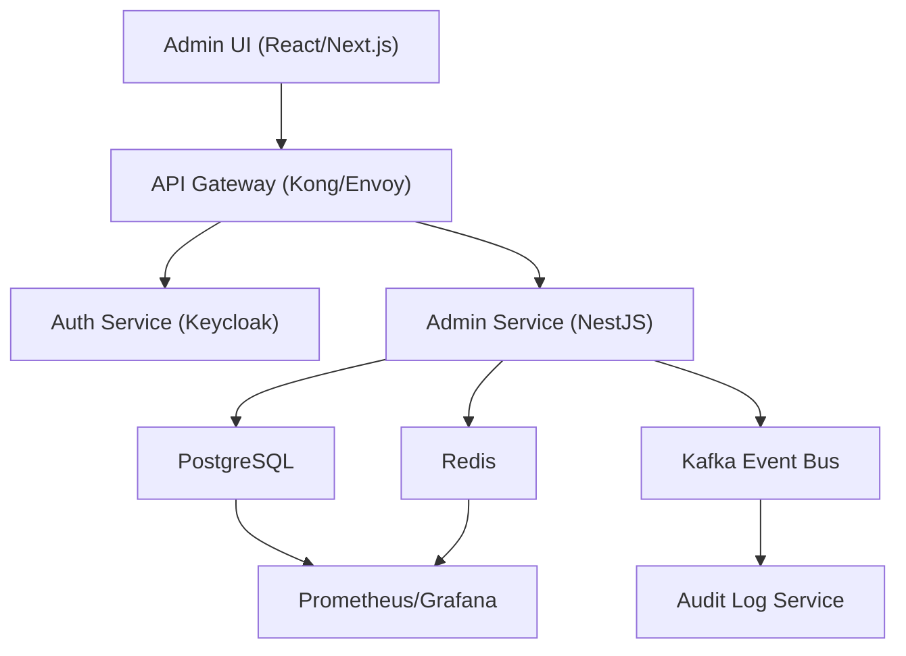

# Admin Panel
**Type:** module | **Priority:** 3 | **Status:** todo

## Checklist
- [ ] User Management — todo
- [ ] Usage Analytics — todo
- [ ] System Settings — todo

## Sub-components
- [User Management](./user-management.md)
- [Usage Analytics](./usage-analytics.md)
- [System Settings](./system-settings.md)

## Notes
# Admin Panel – Feature Specification (Module 1.d)

---

## 1. Feature Overview
**Purpose** – Provide tenant‑level administrators (roles `owner` / `admin`) a secure, self‑service UI to manage users, monitor usage, and configure system‑wide settings.  

**Scope** –  
* **User Management** – List, view, edit roles, suspend/reactivate, and soft‑delete users.  
* **Usage Analytics** – Daily/weekly/monthly aggregates of messages sent and tokens used per tenant.  
* **System Settings** – View and modify the tenant’s subscription plan and feature‑flag configuration.  

**Business Value** –  
* Reduces support overhead by empowering admins to onboard/offboard users without contacting ops.  
* Enables data‑driven decisions through built‑in analytics.  
* Allows rapid feature‑flag roll‑outs and plan upgrades, supporting upsell opportunities.

---

## 2. User Stories  

| # | User Story | Acceptance Criteria |
|---|------------|----------------------|
| 2.1 | **As an `owner` or `admin`, I want to view a paginated list of all users in my tenant, so that I can audit who has access.** | • `GET /api/v1/admin/users` returns only users where `tenant_id = myTenantId`. <br>• Supports `?page=` and `?size=` query params. <br>• Response includes `id`, `email`, `role`, `status`, `created_at`. |
| 2.2 | **As an `owner` or `admin`, I want to change a user’s role or suspend/reactivate the account, so that I can enforce least‑privilege access.** | • `PATCH /api/v1/admin/users/{userId}` accepts JSON with optional `role` and `status`. <br>• Validation ensures `role` ∈ {owner,admin,member,viewer} and `status` ∈ {active,suspended}. <br>• Audit log entry created (`action = "user_role_update"` or `"user_status_update"`). |
| 2.3 | **As an `owner` or `admin`, I want to delete a user permanently, so that the tenant can comply with GDPR “right to be forgotten”.** | • `DELETE /api/v1/admin/users/{userId}` performs a **soft‑delete** by setting `users.status = suspended` and clears PII from `profiles`. <br>• All related rows (`refresh_tokens`, `audit_logs`) remain for audit purposes. <br>• Returns `204 No Content`. |
| 2.4 | **As an `owner` or `admin`, I want to see usage analytics (messages sent, tokens used) for a selected date range, so that I can monitor consumption against my plan.** | • `GET /api/v1/admin/usage?start=YYYY‑MM‑DD&end=YYYY‑MM‑DD` returns daily aggregates from `usage_metrics`. <br>• Data is scoped to the tenant’s `tenant_id`. |
| 2.5 | **As an `owner` or `admin`, I want to view and edit the tenant’s plan and feature flags, so that I can upgrade the subscription or enable beta features.** | • `GET /api/v1/admin/settings` returns the row from `system_settings` for the tenant. <br>• `PATCH /api/v1/admin/settings` accepts `plan` (string) and `feature_flags` (JSON). <br>• Changes are validated against a whitelist of allowed flags and logged in `audit_logs`. |

---

## 3. Technical Specification  

### 3.1 Architecture  



*The Admin Service is a stateless micro‑service that authenticates via JWT, enforces RBAC, and reads/writes only the tables listed in the **Data Model** section.*  

### 3.2 API Endpoints  

| Method | Path | Auth | Request Body | Success Response | Errors |
|--------|------|------|--------------|------------------|--------|
| **GET** | `/api/v1/admin/users` | JWT (`role` ∈ {owner,admin}) | – | `200 OK` → `{ "items": [UserSummary], "page": int, "size": int, "total": int }` | `401 UNAUTHORIZED`, `403 FORBIDDEN`, `429 TOO_MANY_REQUESTS` |
| **GET** | `/api/v1/admin/users/{userId}` | JWT (`role` ∈ {owner,admin}) | – | `200 OK` → `UserDetail` | `401`, `403`, `404 NOT_FOUND` |
| **PATCH** | `/api/v1/admin/users/{userId}` | JWT (`role` ∈ {owner,admin}) | `UserUpdateRequest` | `200 OK` → updated `UserDetail` | `400 INVALID_PAYLOAD`, `401`, `403`, `404`, `409 CONFLICT` |
| **DELETE** | `/api/v1/admin/users/{userId}` | JWT (`role` ∈ {owner,admin}) | – | `204 No Content` | `401`, `403`, `404` |
| **GET** | `/api/v1/admin/usage` | JWT (`role` ∈ {owner,admin}) | – | `200 OK` → `{ "date": "YYYY‑MM‑DD", "messagesSent": int, "tokensUsed": int }[]` | `401`, `403`, `400 INVALID_PAYLOAD` |
| **GET** | `/api/v1/admin/settings` | JWT (`role` ∈ {owner,admin}) | – | `200 OK` → `SystemSettings` | `401`, `403` |
| **PATCH** | `/api/v1/admin/settings` | JWT (`role` ∈ {owner,admin}) | `SystemSettingsUpdateRequest` | `200 OK` → updated `SystemSettings` | `400 INVALID_PAYLOAD`, `401`, `403` |

#### JSON Schemas  

```json
{
  "title": "UserUpdateRequest",
  "type": "object",
  "properties": {
    "role": { "type": "string", "enum": ["owner","admin","member","viewer"] },
    "status": { "type": "string", "enum": ["active","suspended"] }
  },
  "additionalProperties": false,
  "minProperties": 1
}
```

```json
{
  "title": "SystemSettingsUpdateRequest",
  "type": "object",
  "properties": {
    "plan": { "type": "string", "enum": ["free","pro","enterprise"] },
    "feature_flags": { "type": "object", "additionalProperties": { "type": "boolean" } }
  },
  "additionalProperties": false,
  "minProperties": 1
}
```

### 3.3 Data Model  

| Table | Primary Key | Important Columns | Relationships | Indexes |
|-------|-------------|-------------------|---------------|---------|
| `users` | `id` (UUID) | `email`, `password_hash`, `tenant_id`, `status` (ENUM), `role` (ENUM), `created_at`, `updated_at` | 1‑M → `profiles`, 1‑M → `refresh_tokens`, 1‑M → `audit_logs` | `idx_users_tenant_id`, `idx_users_email` |
| `profiles` | `user_id` (FK) | `first_name`, `last_name`, `avatar_url`, `locale` | PK on `user_id` (1‑1) | – |
| `usage_metrics` | `id` (UUID) | `tenant_id`, `date`, `messages_sent`, `tokens_used` | – | Composite index on `(tenant_id, date)` |
| `system_settings` | `tenant_id` (PK) | `plan`, `feature_flags` (JSON) | – | `idx_system_settings_tenant_id` |
| `audit_logs` | `id` (UUID) | `tenant_id`, `user_id`, `action`, `payload` (JSONB), `created_at` | – | `idx_audit_tenant_time` (tenant_id, created_at) |

*All queries are scoped by `tenant_id` to guarantee isolation. Row‑level security (RLS) policies are defined in PostgreSQL to enforce this at the database layer.*

### 3.4 Business Logic  

1. **RBAC Enforcement**  
   * JWT `role` claim must be `owner` or `admin` for any `/admin/*` endpoint.  
   * `owner` can modify any user within the tenant; `admin` can modify users with `role` ≠ `owner`.  

2. **User Update Workflow**  
   * Validate payload against `UserUpdateRequest`.  
   * Load target user; verify `tenant_id` matches JWT claim.  
   * Begin DB transaction:  
     * Update `users.role` and/or `users.status`.  
     * If `status = suspended`, optionally clear PII from `profiles` (GDPR).  
     * Insert audit log entry (`action = "user_role_update"` or `"user_status_update"`).  
   * Commit transaction; return updated user detail.  

3. **Soft‑Delete (GDPR “right to be forgotten”)**  
   * `DELETE /admin/users/{id}` sets `users.status = suspended`.  
   * Clears `profiles.first_name`, `last_name`, `avatar_url`.  
   * Retains `audit_logs` and `refresh_tokens` for compliance.  

4. **Usage Analytics Aggregation**  
   * Service reads from `usage_metrics` using a date range filter.  
   * Returns daily rows; UI aggregates to weekly/monthly as needed.  
   * No write‑path; metrics are populated by the **Chat Engine** service (outside this feature).  

5. **System Settings Update**  
   * Validate `plan` against allowed values and `feature_flags` against a whitelist defined in the feature‑flag service.  
   * Update `system_settings` row for the tenant.  
   * Emit `SystemSettingsChanged` event on Kafka for downstream services (e.g., billing).  

6. **Audit Logging**  
   * Every mutating admin action creates a row in `audit_logs` with `payload` containing the before/after snapshots (JSONB).  

---

## 4. Security Considerations  

| Aspect | Controls |
|--------|----------|
| **Authentication** | JWT signed with RSA‑256 (private key stored in Vault). Short‑lived access token (15 min) + refresh token (7 days). |
| **Authorization** | RBAC enforced at API gateway and service layer. Only `owner`/`admin` can access `/admin/*`. Tenant isolation via `tenant_id` claim and PostgreSQL RLS. |
| **Input Validation** | JSON‑Schema validation for all request bodies; server‑side sanitization (trim, escape). |
| **Rate Limiting** | Redis token‑bucket per tenant: max 20 admin requests per minute. Exceeding returns `429 TOO_MANY_REQUESTS` with `Retry-After`. |
| **Data Protection** | All DB columns encrypted at rest via KMS. `avatar_url` is a signed, time‑limited S3 URL. |
| **Audit Trail** | Immutable entries in `audit_logs`; write‑once, never deleted. |
| **Transport Security** | TLS 1.3 enforced by API gateway; HSTS header set. |
| **Compliance** | GDPR: soft‑delete workflow, ability to purge PII from `profiles`. |

---

## 5. Error Handling  

| HTTP Status | Error Code | Message | Fallback / Retry |
|-------------|------------|---------|------------------|
| 400 | `INVALID_PAYLOAD` | Request body fails schema validation. | Client must correct payload. |
| 401 | `UNAUTHORIZED` | Missing or invalid JWT. | Prompt re‑login. |
| 403 | `FORBIDDEN` | User lacks `owner`/`admin` role or tenant mismatch. | Show access‑denied UI. |
| 404 | `NOT_FOUND` | Requested user or settings not found. | Show friendly not‑found page. |
| 409 | `CONFLICT` | Attempt to set a role that would violate business rules (e.g., demote the sole `owner`). | Explain conflict, suggest corrective action. |
| 429 | `TOO_MANY_REQUESTS` | Rate limit exceeded. | Exponential back‑off on client side. |
| 500 | `INTERNAL_ERROR` | Unexpected server error. | Log, return generic message, trigger alert. |

**Retry Strategy** – Idempotent `GET` endpoints may be retried automatically with exponential back‑off. Mutating endpoints (`PATCH`, `DELETE`) are **not** automatically retried; client must handle `429` or `500` explicitly.

---

## 6. Testing Plan  

| Test Type | Scope | Tools |
|-----------|-------|-------|
| **Unit** | Service layer functions (RBAC checks, audit‑log creation, payload validation). | Jest (TS) / Go test |
| **Integration** | End‑to‑end API flow with PostgreSQL, Redis, and Kafka (using Testcontainers). | SuperTest, Pact (contract) |
| **E2E** | Admin UI scenarios: user list pagination, role change, usage chart, settings update. | Cypress |
| **Performance** | Load test admin endpoints (10 k concurrent requests) to verify rate‑limit enforcement. | k6 |
| **Security** | OWASP ZAP scan for injection, CSRF, and XSS on admin UI. | Snyk for dependency scanning |
| **Chaos** | Simulate DB latency spikes and Kafka consumer failures to ensure graceful degradation. | LitmusChaos |

Edge Cases to cover:  
* Attempt to demote the last `owner` → expect `409`.  
* Update `feature_flags` with an unknown flag → expect `400`.  
* Delete a user that already has `status = suspended` → idempotent `204`.  

---

## 7. Dependencies  

| Dependency | Reason |
|------------|--------|
| **Auth Service (Keycloak)** | JWT issuance and token validation. |
| **Audit Log Service** | Centralized immutable logging of admin actions. |
| **Usage Metrics Producer** (Chat Engine) | Populates `usage_metrics` table. |
| **Feature‑Flag Service** (LaunchDarkly / Unleash) | Provides whitelist for `feature_flags` updates. |
| **PostgreSQL** | Primary data store for users, profiles, settings, metrics, and audit logs. |
| **Redis** | Rate‑limit counters and short‑lived caches. |
| **Kafka** | Event bus for `SystemSettingsChanged` and audit notifications. |

---

## 8. Migration & Deployment  

### 8.1 Database Migration  
*No new tables are introduced.*  
* If a new column is required for future admin‑only flags, add it with a default value using a Prisma/Flyway migration, back‑fill via a background job, then switch code paths.  

### 8.2 Feature Flags  
* `admin_panel_enabled` – Boolean flag controlling UI exposure.  
* `admin_user_role_edit` – Enables role‑editing capability (useful for staged roll‑out).  

Feature flags are stored in `system_settings.feature_flags` (JSON) and cached in Redis for low‑latency checks.

### 8.3 Deployment Steps  

1. **Build Docker image** for `admin-service`.  
2. **Helm upgrade** with `--set featureFlags.admin_panel_enabled=true` for the target namespace.  
3. **Run DB migrations** (if any) via CI pipeline before the new pods start.  
4. **Smoke test** – Automated script calls `GET /api/v1/admin/users` with a test admin token.  
5. **Rollback** – If health checks fail, Helm rollback to previous release; feature flag can be toggled off instantly without redeploy.  

All deployments are **zero‑downtime** thanks to rolling updates and the stateless nature of the service.  

--- 

*End of Document*
