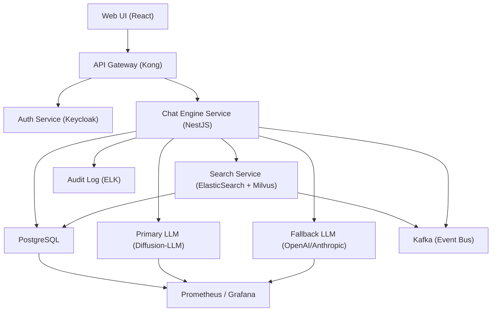

# Chat Engine
**Type:** module | **Priority:** 3 | **Status:** todo

## Checklist
- [ ] Context‑Aware Reply — todo
- [ ] Fallback to LLM — todo
- [ ] Conversation History — todo

## Sub-components
- [Context‑Aware Reply](./context‑aware-reply.md)
- [Fallback to LLM](./fallback-to-llm.md)
- [Conversation History](./conversation-history.md)

## Notes
# Feature Specification – Chat Engine (Module 1.c)

---

## 1. Feature Overview
**Purpose** – Provide a real‑time, context‑aware conversational AI that can answer user queries using the tenant’s uploaded documents, fall back to a generic LLM when confidence is low, and retain full conversation history for analytics and billing.

**Scope** –  
* Retrieve relevant document passages (semantic + keyword) and inject them as citations.  
* Generate assistant replies via the primary diffusion‑LLM; if the model’s confidence falls below a tenant‑configurable threshold, automatically invoke the fallback LLM.  
* Persist every user and assistant message, including citation metadata, fallback flag, and idempotency handling.  
* Expose paginated conversation history to the UI.  

**Business Value** –  
* **Higher relevance** → reduced support tickets and higher customer satisfaction.  
* **Cost control** → fallback only when needed, keeping token usage predictable.  
* **Analytics** → conversation‑level metrics feed billing and usage dashboards.  

---

## 2. User Stories  

| # | User Story | Acceptance Criteria |
|---|------------|----------------------|
| 2.1 | **As a tenant user, I want to ask a question and receive a reply that cites the source documents, so that I can verify the answer.** | • The assistant response includes a `citations` array with `documentId`, `chunkId`, and a short `snippet`. <br>• The citation IDs correspond to rows in `document_chunks` belonging to the same tenant. |
| 2.2 | **As a tenant admin, I want the system to automatically fall back to a generic LLM when the primary model is not confident, so that the user still gets an answer.** | • When the primary LLM confidence < `fallback.confidenceThreshold` (from `system_settings.feature_flags`), the service calls the fallback LLM. <br>• The response field `fallbackUsed` is set to `true`. |
| 2.3 | **As a user, I want my chat history to be persisted and viewable, so that I can continue a conversation later.** | • Every message is stored in `messages` with `conversation_id`. <br>• `GET /api/v1/chat/{conversationId}/messages` returns messages ordered by `created_at` with pagination. |
| 2.4 | **As a developer, I want POST /message to be idempotent, so that retries do not duplicate messages.** | • If the request contains an `Idempotency-Key` header that matches an existing row (same tenant), the service returns the original response without creating a new `message`. |
| 2.5 | **As a tenant admin, I want to enable or disable the whole chat engine per tenant, so that I can roll it out gradually.** | • Feature flag `chatEngine.enabled` stored in `system_settings.feature_flags`. <br>• When disabled, the POST endpoint returns `403 FORBIDDEN` with a clear error message. |

---

## 3. Technical Specification  

### 3.1 Architecture  



*All components already exist in the platform; the Chat Engine Service plugs into the same API gateway, shares the `messages` and `conversations` tables, and publishes `ChatRequested` events to Kafka for downstream analytics.*

### 3.2 API Endpoints  

| Method | Path | Auth | Idempotency | Request Body | Success Response | Error Responses |
|--------|------|------|-------------|--------------|------------------|-----------------|
| **POST** | `/api/v1/chat/{conversationId}/message` | JWT (role ≥ `member`) | Header `Idempotency-Key` (optional) | `UserMessageRequest` (see schema) | `AssistantMessageResponse` (see schema) | 400, 401, 403, 404, 429, 502 (fallback applied internally, still 200), 503, 500 |
| **GET** | `/api/v1/chat/{conversationId}/messages` | JWT (role ≥ `member`) | – | Query: `limit` (default 20), `cursor` (message id) | `MessageListResponse` (see schema) | 400, 401, 403, 404, 429, 500 |
| **POST** | `/api/v1/chat/{conversationId}/reset` | JWT (role ≥ `member`) | – | – | `ResetResponse` (`newConversationId`, `endedAt`) | 400, 401, 403, 404, 429, 500 |

#### Request / Response Schemas  

**UserMessageRequest**  

```json
{
  "type": "object",
  "required": ["content"],
  "properties": {
    "content": { "type": "string", "minLength": 1, "maxLength": 2000 }
  },
  "additionalProperties": false
}
```

**AssistantMessageResponse**  

```json
{
  "type": "object",
  "required": ["messageId", "content", "citations", "fallbackUsed", "createdAt"],
  "properties": {
    "messageId": { "type": "string", "format": "uuid" },
    "content": { "type": "string" },
    "citations": {
      "type": "array",
      "items": {
        "type": "object",
        "required": ["documentId", "chunkId"],
        "properties": {
          "documentId": { "type": "string", "format": "uuid" },
          "chunkId": { "type": "string", "format": "uuid" },
          "snippet": { "type": "string" }
        },
        "additionalProperties": false
      }
    },
    "fallbackUsed": { "type": "boolean" },
    "createdAt": { "type": "string", "format": "date-time" }
  },
  "additionalProperties": false
}
```

**MessageListResponse**  

```json
{
  "type": "object",
  "required": ["messages"],
  "properties": {
    "messages": {
      "type": "array",
      "items": {
        "type": "object",
        "required": ["id", "role", "content", "createdAt"],
        "properties": {
          "id": { "type": "string", "format": "uuid" },
          "role": { "type": "string", "enum": ["user","assistant"] },
          "content": { "type": "string" },
          "createdAt": { "type": "string", "format": "date-time" },
          "citations": {
            "type": "array",
            "items": {
              "type": "object",
              "required": ["documentId", "chunkId"],
              "properties": {
                "documentId": { "type": "string", "format": "uuid" },
                "chunkId": { "type": "string", "format": "uuid" },
                "snippet": { "type": "string" }
              }
            }
          },
          "fallbackUsed": { "type": "boolean" }
        },
        "additionalProperties": false
      }
    }
  },
  "additionalProperties": false
}
```

**ResetResponse**  

```json
{
  "type": "object",
  "required": ["newConversationId", "endedAt"],
  "properties": {
    "newConversationId": { "type": "string", "format": "uuid" },
    "endedAt": { "type": "string", "format": "date-time" }
  }
}
```

### 3.3 Data Model  

| Table | Columns (relevant) | Types | Indexes | Notes |
|-------|--------------------|-------|---------|-------|
| `conversations` | `id` (PK), `tenant_id`, `user_id`, `started_at`, `ended_at` | UUID, UUID, UUID, TIMESTAMP, TIMESTAMP | `idx_conversations_tenant` (tenant_id) | One‑to‑many → `messages`. |
| `messages` | `id` (PK), `conversation_id` (FK), `role`, `content`, `created_at`, `citations` (JSONB), `fallback_used` (BOOLEAN), `idempotency_key` (VARCHAR) | UUID, UUID, ENUM, TEXT, TIMESTAMP, JSONB, BOOLEAN, VARCHAR | `idx_messages_conversation` (conversation_id), `idx_messages_created` (created_at), `idx_messages_citations` (GIN), `idx_messages_idempotency` (unique on tenant_id + idempotency_key where not null) | `fallback_used` defaults FALSE. `citations` stores `{documentId,chunkId,snippet}`. |
| `system_settings` | `tenant_id` (PK), `plan`, `feature_flags` (JSON) | UUID, TEXT, JSON | PK on `tenant_id` | `feature_flags` holds `chatEngine.enabled`, `fallback.enabled`, `fallback.confidenceThreshold`. |
| `usage_metrics` | `id` (PK), `tenant_id`, `date`, `messages_sent`, `tokens_used` | UUID, UUID, DATE, INTEGER, BIGINT | `idx_usage_tenant_date` (tenant_id, date) | Updated by Chat Engine after each assistant reply. |

*All tables already exist; no new tables are introduced for this feature.*

### 3.4 Business Logic  

#### 3.4.1 Conversation Flow  

1. **Validate** request (JWT, tenant match, `conversationId` belongs to tenant).  
2. **Idempotency Check** – If `Idempotency-Key` present and a message with the same key exists, return the stored response.  
3. **Persist User Message** – Insert into `messages` (`role='user'`).  
4. **Retrieve Context** –  
   * Load last **N** messages (configurable, default = 10) from the same conversation, ordered by `created_at`.  
   * Build a **retrieval query** from the user content.  
5. **Semantic Search** – Call Search Service:  
   * Vector similarity on `document_chunks` (Milvus) → top‑k passages.  
   * Keyword match on ElasticSearch → boost passages containing exact terms.  
   * Merge results, de‑duplicate, and select up to **M** citations (default = 3).  
6. **Prompt Construction** – Assemble system prompt, retrieved passages (as citations), and conversation history.  
7. **Primary LLM Invocation** – Send prompt to Primary LLM. Receive:  
   * `assistantContent`  
   * `confidenceScore` (0‑1)  
   * `tokenUsage` (prompt + completion)  
8. **Fallback Decision** –  
   * If `fallback.enabled` is true **and** `confidenceScore < confidenceThreshold` (from `system_settings.feature_flags`), invoke the **Fallback LLM** with the same prompt.  
   * Set `fallbackUsed = true` on the assistant message.  
9. **Persist Assistant Message** – Insert into `messages` (`role='assistant'`, `citations`, `fallback_used`).  
10. **Update Usage Metrics** – Increment `messages_sent` and add `tokens_used` for the tenant in `usage_metrics`.  
11. **Emit Events** – Publish `ChatMessageCreated` (including `fallbackUsed`) to Kafka for analytics.  
12. **Return Response** – AssistantMessageResponse JSON.

#### 3.4.2 State Machine (Conversation Lifecycle)  

```
idle --> active --> ended
   ^        |        |
   |        v        v
   |   (user sends message)   (reset endpoint)
   |        |        |
   +--------+--------+
```

* **idle** – No active conversation row.  
* **active** – `started_at` set, `ended_at` null.  
* **ended** – `ended_at` populated; further POSTs to the same `conversationId` are rejected (404).  

#### 3.4.3 Citation Generation  

* For each selected chunk, extract a 200‑character snippet surrounding the matched term.  
* Store in `messages.citations` as JSONB array:  
  ```json
  [
    { "documentId": "uuid", "chunkId": "uuid", "snippet": "…" },
    …
  ]
  ```

#### 3.4.4 Feature‑Flag Evaluation  

```pseudo
if not system_settings.feature_flags.chatEngine.enabled:
    reject with 403
if system_settings.feature_flags.fallback.enabled:
    use fallback logic as described
```

---

## 4. Security Considerations  

| Aspect | Controls |
|--------|----------|
| **Authentication** | JWT (RS256) validated at API gateway; token contains `tenantId` and `role`. |
| **Authorization** | RBAC – only `member`, `admin`, `owner` can POST/GET messages. Enforced in service layer and reinforced by PostgreSQL RLS on `tenant_id`. |
| **Input Validation** | JSON‑Schema validation; content length ≤ 2000; reject control characters; trim whitespace. |
| **Idempotency** | `Idempotency-Key` header hashed (SHA‑256) and stored in `messages.idempotency_key`; unique index per tenant prevents replay. |
| **Rate Limiting** | Redis token‑bucket per tenant: 20 req/min for `/chat/*`. Exceeds → `429 TOO_MANY_REQUESTS` with `Retry-After`. |
| **Data Protection** | - `citations` contain only IDs and snippets (no PII). <br>- All DB columns at rest encrypted (PostgreSQL Transparent Data Encryption). <br>- TLS 1.3 everywhere (Ingress, internal mTLS). |
| **Audit Logging** | Every request (including fallback decision) writes an immutable entry to `audit_logs` (`action = "chat_message"`). |
| **Feature‑Flag Security** | Flags stored in `system_settings.feature_flags`; only `admin` role can modify via Admin API. |
| **Compliance** | GDPR “right to be forgotten” – `DELETE /api/v1/conversations/{id}` removes related rows from `messages` and updates `usage_metrics`. |

---

## 5. Error Handling  

| HTTP Status | JSON Error Code | Message | Fallback / Retry |
|-------------|-----------------|---------|------------------|
| 400 | `INVALID_PAYLOAD` | Request body fails schema validation. | Client must correct payload. |
| 401 | `UNAUTHORIZED` | Missing or invalid JWT. | Prompt re‑login. |
| 403 | `FORBIDDEN` | RBAC violation, tenant mismatch, or `chatEngine.enabled = false`. | Show access‑denied UI. |
| 404 | `CONVERSATION_NOT_FOUND` | `conversationId` does not exist for this tenant or is ended. | Show friendly “not found”. |
| 429 | `TOO_MANY_REQUESTS` | Rate limit exceeded. | Exponential back‑off; respect `Retry-After`. |
| 502 | `LLM_PRIMARY_UNAVAILABLE` | Primary LLM service failed. | Automatic fallback to secondary LLM (transparent to client). |
| 503 | `SERVICE_UNAVAILABLE` | Downstream service (search, embeddings) unavailable. | Return `503` with `Retry-After`. |
| 500 | `INTERNAL_ERROR` | Unexpected server error. | Log, alert, generic message. |

**Retry Strategy**  

* **GET** endpoints – safe to retry up to 3 times with exponential back‑off.  
* **POST** `/message` – client must not auto‑retry; UI shows “Try again”.  

When fallback is triggered, the response still returns `200 OK` with `fallbackUsed = true`; the client is unaware of the internal switch.

---

## 6. Testing Plan  

| Test Level | Scope | Tools |
|------------|-------|-------|
| **Unit** | Message validation, idempotency lookup, citation extraction, fallback decision logic. | Jest (TS), Go test (if Go service). |
| **Integration** | End‑to‑end flow: POST → DB write → Search Service → LLM → DB write → response. Uses Testcontainers for PostgreSQL, Kafka, Milvus, ElasticSearch. | SuperTest, Testcontainers, Pact (contract). |
| **Contract** | Verify that API conforms to OpenAPI spec; Kafka events match Avro schema. | OpenAPI validator, Pact. |
| **E2E** | UI scenario: user opens chat, sends message, sees citations, resets conversation, pagination. | Cypress (frontend), Playwright (browser). |
| **Performance** | Latency under load (100 concurrent chats), token usage vs. fallback threshold. | k6, Locust. |
| **Security** | OWASP ZAP scan, JWT tampering, rate‑limit enforcement. | OWASP ZAP, Snyk. |
| **Chaos** | Simulate primary LLM outage, ensure fallback works; Kafka consumer lag. | LitmusChaos (K8s). |

**Edge Cases**  

* Empty or overly long `content`.  
* Duplicate `Idempotency-Key` after 5 minutes (should be treated as new).  
* `fallback.confidenceThreshold` set to 0 (always fallback) or 1 (never fallback).  
* Conversation ended – POST should return 404.  

---

## 7. Dependencies  

| Dependency | Type | Reason |
|------------|------|--------|
| **Document Service** | Internal microservice | Provides document chunks and embeddings for retrieval. |
| **Search Service** | Internal microservice (ElasticSearch + Milvus) | Performs semantic & keyword search for context. |
| **Primary LLM Inference Service** | Internal (Diffusion‑LLM) | Generates fast, parallel token replies. |
| **Fallback LLM Service** | External (OpenAI, Anthropic) | Provides backup when confidence low. |
| **Feature‑Flag Service** | Internal (LaunchDarkly‑compatible) | Controls per‑tenant rollout of chat engine and fallback. |
| **Kafka** | Event bus | Publishes `ChatMessageCreated` for analytics and audit. |
| **Prometheus / Grafana** | Observability | Metrics for latency, fallback count, error rates. |
| **Audit Log (ELK)** | Logging | Immutable audit trail for compliance. |

---

## 8. Migration & Deployment  

### 8.1 Database Migration  

*No new tables or columns are required for this feature.*  
All needed columns (`citations`, `fallback_used`, `idempotency_key`) already exist per the architecture decisions.

### 8.2 Feature Flags  

| Flag | Location | Default | Description |
|------|----------|---------|-------------|
| `chatEngine.enabled` | `system_settings.feature_flags` (JSON) | `true` | Enables the whole chat module for a tenant. |
| `fallback.enabled` | `system_settings.feature_flags` (JSON) | `true` | Allows fallback LLM usage. |
| `fallback.confidenceThreshold` | `system_settings.feature_flags` (JSON) | `0.65` | Minimum confidence required to avoid fallback. |

Feature flags are mutable via the Admin API (role = `admin`).

### 8.3 Deployment  

| Item | Details |
|------|---------|
| **Docker Image** | `chat-engine` – built from the NestJS service source. |
| **Helm Chart** | `chat-engine` with replica count ≥ 2, HPA based on CPU & Kafka lag. |
| **PodDisruptionBudget** | `minAvailable: 1` for zero‑downtime rolling updates. |
| **Canary Release** | 5 % of traffic routed to new version via API‑gateway weight; monitor `/metrics` for error spikes before full rollout. |
| **Rollback** | Helm rollback to previous chart version; feature flag can be toggled off instantly to disable the module without redeploy. |
| **Observability** | `/metrics` endpoint exposing `chat_request_latency_seconds`, `chat_fallback_total`, `chat_error_total`. |
| **CI/CD** | - Unit & contract tests on every PR.<br>- Integration tests on staging after merge.<br>- Canary deployment as described. |

### 8.4 Monitoring & Alerting  

* **SLO** – 99.9 % of chat replies under 500 ms.  
* **Alert** – If `chat_fallback_total` spikes > 10 % of total requests, trigger PagerDuty.  
* **Dashboard** – Grafana panel showing per‑tenant `messages_sent`, `tokens_used`, and fallback ratio.

--- 

*End of Specification*
