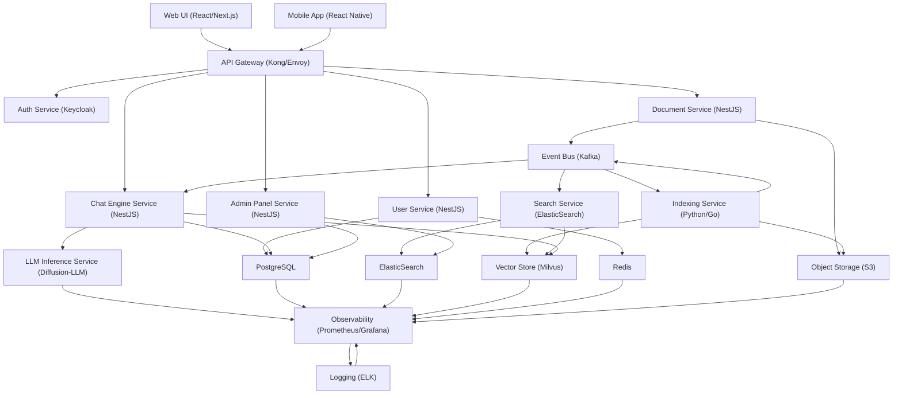

# Chatbot SaaS Application
**Type:** trunk | **Priority:** 3 | **Status:** todo

## Checklist
- [ ] User Management — todo
- [ ] Document Handling — todo
- [ ] Chat Engine — todo
- [ ] Admin Panel — todo

## Sub-components
- [User Management](./user-management.md)
- [Document Handling](./document-handling.md)
- [Chat Engine](./chat-engine.md)
- [Admin Panel](./admin-panel.md)

## Notes
# Chatbot SaaS Application – Architecture Document  

---

## 1. Executive Summary
The **Chatbot SaaS Application** is a multi‑tenant, cloud‑native platform that lets organizations upload documents, build searchable knowledge bases, and interact with a context‑aware conversational AI.  
Key goals:

| Goal | Description |
|------|-------------|
| **Scalability** | Horizontal scaling of ingestion, indexing, and chat inference workloads. |
| **Modularity** | Each functional area (User Management, Document Handling, Chat Engine, Admin Panel) can be developed, deployed, and versioned independently. |
| **Security & Compliance** | Multi‑tenant isolation, GDPR‑ready data handling, and robust authentication/authorization. |
| **Observability** | End‑to‑end metrics, tracing, and alerting for rapid incident response. |
| **Rapid Feature Delivery** | Feature‑flag driven rollout and pluggable contracts to avoid breaking changes. |

---

## 2. Tech Stack  

| Layer | Technology | Rationale |
|-------|------------|-----------|
| **Frontend** | **React** + **TypeScript** + **Next.js** (SSR) | Component ecosystem, strong typing, SEO‑friendly pages for admin portal, easy integration with feature‑flag SDKs. |
| **UI Component Library** | **MUI** (Material‑UI) | Consistent design system, theming, accessibility out‑of‑the‑box. |
| **Backend** | **Node.js** (NestJS) **or** **Go** (Gin) – choose based on team expertise | NestJS gives a modular, decorator‑driven architecture that mirrors the feature tree; Go offers lower latency for heavy‑throughput indexing. |
| **API Layer** | **GraphQL** (Apollo Server) + **REST** fallback | GraphQL for flexible UI queries; REST for webhook‑style integrations (e.g., document upload). |
| **Authentication** | **OAuth2 / OpenID Connect** (Keycloak) + **JWT** | Centralized identity provider, SSO support, token‑based stateless auth. |
| **Message Bus** | **Kafka** (or **NATS** for lighter weight) | Event‑driven communication between modules (e.g., document uploaded → indexing service). |
| **Search & Indexing** | **ElasticSearch** (or **OpenSearch**) | Full‑text search, relevance tuning, vector similarity for semantic search. |
| **Vector Store** | **Milvus** or **PGVector** (PostgreSQL extension) | Stores embeddings generated by the LLM for context‑aware retrieval. |
| **Database** | **PostgreSQL** (cloud‑managed) | ACID transactions, relational data for users, settings, analytics. |
| **Cache** | **Redis** (TTL & pub/sub) | Session store, rate‑limit counters, short‑lived query caches. |
| **Object Storage** | **AWS S3** (or **MinIO** for on‑prem) | Durable storage for raw documents and generated chunks. |
| **LLM Inference** | **Diffusion‑LLM** (via internal inference service) + **OpenAI / Anthropic** fallback | Primary fast, parallel token generation; fallback for out‑of‑domain queries. |
| **Infrastructure** | **Kubernetes** (EKS / GKE / AKS) + **Terraform** | Declarative infra, auto‑scaling, zero‑downtime deployments. |
| **CI/CD** | **GitHub Actions** + **Docker** + **Helm** | Automated build, test, and release pipelines; Helm charts for versioned releases. |
| **Observability** | **Prometheus** + **Grafana** (metrics), **OpenTelemetry** (traces), **ELK** (logs) | Unified monitoring across services. |
| **Feature Flags** | **LaunchDarkly** (or self‑hosted **Unleash**) | Gradual rollout, canary releases, per‑tenant toggles. |

---

## 3. System Architecture  



**Key Interaction Flow**

1. **User Management** – UI → API GW → Auth Service (OAuth2) → User Service → PostgreSQL.  
2. **Document Upload** – UI → GW → Document Service → S3 (raw file) + Kafka event *DocumentUploaded*.  
3. **Indexing** – Indexing Service consumes *DocumentUploaded*, extracts text, generates embeddings, stores chunks in Milvus, updates ElasticSearch.  
4. **Search / Retrieval** – Chat Engine consumes user query → Vector similarity (Milvus) + full‑text (ElasticSearch) → top‑k passages → LLM inference.  
5. **Admin Panel** – Admin Service aggregates usage metrics from PostgreSQL, ElasticSearch, and Prometheus.  

All services are **stateless** (except caches) and can be horizontally scaled behind the API gateway. The **event bus** guarantees loose coupling and enables pluggable extensions (e.g., new analytics consumer).

---

## 4. Feature Map & Table of Contents  

| Notation | Feature | Type | Module |
|----------|---------|------|--------|
| 1 | Chatbot SaaS Application | Trunk | – |
| 1.a | User Management | Module | – |
| 1.a.a | User Sign‑up | Feature | User Management |
| 1.a.b | User Login | Feature | User Management |
| 1.a.c | User Profile Management | Feature | User Management |
| 1.b | Document Handling | Module | – |
| 1.b.a | Document Upload | Feature | Document Handling |
| 1.b.b | Document Indexing | Feature | Document Handling |
| 1.b.c | Document Search | Feature | Document Handling |
| 1.c | Chat Engine | Module | – |
| 1.c.a | Context‑Aware Reply | Feature | Chat Engine |
| 1.c.b | Fallback to LLM | Feature | Chat Engine |
| 1.c.c | Conversation History | Feature | Chat Engine |
| 1.d | Admin Panel | Module | – |
| 1.d.a | User Management (Admin) | Feature | Admin Panel |
| 1.d.b | Usage Analytics | Feature | Admin Panel |
| 1.d.c | System Settings | Feature | Admin Panel |

Each entry links to a dedicated markdown section (e.g., `#1-a-a-User-Sign-up`) in the full documentation repository.

---

## 5. Integration Strategy  

### 5.1 Shared Interfaces / Contracts  

| Layer | Contract Type | Description |
|-------|---------------|-------------|
| **API** | OpenAPI 3.0 (REST) & GraphQL SDL | Versioned contracts stored in `api-contracts/`. |
| **Events** | Avro schema (Kafka) | Strongly typed events: `DocumentUploaded`, `IndexingCompleted`, `ChatRequested`, `AnalyticsRecorded`. |
| **Data Transfer** | Protobuf (gRPC) for internal service‑to‑service calls | Low‑latency, binary format for high‑throughput pipelines (e.g., embedding generation). |
| **Feature Flags** | JSON schema per flag | Central registry in `flags/` with tenant‑scoped overrides. |

All contracts are **backward compatible**; new fields are optional and versioned.

### 5.2 Event Bus / Messaging Patterns  

* **Publish‑Subscribe** – Core services publish domain events to Kafka topics.  
* **Consumer Groups** – Multiple independent consumers (e.g., analytics, audit) can process the same event without interfering.  
* **Dead‑Letter Queue (DLQ)** – Each topic has a DLQ for failed messages, monitored by alerting rules.  

### 5.3 API Gateway Structure  

```
/api/v1/
   ├─ /auth/*          → Auth Service
   ├─ /users/*         → User Service
   ├─ /documents/*     → Document Service
   ├─ /search/*        → Search Service
   ├─ /chat/*          → Chat Engine Service
   └─ /admin/*         → Admin Service
```

* **Rate limiting** per tenant (Redis token bucket).  
* **Request validation** against OpenAPI schema.  
* **JWT verification** and role extraction for RBAC.  

### 5.4 Feature Flag Approach  

* **Flag Store** – Centralized Redis/DB with TTL for experiments.  
* **SDK Integration** – Frontend and backend import a lightweight flag client (LaunchDarkly SDK or Unleash).  
* **Rollout Strategies** –  
  * **Percentage rollout** (e.g., 10 % of tenants).  
  * **Targeted rollout** (by tenant ID or plan tier).  
  * **Canary** – Deploy new version behind a flag, monitor error rates, then enable globally.  

Feature flags are **first‑class citizens** in CI pipelines: a feature cannot be merged without an associated flag definition.

---

## 6. Database Design  

### 6.1 Core Entities  

| Table | Primary Key | Important Columns | Relationships |
|-------|-------------|-------------------|---------------|
| `users` | `id` (UUID) | `email`, `password_hash`, `created_at`, `tenant_id` | 1‑M → `profiles`, 1‑M → `conversations` |
| `profiles` | `user_id` (FK) | `first_name`, `last_name`, `avatar_url` | 1‑1 with `users` |
| `documents` | `id` (UUID) | `tenant_id`, `owner_id`, `filename`, `s3_key`, `status`, `created_at` | 1‑M → `document_chunks` |
| `document_chunks` | `id` (UUID) | `document_id` (FK), `content`, `embedding_id` | 1‑1 → `embeddings` |
| `embeddings` | `id` (UUID) | `vector` (binary/float array) | 1‑M → `document_chunks` |
| `conversations` | `id` (UUID) | `tenant_id`, `user_id`, `started_at`, `ended_at` | 1‑M → `messages` |
| `messages` | `id` (UUID) | `conversation_id` (FK), `role` (user/assistant), `content`, `created_at` | – |
| `usage_metrics` | `id` (UUID) | `tenant_id`, `date`, `messages_sent`, `tokens_used` | – |
| `system_settings` | `tenant_id` (PK) | `plan`, `feature_flags` (JSON) | – |

### 6.2 Relationships  

* **Tenant Isolation** – All tables include `tenant_id`. Row‑level security (PostgreSQL RLS) enforces that a tenant can only access its own data.  
* **Document → Chunk → Embedding** – One‑to‑many cascade; when a document is deleted, related chunks and embeddings are removed via foreign‑key `ON DELETE CASCADE`.  

### 6.3 Migration Strategy  

* **Tooling** – `Prisma Migrate` (if using TypeScript) or `Flyway` (SQL‑first).  
* **Versioned Scripts** – Each feature adds its own migration file; CI runs migrations against a disposable test DB.  
* **Zero‑Downtime** – Add new columns with defaults, back‑fill via background jobs, then switch code paths.  

---

## 7. Security Architecture  

| Concern | Controls |
|---------|----------|
| **Authentication** | OAuth2 / OIDC via Keycloak; short‑lived JWT (15 min) + refresh token (7 days). |
| **Authorization** | RBAC (roles: `admin`, `owner`, `viewer`). Enforced at API gateway and service layer. |
| **Transport Security** | TLS 1.3 everywhere (Ingress, internal service mesh). |
| **Data at Rest** | PostgreSQL & ElasticSearch encrypted with KMS‑managed keys; S3 bucket default encryption (AES‑256). |
| **Secrets Management** | HashiCorp Vault or AWS Secrets Manager; injected as Kubernetes secrets. |
| **Input Validation** | OpenAPI schema validation, server‑side sanitization, CSP for frontend. |
| **Rate Limiting & DDoS** | API gateway token bucket per tenant; Cloud‑provider WAF for edge protection. |
| **Audit Logging** | Immutable audit trail for login, document upload, admin actions stored in append‑only log (e.g., CloudTrail / Loki). |
| **Compliance** | GDPR: data‑subject request API; data retention policies configurable per tenant. |

---

## 8. Testing Strategy  

| Test Type | Tools | Scope |
|-----------|-------|-------|
| **Unit** | Jest (TS), Go test, PyTest | Individual functions, service classes, contract validators. |
| **Integration** | Testcontainers (PostgreSQL, Kafka, ElasticSearch), SuperTest (API) | Service‑to‑service contracts, event flow, DB migrations. |
| **Contract** | Pact (consumer‑driven) | Verify that providers honor OpenAPI/Avro contracts. |
| **End‑to‑End** | Cypress (frontend), Playwright (browser) | Full user journeys: sign‑up → document upload → chat → admin analytics. |
| **Performance** | k6, Locust | Load test indexing pipeline, chat latency, concurrent users. |
| **Security** | OWASP ZAP, Snyk | Vulnerability scanning, dependency checks. |
| **Chaos** | LitmusChaos (K8s) | Resilience testing of message bus and service restarts. |

**CI Integration** – Every PR runs unit + contract tests; nightly pipeline runs integration + E2E on a staging cluster. Feature‑flag tests ensure new flags do not affect existing flows.

---

## 9. Deployment & DevOps  

### 9.1 CI/CD Pipeline (GitHub Actions)

```yaml
name: CI/CD
on:
  push:
    branches: [main, develop]
  pull_request:
jobs:
  build:
    runs-on: ubuntu-latest
    steps:
      - uses: actions/checkout@v3
      - name: Set up Node
        uses: actions/setup-node@v3
        with: { node-version: '20' }
      - name: Install deps
        run: npm ci
      - name: Lint & Unit Tests
        run: npm run lint && npm test
      - name: Build Docker image
        run: |
          docker build -t ${{ secrets.REGISTRY }}/chatbot:${{ github.sha }} .
          docker push ${{ secrets.REGISTRY }}/chatbot:${{ github.sha }}
  deploy:
    needs: build
    runs-on: ubuntu-latest
    environment: staging
    steps:
      - name: Deploy to K8s
        uses: azure/k8s-deploy@v4
        with:
          manifests: |
            k8s/*.yaml
          images: |
            ${{ secrets.REGISTRY }}/chatbot:${{ github.sha }}
```

* **Environments** – `dev`, `staging`, `prod`. Each has its own Kubernetes namespace and isolated DB.  
* **Helm Charts** – Parameterized per environment (replica count, resource limits, feature‑flag defaults).  

### 9.2 Monitoring & Alerting  

* **Metrics** – Prometheus scrapes service `/metrics` endpoints; Grafana dashboards for latency, error rates, queue depth.  
* **Tracing** – OpenTelemetry SDK in all services; traces visualized in Jaeger.  
* **Logging** – Structured JSON logs shipped via Fluent Bit to Elasticsearch → Kibana.  
* **Alerting** – PagerDuty integration for SLO breaches (e.g., 99.9 % API latency < 200 ms).  

### 9.3 Disaster Recovery  

* **Multi‑AZ PostgreSQL** – Automated failover via cloud provider.  
* **S3 Cross‑Region Replication** – Document durability.  
* **Backup** – Daily snapshots of DB and ElasticSearch; retained 30 days.  

### 9.4 Scaling  

* **Horizontal Pod Autoscaler (HPA)** – Based on CPU, request latency, and Kafka lag.  
* **Cluster Autoscaler** – Adds nodes when pod pending count rises.  
* **Burst Capacity** – Separate “burst” node pool for heavy indexing jobs, spun up on demand via Kubernetes Jobs.  

---

*End of Document**  
