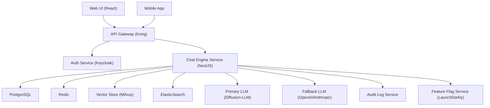

# Context‑Aware Reply
**Type:** feature | **Priority:** 3 | **Status:** todo

## Notes
# 1. Feature Overview  

**Feature:** Context‑Aware Reply (notation 1.c.a)  

**Purpose** – When a user sends a message, the chat engine should retrieve the most relevant knowledge‑base passages (document chunks) and inject them as citations into the assistant’s reply. If the primary diffusion‑LLM cannot produce a confident answer, the system falls back to a secondary LLM and marks the response accordingly.  

**Scope** –  
* Retrieval of relevant chunks using vector similarity + BM25 hybrid.  
* Construction of a citation list (`documentId`, `chunkId`, `snippet`).  
* Automatic fallback to the secondary LLM when confidence < `fallback.confidenceThreshold` or the primary service is unavailable.  
* Persistence of `citations` and `fallback_used` in the `messages` table.  
* Idempotent POST semantics via `Idempotency‑Key`.  

**Business Value** –  
* Improves answer accuracy by grounding responses in tenant‑specific documents.  
* Provides traceability (citations) for compliance and audit.  
* Guarantees service continuity through graceful fallback, reducing perceived downtime.  

---

# 2. User Stories  

| # | User Story | Acceptance Criteria |
|---|------------|----------------------|
| 2.1 | **As a** tenant user, **I want** my chat replies to reference the exact document passages that were used, **so that** I can verify the source of the information. | * The assistant response includes a `citations` array with at least one entry when relevant documents exist. <br>* Each citation contains `documentId`, `chunkId`, and a non‑empty `snippet`. <br>* The `messages.citations` column stores the same JSONB payload. |
| 2.2 | **As a** tenant user, **I want** the system to fall back to a secondary LLM when the primary model is uncertain, **so that** I still receive an answer instead of an error. | * When primary LLM returns a confidence score `< fallback.confidenceThreshold` **or** throws an error, the fallback LLM is invoked. <br>* The resulting message has `fallback_used: true`. <br>* The response is still returned with HTTP 200. |
| 2.3 | **As a** developer, **I want** POST `/api/v1/chat/{conversationId}/message` to be idempotent, **so that** retries from the client do not create duplicate messages. | * Supplying an `Idempotency-Key` header stores a SHA‑256 hash in `messages.idempotency_key`. <br>* Subsequent identical requests return the same `messageId` and content without creating a new row. |
| 2.4 | **As a** tenant admin, **I want** to enable or disable the context‑aware reply per tenant, **so that** I can roll it out gradually. | * Feature flag `feature.contextAwareReply` lives in `system_settings.feature_flags`. <br>* When disabled, the chat endpoint skips retrieval and fallback logic, returning a plain LLM answer with empty `citations`. |
| 2.5 | **As a** compliance officer, **I want** every citation to be stored immutably, **so that** we can audit the source of each assistant answer. | * `messages.citations` column is write‑once after creation (no UPDATE allowed by API). <br>* Audit log entry `action = "chat_reply"` records `messageId`, `conversationId`, `fallbackUsed`, and a hash of the citation payload. |

---

# 3. Technical Specification  

## 3.1 Architecture  



*The Context‑Aware Reply feature lives entirely inside **Chat Engine Service**. It consumes the `feature.contextAwareReply` flag, reads from `messages` and `conversations`, writes citations and fallback status, and emits audit events.*

## 3.2 API Endpoints  

| Method | Path | Idempotency | Request Headers | Request Body | Success Response | Error Responses |
|--------|------|-------------|----------------|--------------|------------------|-----------------|
| **POST** | `/api/v1/chat/{conversationId}/message` | Header `Idempotency-Key` (optional) | `Authorization: Bearer <jwt>`<br>`Idempotency-Key: <string>` (optional) | `UserMessageRequest` (see schema) | `AssistantMessageResponse` (see schema) | 400 INVALID_PAYLOAD, 401 UNAUTHORIZED, 403 FORBIDDEN, 404 CONVERSATION_NOT_FOUND, 429 TOO_MANY_REQUESTS, 502 LLM_PRIMARY_UNAVAILABLE (fallback applied internally, still 200), 503 SERVICE_UNAVAILABLE, 500 INTERNAL_ERROR |
| **GET** | `/api/v1/chat/{conversationId}/messages` | – | `Authorization: Bearer <jwt>` | Query: `?limit=50&cursor=uuid` | `MessageListResponse` (see schema) | 400, 401, 403, 404, 429, 500 |
| **POST** | `/api/v1/chat/{conversationId}/reset` | – | `Authorization: Bearer <jwt>` | – | `ResetResponse` (see schema) | 400, 401, 403, 404, 429, 500 |

### Schemas  

**UserMessageRequest**  

```json
{
  "type": "object",
  "required": ["content"],
  "properties": {
    "content": { "type": "string", "minLength": 1, "maxLength": 2000 }
  },
  "additionalProperties": false
}
```

**AssistantMessageResponse**  

```json
{
  "type": "object",
  "required": ["messageId", "content", "citations", "fallbackUsed", "createdAt"],
  "properties": {
    "messageId": { "type": "string", "format": "uuid" },
    "content": { "type": "string" },
    "citations": {
      "type": "array",
      "items": {
        "type": "object",
        "required": ["documentId", "chunkId"],
        "properties": {
          "documentId": { "type": "string", "format": "uuid" },
          "chunkId": { "type": "string", "format": "uuid" },
          "snippet": { "type": "string" }
        },
        "additionalProperties": false
      }
    },
    "fallbackUsed": { "type": "boolean" },
    "createdAt": { "type": "string", "format": "date-time" }
  },
  "additionalProperties": false
}
```

**MessageListResponse** – same shape as earlier spec, includes `citations` and `fallbackUsed` per message.

**ResetResponse** – as defined earlier.

## 3.3 Data Model  

| Table | Columns (relevant) | Types | Indexes | Notes |
|-------|--------------------|-------|---------|-------|
| `messages` | `id` (PK), `conversation_id` (FK), `role`, `content`, `created_at`, `citations` (JSONB), `fallback_used` (BOOLEAN), `idempotency_key` (VARCHAR) | UUID, UUID, ENUM(`user`,`assistant`), TEXT, TIMESTAMP, JSONB, BOOLEAN, VARCHAR(255) | `idx_messages_conversation` (conversation_id), `idx_messages_created` (created_at), `idx_messages_citations` (GIN), `idx_messages_idempotency` (unique on tenant_id + idempotency_key where not null) | `fallback_used` defaults FALSE. `citations` stores `{documentId,chunkId,snippet}`. |
| `conversations` | `id` (PK), `tenant_id`, `user_id`, `started_at`, `ended_at` | UUID, UUID, UUID, TIMESTAMP, TIMESTAMP | `idx_conversations_tenant` (tenant_id) | One‑to‑many → `messages`. |
| `system_settings` | `tenant_id` (PK), `plan`, `feature_flags` (JSON) | UUID, TEXT, JSON | PK on `tenant_id` | `feature_flags` holds `feature.contextAwareReply` and `fallback.*` keys. |
| `usage_metrics` | `id`, `tenant_id`, `date`, `messages_sent`, `tokens_used` | UUID, UUID, DATE, INTEGER, BIGINT | `idx_usage_tenant_date` (tenant_id, date) | Updated after each assistant reply. |

*No new tables are introduced; the feature only adds data to existing columns.*

## 3.4 Business Logic  

### 3.4.1 Request Flow  

1. **Idempotency Check**  
   * If `Idempotency-Key` header present → hash → look up `messages.idempotency_key` for the tenant.  
   * If a matching message exists → return its `AssistantMessageResponse` immediately.  

2. **Feature‑Flag Guard**  
   * Read `system_settings.feature_flags` for the tenant.  
   * If `feature.contextAwareReply` is `false` → skip retrieval & fallback, call primary LLM directly, set `citations = []`, `fallback_used = false`.  

3. **Context Retrieval**  
   * Embed the user `content` using the same embedding model used for document chunks.  
   * Query **Milvus** for top‑k (default 5) nearest vectors.  
   * For each candidate chunk, fetch the original `content` from `document_chunks` (joined via `embedding_id`).  
   * Optionally re‑rank with BM25 from **ElasticSearch** (hybrid).  
   * Build `citations` array: each entry contains `documentId`, `chunkId`, and a 150‑character `snippet` (trimmed around the match).  

4. **Primary LLM Invocation**  
   * Construct system prompt that includes the retrieved snippets (formatted as “Citation #n: …”).  
   * Call **LLMPrimary** with the prompt and request a **confidence score** (model‑specific).  

5. **Fallback Decision**  
   * If primary call fails (network/5xx) **or** returned confidence `< fallback.confidenceThreshold` (from `system_settings.feature_flags.fallback.confidenceThreshold`), invoke **LLMFallback** with the same prompt (without citations if fallback model cannot handle them).  
   * Set `fallback_used = true`.  

6. **Persist Message**  
   * Insert a new row into `messages` with:  
     * `role = 'assistant'`  
     * `content` = LLM answer  
     * `citations` = JSONB array (or `null` if none)  
     * `fallback_used` = boolean  
     * `idempotency_key` = hashed header value (if supplied)  
   * Update `conversations.ended_at` if the conversation is marked closed.  

7. **Audit & Metrics**  
   * Emit audit log entry (`action = "chat_reply"`).  
   * Increment `usage_metrics.messages_sent` and add token count (from LLM response).  

### 3.4.2 State Machine (Conversation Lifecycle)  

```
idle --> receiving_message --> processing --> replying --> idle
```

* `idle` – waiting for user input.  
* `receiving_message` – POST received, idempotency validated.  
* `processing` – retrieval, LLM call(s), fallback decision.  
* `replying` – message persisted, response sent.  

If `fallback_used = true`, the state machine records a **fallback** flag for observability but continues the same flow.

---

# 4. Security Considerations  

| Aspect | Controls |
|--------|----------|
| **Authentication** | JWT (RS256) validated at API gateway; token contains `tenantId` and `role`. |
| **Authorization** | RBAC – only users with role `member`, `admin`, or `owner` may POST/GET messages. Enforced in service layer and reinforced by PostgreSQL RLS on `tenant_id`. |
| **Input Validation** | JSON‑Schema validation (max 2000 chars, no control characters). Trim whitespace, reject empty strings. |
| **Idempotency** | `Idempotency-Key` header hashed (SHA‑256) and stored in `messages.idempotency_key`; unique index per tenant prevents replay. |
| **Rate Limiting** | Redis token‑bucket per tenant: 20 req/min for `/chat/*`. Exceeding returns `429 TOO_MANY_REQUESTS` with `Retry-After`. |
| **Data Protection** | - `citations` contain only IDs and short snippets (no PII). <br>- All DB columns at rest encrypted (PostgreSQL TDE). <br>- S3 objects encrypted (AES‑256). <br>- TLS 1.3 everywhere (Ingress, internal mTLS). |
| **Audit Logging** | Every chat request, retrieval outcome, and fallback decision writes an immutable entry to `audit_logs` (`action = "chat_reply"`). |
| **Feature‑Flag Security** | Flags stored in `system_settings.feature_flags`; only `admin` role can modify via Admin API. |
| **Compliance** | GDPR – `DELETE /api/v1/conversations/{id}` removes rows from `messages` and clears `citations`. |

---

# 5. Error Handling  

| Situation | HTTP Status | Response Body | Internal Action |
|-----------|-------------|---------------|-----------------|
| Invalid JSON / missing `content` | 400 INVALID_PAYLOAD | `{ "error": "content required, max 2000 chars" }` | Log and audit. |
| Conversation not found / tenant mismatch | 404 CONVERSATION_NOT_FOUND | `{ "error": "Conversation not found" }` | RLS prevents cross‑tenant access. |
| Rate limit exceeded | 429 TOO_MANY_REQUESTS | `{ "error": "Rate limit exceeded", "retryAfter": 30 }` | Increment metric `rate_limit_exceeded`. |
| Primary LLM unavailable (network/5xx) | 200 OK (fallback) | Normal `AssistantMessageResponse` with `fallbackUsed: true` | Record `fallback_used = true`. |
| Both primary and fallback fail | 502 LLM_BOTH_UNAVAILABLE | `{ "error": "All language models unavailable" }` | Increment `llm_failure` metric, alert. |
| Unexpected server error | 500 INTERNAL_ERROR | `{ "error": "Unexpected error, try again later" }` | Capture stack trace, send to Sentry. |

**Retry Strategy** – Client‑side exponential back‑off for 429/502/503. Server does **not** automatically retry LLM calls; fallback is immediate and deterministic.

---

# 6. Testing Plan  

| Test Type | Scope | Tools |
|-----------|-------|-------|
| **Unit** | `retrieveRelevantChunks`, `buildCitations`, `decideFallback`, idempotency hash logic | Jest (TS) |
| **Integration** | End‑to‑end POST flow with mock Milvus, ElasticSearch, LLM services; verify DB rows and audit log | Testcontainers (PostgreSQL, Milvus, ES), SuperTest |
| **Contract** | OpenAPI compliance for `/chat/{conversationId}/message` | Pact |
| **E2E** | UI chat window sends a message, sees citations, fallback flag toggles correctly | Cypress |
| **Performance** | Latency under 500 ms for retrieval + primary LLM; fallback latency < 1 s | k6 |
| **Security** | JWT validation, RLS enforcement, idempotency replay protection | OWASP ZAP, custom scripts |
| **Chaos** | Simulate primary LLM timeout → verify fallback path | LitmusChaos (K8s) |

**Edge Cases** –  
* No relevant chunks → `citations = []`.  
* Empty `Idempotency-Key` header → treat as no idempotency.  
* `fallback.confidenceThreshold` missing → default to `0.6`.  
* Document deleted during retrieval → chunk missing → skip citation.  

---

# 7. Dependencies  

| Dependency | Description | Version / Provider |
|------------|-------------|--------------------|
| **Feature Flag** | `feature.contextAwareReply` flag | Stored in `system_settings.feature_flags` (JSON) |
| **Vector Store** | Milvus (or PGVector) for embedding similarity | Managed service, version 2.x |
| **Search Engine** | ElasticSearch for BM25 re‑ranking | Managed OpenSearch, version 8.x |
| **Primary LLM** | Diffusion‑LLM inference service (internal) | Container image `diffusion-llm:latest` |
| **Fallback LLM** | OpenAI `gpt‑4o` or Anthropic `claude‑3` | API keys in Vault |
| **Message Bus** | Kafka (for audit & analytics) | Confluent Cloud |
| **Cache** | Redis for rate‑limit counters & idempotency hash lookup | Redis 7.x |
| **Auth** | Keycloak OIDC provider | Version 22.x |
| **Observability** | OpenTelemetry SDK, Prometheus, Grafana | Latest stable releases |

All dependencies are already part of the platform; no new services are required for this feature.

---

# 8. Migration & Deployment  

### 8.1 Database Migrations  

No new tables are required. Ensure the following migrations are present (already in production):  

| Version | Script | Description |
|---------|--------|-------------|
| `011-add-message-citations.sql` | Adds `citations` JSONB column + GIN index. |
| `012-add-message-fallback.sql` | Adds `fallback_used` BOOLEAN column (default FALSE). |
| `013-add-idempotency-key.sql` | Adds `idempotency_key` VARCHAR column + unique partial index. |

If a future column (e.g., `confidence_score`) is needed, follow the zero‑downtime pattern: add column with default, back‑fill via background job, then switch code.

### 8.2 Feature‑Flag Rollout  

| Tenant Tier | Flag Default | Rollout Plan |
|-------------|--------------|--------------|
| `beta` plan | `true` | Immediate enable for all beta tenants. |
| `enterprise` plan | `true` | Enable after 48 h monitoring of error rates. |
| `basic` plan | `false` | Keep disabled until stability proven. |

Feature flag key: `feature.contextAwareReply`.  

### 8.3 Deployment Steps  

1. **Build** – Increment version of `chat-engine` Docker image.  
2. **Helm Upgrade** – Deploy new chart with `featureFlags.contextAwareReply` set to the tenant‑specific value (read from DB at startup).  
3. **Canary** – Deploy to a small subset of pods (5 %) with `feature.contextAwareReply = true`. Monitor `fallback_used` and latency.  
4. **Full Rollout** – Gradually increase traffic to 100 % once SLOs are met.  
5. **Rollback** – If error rate > 2 % or latency spikes, revert Helm release to previous image; the flag can be toggled off instantly without redeploy.  

### 8.4 Monitoring & Alerting  

* **Metric** `chat.context_aware.citations_count` – average citations per reply.  
* **Metric** `chat.fallback.rate` – percentage of replies where `fallback_used = true`.  
* **Alert**: `fallback.rate > 0.15` for 5 min → PagerDuty.  
* **Alert**: `chat.response.latency.p95 > 800ms` → Ops team.  

---  

*End of Context‑Aware Reply feature specification.*
