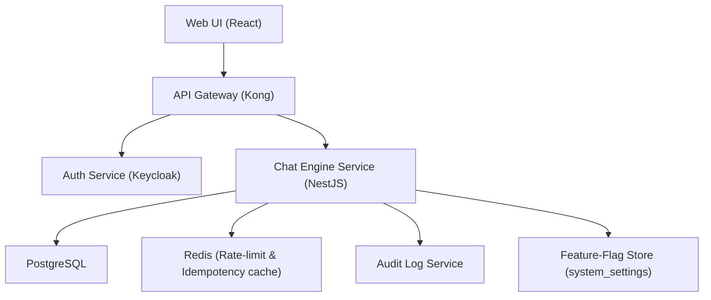

# Conversation History
**Type:** feature | **Priority:** 3 | **Status:** todo

## Notes
# 1. Feature Overview  

**Feature ID:** `1.c.c` – *Conversation History*  

**Purpose** – Enable users to view, paginate, and reset the full message history of a chat session.  

**Scope** –  
* Retrieval of messages for a given conversation (including citations, fallback flag, timestamps).  
* Server‑side pagination via cursor‑based approach.  
* Ability to reset a conversation, which closes the current conversation and creates a new empty one.  

**Business Value** –  
* Improves user experience by allowing users to review prior assistant answers and the context that led to them.  
* Supports compliance (audit) and troubleshooting (why did the model answer this way?).  
* Provides a clean “new chat” action that preserves historical data for analytics while giving users a fresh context.  

---

## 2. User Stories  

| # | User Story | Acceptance Criteria |
|---|------------|----------------------|
| 1 | **As a regular user**, I want to scroll back through my previous messages in a chat, so that I can recall what was discussed. | • `GET /api/v1/chat/{conversationId}/messages` returns messages ordered by `created_at` descending. <br>• Supports `limit` (default 20, max 100) and `cursor` (message UUID) for pagination. <br>• Each message includes `id`, `role`, `content`, `createdAt`, optional `citations`, and `fallbackUsed`. |
| 2 | **As a regular user**, I want to start a new conversation without losing the old one, so that I can ask a fresh question while preserving history for analytics. | • `POST /api/v1/chat/{conversationId}/reset` marks the current conversation `ended_at` and creates a new `conversations` row. <br>• Response contains `newConversationId` and `endedAt`. |
| 3 | **As a regular user**, I want the UI to show a loading skeleton while the history loads, so that the experience feels responsive. | • API returns `200 OK` within 500 ms for the first page (limit ≤ 20). <br>• Subsequent pages are fetched lazily as the user scrolls. |
| 4 | **As an admin**, I want to be able to disable the conversation‑history endpoint for a tenant (e.g., for privacy‑first plans). | • Feature flag `conversationHistory.enabled` stored in `system_settings.feature_flags`. <br>• When disabled, the endpoint returns `403 FORBIDDEN` with error code `FEATURE_DISABLED`. |
| 5 | **As a developer**, I want the POST‑message endpoint to be idempotent, so that retries do not duplicate messages. | • `Idempotency-Key` header is optional; when present the service stores the key in `messages.idempotency_key` (unique per tenant). <br>• Duplicate requests with the same key return the original `AssistantMessageResponse`. |

---

## 3. Technical Specification  

### 3.1 Architecture  



*The Conversation History feature lives entirely inside the **Chat Engine Service** and uses the existing `conversations` and `messages` tables.*  

### 3.2 API Endpoints  

| Method | Path | Idempotency | Request Headers | Request Body | Success Response | Error Responses |
|--------|------|-------------|----------------|--------------|------------------|-----------------|
| **GET** | `/api/v1/chat/{conversationId}/messages` | – | `Authorization: Bearer <jwt>` | Query parameters: <br>`limit` (int, default 20, max 100) <br>`cursor` (UUID, optional) | `MessageListResponse` (see schema) | 400 INVALID_PAYLOAD, 401 UNAUTHORIZED, 403 FORBIDDEN, 404 CONVERSATION_NOT_FOUND, 429 TOO_MANY_REQUESTS, 500 INTERNAL_ERROR |
| **POST** | `/api/v1/chat/{conversationId}/reset` | – | `Authorization: Bearer <jwt>` | – | `ResetResponse` (see schema) | 400, 401, 403, 404, 429, 500 |

#### Schemas  

**MessageListResponse**  

```json
{
  "type": "object",
  "required": ["messages", "nextCursor"],
  "properties": {
    "messages": {
      "type": "array",
      "items": {
        "type": "object",
        "required": ["id", "role", "content", "createdAt"],
        "properties": {
          "id": { "type": "string", "format": "uuid" },
          "role": { "type": "string", "enum": ["user","assistant"] },
          "content": { "type": "string" },
          "createdAt": { "type": "string", "format": "date-time" },
          "citations": {
            "type": "array",
            "items": {
              "type": "object",
              "required": ["documentId", "chunkId"],
              "properties": {
                "documentId": { "type": "string", "format": "uuid" },
                "chunkId": { "type": "string", "format": "uuid" },
                "snippet": { "type": "string" }
              },
              "additionalProperties": false
            }
          },
          "fallbackUsed": { "type": "boolean" }
        },
        "additionalProperties": false
      }
    },
    "nextCursor": { "type": "string", "format": "uuid", "nullable": true }
  },
  "additionalProperties": false
}
```

**ResetResponse**  

```json
{
  "type": "object",
  "required": ["newConversationId", "endedAt"],
  "properties": {
    "newConversationId": { "type": "string", "format": "uuid" },
    "endedAt": { "type": "string", "format": "date-time" }
  },
  "additionalProperties": false
}
```

### 3.3 Data Model  

| Table | Columns Used | Types | Indexes | Notes |
|-------|--------------|-------|---------|-------|
| `conversations` | `id` (PK), `tenant_id`, `user_id`, `started_at`, `ended_at` | UUID, UUID, UUID, TIMESTAMP, TIMESTAMP | `idx_conversations_tenant` (tenant_id) | `ended_at` is `NULL` while active. |
| `messages` | `id` (PK), `conversation_id` (FK), `role`, `content`, `created_at`, `citations`, `fallback_used`, `idempotency_key` | UUID, UUID, ENUM, TEXT, TIMESTAMP, JSONB, BOOLEAN, VARCHAR(255) | `idx_messages_conversation` (conversation_id), `idx_messages_created` (created_at), `idx_messages_citations` (GIN), `idx_messages_idempotency` (unique on tenant_id + idempotency_key where not null) | `fallback_used` defaults FALSE. `citations` stores `{documentId,chunkId,snippet}`. |
| `system_settings` | `tenant_id` (PK), `feature_flags` (JSON) | UUID, JSON | PK on `tenant_id` | Feature flag `conversationHistory.enabled` lives here. |
| `usage_metrics` | `id`, `tenant_id`, `date`, `messages_sent`, `tokens_used` | UUID, UUID, DATE, INTEGER, BIGINT | `idx_usage_tenant_date` (tenant_id, date) | Updated by chat engine after each assistant reply (unchanged by history feature). |

*No new tables or columns are introduced; the feature only reads/writes existing columns.*  

### 3.4 Business Logic  

#### 3.4.1 Retrieve History (GET)  

1. **Auth & RBAC** – Verify JWT, extract `tenant_id`.  
2. **Feature‑Flag Check** – Read `system_settings.feature_flags` for the tenant; if `conversationHistory.enabled` is false → `403`.  
3. **Conversation Ownership** – Query `conversations` where `id = :conversationId` and `tenant_id = :tenantId`. If not found → `404`.  
4. **Pagination** –  
   * If `cursor` is supplied, fetch messages with `created_at < (SELECT created_at FROM messages WHERE id = :cursor)`.  
   * Order by `created_at DESC`.  
   * Limit to `:limit`.  
   * Compute `nextCursor` as the `id` of the last message in the result set (or `null` if fewer than `limit`).  
5. **Response Construction** – Map DB rows to `MessageListResponse`. Include `citations` (JSONB) and `fallback_used`.  
6. **Audit** – Emit an audit log entry `action = "chat_history_read"` with `conversation_id` and `page_size`.  

#### 3.4.2 Reset Conversation (POST)  

1. **Auth & RBAC** – Same as above.  
2. **Feature‑Flag Check** – Optional; if a flag disables reset, return `403`.  
3. **Validate Ownership** – Ensure the conversation belongs to the tenant.  
4. **Transactional Update** – Within a DB transaction:  
   * Set `ended_at = now()` on the existing conversation.  
   * Insert a new row into `conversations` with same `tenant_id`, `user_id`, `started_at = now()`, `ended_at = NULL`.  
5. **Return** – `newConversationId` (UUID of the newly created row) and `endedAt` (timestamp of the old conversation).  
6. **Audit** – Log `action = "chat_conversation_reset"` with both IDs.  

#### 3.4.3 Idempotent Message POST (re‑used)  

*When a client sends a `Idempotency-Key`, the service:  
* Looks up `messages` where `tenant_id = :tenantId` and `idempotency_key = :key`.  
* If found, returns the previously generated `AssistantMessageResponse`.  
* If not, proceeds to normal message handling and stores the key with the newly created assistant message.  

---

## 4. Security Considerations  

| Aspect | Controls |
|--------|----------|
| **Authentication** | JWT (RS256) validated at API gateway; token contains `tenantId` and `role`. |
| **Authorization** | RBAC – only users with role `member` or higher may access the endpoints. Enforced in service layer and reinforced by PostgreSQL RLS on `tenant_id`. |
| **Feature‑Flag Guard** | `conversationHistory.enabled` stored in `system_settings.feature_flags`; only `admin` role can toggle via Admin API. |
| **Input Validation** | Query parameters (`limit`, `cursor`) validated (numeric range, UUID format). `limit` capped at 100. |
| **Rate Limiting** | Redis token‑bucket per tenant: 20 GET /min for `/messages`, 5 POST /min for `/reset`. Exceeding → `429 TOO_MANY_REQUESTS` with `Retry-After`. |
| **Data Protection** | `citations` JSONB contains only IDs and short snippets – no PII. All DB columns encrypted at rest (PostgreSQL TDE). TLS 1.3 everywhere (Ingress, internal mTLS). |
| **Audit Logging** | Every read (`chat_history_read`) and reset (`chat_conversation_reset`) writes an immutable entry to `audit_logs`. |
| **Compliance** | GDPR “right to be forgotten” – deleting a conversation removes rows from `messages` and updates `usage_metrics`. |

---

## 5. Error Handling  

| Situation | HTTP Status | JSON Error Code | Body Example | Internal Action |
|-----------|-------------|-----------------|--------------|-----------------|
| Invalid query parameters (e.g., non‑numeric `limit`) | 400 | `INVALID_QUERY` | `{ "error": "limit must be an integer between 1 and 100" }` | Log, audit. |
| Conversation not found or tenant mismatch | 404 | `CONVERSATION_NOT_FOUND` | `{ "error": "Conversation not found" }` | RLS prevents cross‑tenant access. |
| Feature disabled for tenant | 403 | `FEATURE_DISABLED` | `{ "error": "Conversation history is disabled for this tenant" }` | Increment feature‑flag metric. |
| Rate limit exceeded | 429 | `TOO_MANY_REQUESTS` | `{ "error": "Rate limit exceeded", "retryAfter": 30 }` | Increment `rate_limit_exceeded` metric. |
| Unexpected server error | 500 | `INTERNAL_ERROR` | `{ "error": "Unexpected error, please try again later" }` | Capture stack trace, send to Sentry. |
| Database deadlock / timeout | 503 | `SERVICE_UNAVAILABLE` | `{ "error": "Temporary database issue, retry later" }` | Increment `db_unavailable` metric, alert. |

**Retry Strategy**  
* **GET** – safe to retry up to 3 times with exponential back‑off (client‑side).  
* **POST** – client must not auto‑retry; UI shows “Try again”. Idempotency key prevents duplicate creation if the user manually retries.  

---

## 6. Testing Plan  

| Test Type | Scope | Tools |
|-----------|-------|-------|
| **Unit** | Service methods: pagination logic, cursor calculation, feature‑flag guard. | Jest (TS) / Go test |
| **Integration** | End‑to‑end flow: GET messages with pagination, POST reset, idempotent POST message. Uses Testcontainers for PostgreSQL + Redis. | SuperTest, Testcontainers |
| **Contract** | Verify OpenAPI spec matches implementation. | Pact, OpenAPI validator |
| **E2E** | UI scrolls through history, clicks “New chat”, verifies new conversation ID. | Cypress |
| **Performance** | Load test GET messages with 100‑message pages, ensure < 200 ms latency under 100 concurrent users. | k6 |
| **Security** | OWASP ZAP scan for injection, auth bypass, rate‑limit bypass. | OWASP ZAP, Snyk |
| **Chaos** | Simulate Redis outage while fetching history; expect graceful 503. | LitmusChaos |

**Edge Cases**  
* Empty conversation (no messages) → returns empty array, `nextCursor = null`.  
* `cursor` points to a message that has been deleted → treat as if cursor not supplied (start from most recent).  
* `limit` > 100 → reject with 400.  
* `Idempotency-Key` collision across tenants → prevented by partial unique index (`tenant_id + idempotency_key`).  

---

## 7. Dependencies  

| Dependency | Description |
|------------|-------------|
| **Chat Engine Service** | Implements the endpoints; already depends on `messages` and `conversations`. |
| **System Settings** | Feature flag `conversationHistory.enabled` stored in `system_settings`. |
| **Redis** | Rate‑limit counters and optional caching of recent messages (optional performance optimization). |
| **Audit Log Service** | Consumes audit events emitted by the chat engine. |
| **Frontend UI** | Must add a “History” panel and “New chat” button that call the new endpoints. |
| **API Gateway** | Must forward `Idempotency-Key` header to the service (already supported). |

---

## 8. Migration & Deployment  

### 8.1 Database Migrations  

*No schema changes are required.* The feature only reads existing columns (`messages.citations`, `messages.fallback_used`, `messages.idempotency_key`) and writes a new row in `conversations` on reset.  

If a future tenant‑level flag is added, it will be stored in the existing `system_settings.feature_flags` JSON column – no migration needed.  

### 8.2 Feature‑Flag Rollout  

1. Add `conversationHistory.enabled` (default `true`) to the JSON schema of `system_settings.feature_flags`.  
2. Deploy the updated service behind a **canary** release (5 % of traffic).  
3. Monitor error rates and latency; if stable, increase rollout to 100 %.  

### 8.3 Deployment Steps  

| Step | Action |
|------|--------|
| 1 | Build Docker image for Chat Engine Service (increment version tag). |
| 2 | Update Helm chart values: `featureFlags.conversationHistory.enabled = true` (default). |
| 3 | Deploy to **staging** namespace; run integration tests against a copy of production DB. |
| 4 | Promote to **production** via Helm upgrade. |
| 5 | Verify metrics (`chat_history_requests_total`, `chat_reset_requests_total`) appear in Prometheus. |
| 6 | If any issue, rollback Helm release (`helm rollback <release> <revision>`). |

**Rollback Plan** – Because no DB schema changes are introduced, rolling back simply reverts the Docker image and Helm values. Existing data remains untouched.  

---  

*End of Conversation History (1.c.c) specification.*
