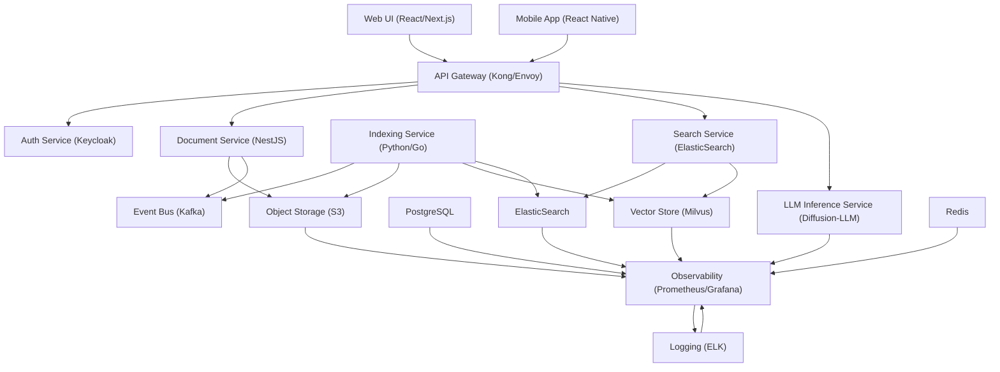

# Document Handling
**Type:** module | **Priority:** 3 | **Status:** todo

## Checklist
- [ ] Document Upload — todo
- [ ] Document Indexing — todo
- [ ] Document Search — todo

## Sub-components
- [Document Upload](./document-upload.md)
- [Document Indexing](./document-indexing.md)
- [Document Search](./document-search.md)

## Notes
# Document Handling – Feature Specification (Module 1.b)

## 1. Feature Overview
**Purpose** – Enable tenants to upload, index, and search their knowledge‑base documents so that the chatbot can retrieve relevant passages during a conversation.  

**Scope** – Covers the complete lifecycle of a document: upload → asynchronous chunking & embedding → searchable storage.  

**Business Value** –  
- Improves answer relevance → higher user satisfaction.  
- Provides a self‑service knowledge‑base for each tenant, reducing support overhead.  
- Generates usage‑based revenue (premium “document search” add‑on).  

---

## 2. User Stories  

| # | User Story | Acceptance Criteria |
|---|------------|----------------------|
| 1 | **As a tenant member**, I want to upload a PDF (or DOCX/TXT) file, so that it becomes part of my knowledge base. | - UI shows an upload button. - API returns `202 Accepted` with `documentId` and `status=processing`. - File size ≤ 50 MiB and MIME type is whitelisted. - An audit log entry `document_upload_success` is created. |
| 2 | **As a tenant owner**, I want to view a list of my documents with status, so that I can monitor processing progress. | - `GET /api/v1/documents` returns paginated list with `id`, `filename`, `status`, `size`, `createdAt`. - Only documents belonging to the tenant are returned (RLS enforced). |
| 3 | **As a tenant member**, I want to search across all my uploaded documents, so that the chatbot can surface relevant passages. | - `GET /api/v1/search?query=…&k=5` returns up to `k` results each containing `documentId`, `chunkId`, `snippet`, `score`. - Results are ordered by descending similarity score. - Search respects tenant isolation. |
| 4 | **As a tenant owner**, I want to delete a document, so that all its data is permanently removed (GDPR “right to be forgotten”). | - `DELETE /api/v1/documents/{id}` returns `204 No Content`. - All related rows in `document_chunks` and `embeddings` are cascade‑deleted. - S3 object and ElasticSearch entries are removed asynchronously. - Audit log entry `document_deleted` is recorded. |
| 5 | **As a system admin**, I want to receive a `409 DUPLICATE_DOCUMENT` when a file with the same checksum is uploaded, so that I can avoid redundant processing. | - If the optional `metadata.checksum` matches an existing document’s checksum, the API returns `409` with the existing `documentId`. |

---

## 3. Technical Specification  

### 3.1 Architecture  

**How the feature plugs in**  
- **Upload** → `Document Service` stores the raw file in S3 and emits `DocumentUploaded` on Kafka.  
- **Indexing** → `Indexing Service` consumes the event, extracts text, creates `document_chunks`, generates embeddings (via LLM), stores vectors in Milvus, and indexes content in ElasticSearch.  
- **Search** → `Search Service` queries ElasticSearch (full‑text) and Milvus (vector similarity) and returns top‑k passages.  
- **RLS** – All DB queries are filtered by `tenant_id` via PostgreSQL row‑level security (`010-rls-documents.sql`).  

### 3.2 API Endpoints  

| Method | Path | Auth | Request | Success Response | Errors |
|--------|------|------|---------|------------------|--------|
| **POST** | `/api/v1/documents` | JWT (role ≥ member) | `multipart/form-data` – `file` (binary); optional JSON `metadata` (e.g., `{ "checksum": "sha256:…" }`) | `202 Accepted` → `UploadResponse` (`documentId`, `status`) | `400 INVALID_PAYLOAD`, `401 UNAUTHORIZED`, `413 PAYLOAD_TOO_LARGE`, `415 UNSUPPORTED_MEDIA_TYPE`, `429 TOO_MANY_REQUESTS`, `409 DUPLICATE_DOCUMENT` |
| **GET** | `/api/v1/documents` | JWT | Query: `?page=`, `?size=`, `?status=` (optional) | `200 OK` → `{ "items": [ { "id":"uuid","filename":"string","status":"ready","size":int,"createdAt":"timestamp" } ], "total":int }` | `401 UNAUTHORIZED`, `403 FORBIDDEN` |
| **GET** | `/api/v1/documents/{id}` | JWT | – | `200 OK` → `{ "id":"uuid","filename":"string","status":"ready","size":int,"createdAt":"timestamp","s3Url":"string" }` | `401 UNAUTHORIZED`, `403 FORBIDDEN`, `404 NOT_FOUND` |
| **DELETE** | `/api/v1/documents/{id}` | JWT (role ≥ owner) | – | `204 No Content` | `401 UNAUTHORIZED`, `403 FORBIDDEN`, `404 NOT_FOUND` |
| **GET** | `/api/v1/search` | JWT | Query: `?query=` (max 512 chars), `?k=` (default 5) | `200 OK` → `{ "results": [ { "documentId":"uuid","chunkId":"uuid","snippet":"string","score":float } ] }` | `400 INVALID_PAYLOAD`, `401 UNAUTHORIZED`, `429 TOO_MANY_REQUESTS` |

**JSON Schemas (inline)**  

- **UploadResponse** – `{ "documentId": "uuid", "status": "processing" }`  
- **SearchResult** – `{ "documentId": "uuid", "chunkId": "uuid", "snippet": "string", "score": 0.0 }`  

All request bodies are validated against the OpenAPI 3.0 contract stored in `api-contracts/`.

### 3.3 Data Model  

| Table | Primary Key | Columns (type) | Indexes | Notes |
|-------|-------------|----------------|---------|-------|
| `documents` | `id` UUID | `tenant_id` UUID, `owner_id` UUID, `filename` VARCHAR, `s3_key` VARCHAR, `status` ENUM(`processing`,`ready`,`failed`,`deleted`), `size` BIGINT, `created_at` TIMESTAMP | `idx_documents_tenant` (tenant_id), `idx_documents_status` (status) | RLS enforces `tenant_id = current_setting('app.tenant_id')`. |
| `document_chunks` | `id` UUID | `document_id` UUID, `content` TEXT, `embedding_id` UUID, `chunk_index` INT | `idx_chunks_doc` (document_id) | `ON DELETE CASCADE` from `documents`. |
| `embeddings` | `id` UUID | `vector` BYTEA (float array) | `idx_embeddings_chunk` (embedding_id) | Row holds reference to Milvus vector. |
| `audit_logs` | `id` UUID | `tenant_id` UUID, `user_id` UUID, `action` VARCHAR, `payload` JSONB, `created_at` TIMESTAMP | `idx_audit_tenant_time` (tenant_id, created_at) | Immutable append‑only log. |

**Relationships**  
- `documents.owner_id → users.id` (FK).  
- `document_chunks.document_id → documents.id` (FK).  
- `document_chunks.embedding_id → embeddings.id` (FK).  

All foreign‑key columns are indexed. Full‑text search on `document_chunks.content` lives in ElasticSearch (outside PostgreSQL).

### 3.4 Business Logic  

#### 3.4.1 Document Upload Workflow  

1. **Validate** MIME type, size, optional checksum.  
2. **Store** file in S3 → obtain `s3_key`.  
3. **Insert** row into `documents` with `status='processing'`.  
4. **Emit** `DocumentUploaded` event (`documentId`, `tenantId`, `ownerId`, `s3_key`).  
5. **Return** `202 Accepted` with `documentId`.  

#### 3.4.2 Indexing Pipeline (Background)  

| Step | Action | Output |
|------|--------|--------|
| **Consume** | `DocumentUploaded` from Kafka | Document metadata |
| **Download** | Pull file from S3 | Local temp file |
| **Extract** | Text extraction (PDFBox, Tika) → split into chunks (≈ 500 tokens) | `document_chunks` rows (status `processing`) |
| **Embed** | Call LLM embedding endpoint → vector | `embeddings` rows |
| **Persist** | Store chunk `content` in PostgreSQL, `vector` in Milvus, full‑text in ElasticSearch | Searchable data |
| **Update** | Set `documents.status='ready'` (or `failed` on error) | Final status |
| **Audit** | Write `document_indexed` or `document_index_failed` log entry | Traceability |

All steps are idempotent; retries are safe because chunk IDs are deterministic (`documentId + chunkIndex`).  

#### 3.4.3 Search Workflow  

1. **Receive** query string from API.  
2. **Generate** query embedding via LLM (same model used for indexing).  
3. **Vector Search** in Milvus → top‑k candidate chunk IDs.  
4. **Full‑Text Boost** – ElasticSearch query on `document_chunks.content` with the same query; combine scores (e.g., weighted sum).  
5. **Return** merged, sorted list of `SearchResult` objects.  

#### 3.4.4 Deletion Workflow  

1. **Authorize** owner or admin.  
2. **Set** `documents.status='deleted'` (soft flag) and immediately **DELETE** row (ON DELETE CASCADE removes chunks & embeddings).  
3. **Publish** `DocumentDeleted` event.  
4. **Async Workers**:  
   - Remove S3 object.  
   - Delete ElasticSearch documents.  
   - Remove Milvus vectors.  
5. **Audit** `document_deleted`.  

---

## 4. Security Considerations  

| Aspect | Controls |
|--------|----------|
| **Authentication** | JWT (RS256) validated at API gateway; token contains `tenantId` and `role`. |
| **Authorization** | RBAC: `member` can upload/search; `owner`/`admin` can delete. Enforced in service layer and reinforced by PostgreSQL RLS (`010-rls-documents.sql`). |
| **Transport Security** | TLS 1.3 on all ingress and internal mesh (mTLS). |
| **Input Validation** | - MIME whitelist (PDF, DOCX, TXT). - File size ≤ 50 MiB. - SHA‑256 checksum verification if supplied. - Query string length ≤ 512 chars; HTML/JS stripped before logging. |
| **Data Protection** | - S3 bucket default encryption (AES‑256). - No PII stored in `documents` (only filename & key). - Embeddings stored in Milvus with at‑rest encryption (KMS). |
| **Rate Limiting** | Redis token‑bucket per tenant: 10 uploads / minute, 20 searches / second. Exceeding returns `429` with `Retry-After`. |
| **Audit Logging** | Every upload, indexing start/completion, and deletion writes an immutable entry to `audit_logs`. Failures also logged with appropriate `action`. |
| **Compliance** | GDPR “right to be forgotten” – `DELETE /documents/{id}` permanently removes all related data. |
| **Secrets Management** | All credentials (S3, Milvus, DB) stored in HashiCorp Vault and injected as Kubernetes secrets. |

---

## 5. Error Handling  

| HTTP | JSON Error Code | Message | Client Guidance |
|------|----------------|---------|-----------------|
| 400 | `INVALID_PAYLOAD` | Request body or file fails validation (e.g., missing file, unsupported MIME). | Fix payload and retry. |
| 401 | `UNAUTHORIZED` | Missing or invalid JWT. | Re‑authenticate. |
| 403 | `FORBIDDEN` | RBAC violation or tenant mismatch. | Show access‑denied UI. |
| 404 | `NOT_FOUND` | Document or chunk not found. | Verify ID. |
| 409 | `DUPLICATE_DOCUMENT` | Same checksum already uploaded. | Use returned `documentId`. |
| 413 | `PAYLOAD_TOO_LARGE` | File exceeds allowed size. | Compress or split file. |
| 415 | `UNSUPPORTED_MEDIA_TYPE` | File type not allowed. | Upload PDF/DOCX/TXT only. |
| 429 | `TOO_MANY_REQUESTS` | Rate limit exceeded. | Exponential back‑off, respect `Retry-After`. |
| 500 | `INTERNAL_ERROR` | Unexpected server error. | Show generic error, retry after a short delay. |

**Retry Strategy**  
- **Idempotent** endpoints (`GET /documents`, `GET /documents/{id}`, `GET /search`) may be automatically retried up to 3 times with exponential back‑off.  
- **Non‑idempotent** (`POST /documents`) must not be auto‑retried; UI prompts the user to retry manually.  

---

## 6. Testing Plan  

| Test Level | Scope | Tools | Example Cases |
|------------|-------|-------|---------------|
| **Unit** | Service functions, validation logic, event publishing | Jest (TS), Go test, PyTest | Validate MIME whitelist, checksum verification, chunk split algorithm. |
| **Integration** | End‑to‑end flow through API, DB, Kafka, S3 (Testcontainers) | SuperTest, Docker‑Compose, Testcontainers | Upload a PDF → verify `documents` row, S3 object, `DocumentUploaded` event, and final `ready` status. |
| **Contract** | OpenAPI & Avro schema compliance | Pact, Swagger‑CLI | Ensure `POST /documents` response matches `UploadResponse` schema. |
| **E2E** | UI interactions and full user journey | Cypress, Playwright | Sign‑in → upload → wait for indexing → search → verify snippet relevance. |
| **Performance** | Indexing throughput, search latency under load | k6, Locust | 100 concurrent uploads, 200 concurrent searches; assert < 200 ms 95th percentile. |
| **Security** | OWASP checks, dependency scanning | OWASP ZAP, Snyk | Verify no XSS in query string, no vulnerable npm packages. |
| **Chaos** | Resilience to service failures | LitmusChaos (K8s) | Kill the Kafka broker during indexing; ensure message is re‑processed after restart. |

All tests run in CI on every PR; nightly pipeline runs full integration & performance suites on a staging cluster.

---

## 7. Dependencies  

| Dependency | Type | Reason |
|------------|------|--------|
| **User Management (1.a)** | Internal feature | Provides `tenant_id`, `owner_id`, and RBAC context for all document operations. |
| **Object Storage (S3/MinIO)** | External service | Stores raw document binaries. |
| **Kafka** | Internal messaging | Event bus for `DocumentUploaded`, `DocumentDeleted`, `IndexingCompleted`. |
| **ElasticSearch** | External search engine | Full‑text indexing of document chunks. |
| **Milvus** | Vector database | Stores embeddings for semantic search. |
| **LLM Inference Service** | Internal microservice | Generates embeddings and optional query vectors. |
| **Audit Logging** | Internal table (`audit_logs`) | Required for compliance and observability. |
| **Feature Flag Service** | Internal (LaunchDarkly/Unleash) | Allows gradual rollout of the Document Handling module. |
| **Redis** | Cache & rate‑limit store | Token‑bucket counters per tenant. |

---

## 8. Migration & Deployment  

### 8.1 Database Migrations  
No new tables are introduced. The feature relies on existing migrations:  

| Version | Script | Description |
|---------|--------|-------------|
| `006-add-documents-table.sql` | Creates `documents` |
| `007-add-document-chunks.sql` | Creates `document_chunks` |
| `008-add-embeddings.sql` | Creates `embeddings` |
| `009-index-documents-status.sql` | Index on `documents(status)` |
| `010-rls-documents.sql` | RLS policy `tenant_id = current_setting('app.tenant_id')` |

If a future change (e.g., adding a `checksum` column) is needed, follow the zero‑downtime pattern: add column with default, back‑fill via background job, then switch code.

### 8.2 Feature Flags  
- Flag name: `document_handling_enabled`.  
- Default: `true` for all tenants on production.  
- Can be toggled per‑tenant for beta testing or staged roll‑out.  

### 8.3 Deployment Steps  

1. **Build Docker images** for `document-service`, `indexing-service`, `search-service`.  
2. **Helm upgrade** with new image tags and flag values.  
3. **Run DB migrations** (Prisma Migrate) as a pre‑upgrade hook.  
4. **Rollout**:  
   - Deploy new pods with `readinessProbe` that checks `/health`.  
   - Use **Blue‑Green** or **Canary** (10 % of traffic) for the first 5 minutes; monitor error rate via Prometheus.  
5. **Rollback**:  
   - If error rate > 1 % or latency spikes, revert Helm release to previous version.  
   - RLS and audit logs remain unchanged; no data loss.  

### 8.4 Observability  

- **Metrics**: `document_upload_seconds`, `indexing_latency_seconds`, `search_latency_seconds`.  
- **Alerts**: `document_upload_failed > 5 %` or `search_error_rate > 2 %`.  
- **Logs**: Structured JSON logs include `tenantId`, `documentId`, `action`.  

---  

*End of Document Handling feature specification.*
