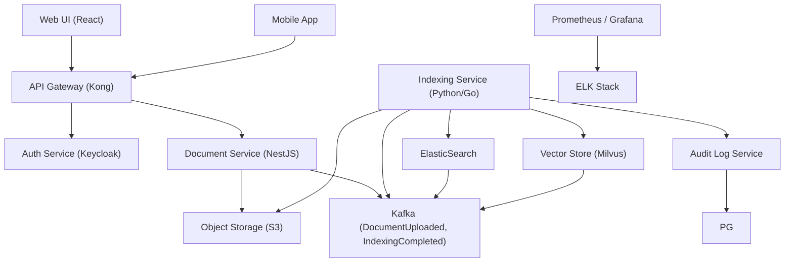

# Document Indexing
**Type:** feature | **Priority:** 3 | **Status:** todo

## Notes
# Document Indexing – Feature Specification (1.b.b)

## 1. Feature Overview
**Purpose** – Enable tenants to upload arbitrary documents (PDF, DOCX, TXT) and have the system automatically extract text, chunk it, generate vector embeddings, and make the content searchable via both BM25 and semantic similarity.  

**Scope** – Covers the end‑to‑end flow from upload → background indexing → searchable state. No new database tables are introduced; the feature re‑uses the existing `documents`, `document_chunks`, `embeddings`, and `audit_logs` tables.  

**Business Value** –  
* Turns raw files into knowledge‑base material that the chatbot can reference, improving answer relevance.  
* Provides a self‑service “knowledge‑base as a service” that differentiates the SaaS offering.  
* Enables per‑tenant usage‑based billing (indexed documents, search queries).  

---

## 2. User Stories  

| # | User Story | Acceptance Criteria |
|---|------------|----------------------|
| 1 | **As a tenant member**, I want to upload a PDF file, so that it becomes part of my knowledge base. | * File is accepted via `POST /api/v1/documents`.<br>* Response returns `202 Accepted` with a `documentId` and status `processing`.<br>* Audit log entry `document_upload` is created.<br>* File is stored in S3 under the tenant’s bucket. |
| 2 | **As a tenant owner**, I want to see the processing status of my uploaded document, so that I know when it is ready for search. | * `GET /api/v1/documents/{id}` returns `status` (`processing`, `ready`, `failed`, `deleted`).<br>* Status transitions only via background workers; no manual mutation. |
| 3 | **As a tenant member**, I want to search across all my indexed documents, so that I can retrieve relevant passages for the chatbot. | * `GET /api/v1/search?query=…&k=5` returns a list of `SearchResult` objects with `documentId`, `chunkId`, `snippet`, and relevance `score`.<br>* Results are ordered by combined BM25 + vector similarity score.<br>* Only documents with `status='ready'` are considered. |
| 4 | **As a tenant owner**, I want to delete a document, so that it is removed from storage and no longer appears in search results. | * `DELETE /api/v1/documents/{id}` returns `204 No Content`.<br>* Background cascade deletes `document_chunks` and `embeddings` (via FK `ON DELETE CASCADE`).<br>* S3 object and ElasticSearch index entry are removed asynchronously.<br>* Audit log entry `document_deleted` is recorded. |
| 5 | **As a system operator**, I want the indexing pipeline to be resilient to failures, so that a single bad file does not block other uploads. | * Failures are captured in `audit_logs` with `action='document_indexing_failed'`.<br>* Document status is set to `failed`.<br>* Retry queue can be manually re‑triggered via admin UI. |

---

## 3. Technical Specification  

### 3.1 Architecture  



*The Document Indexing feature plugs into the existing event‑driven pipeline. The Document Service stores the raw file and emits a `DocumentUploaded` event. The Indexing Service consumes the event, performs OCR/text extraction, chunking, embedding generation, and writes results to ElasticSearch (BM25) and Milvus (vector). All state changes are persisted in the existing tables and reflected in the audit log.*

### 3.2 API Endpoints  

| Method | Path | Auth | Request | Success Response | Errors |
|--------|------|------|---------|------------------|--------|
| **POST** | `/api/v1/documents` | JWT (role ≥ member) | `multipart/form-data` – `file` (binary), optional `metadata` (JSON) | `202 Accepted` → `UploadResponse` (`documentId`, `status`) | `400 INVALID_PAYLOAD`, `401 UNAUTHORIZED`, `413 PAYLOAD_TOO_LARGE`, `429 TOO_MANY_REQUESTS`, `409 DUPLICATE_DOCUMENT` |
| **GET** | `/api/v1/documents/{id}` | JWT | – | `200 OK` → `DocumentDetail` (`id`, `filename`, `status`, `size`, `createdAt`, `s3Url`) | `401 UNAUTHORIZED`, `403 FORBIDDEN`, `404 NOT_FOUND` |
| **GET** | `/api/v1/search` | JWT | Query: `?query=` (≤ 512 chars), optional `?k=` (default 5) | `200 OK` → `{ "results": [ SearchResult, … ] }` | `400 INVALID_PAYLOAD`, `401 UNAUTHORIZED`, `429 TOO_MANY_REQUESTS` |
| **DELETE** | `/api/v1/documents/{id}` | JWT (role ≥ owner) | – | `204 No Content` | `401 UNAUTHORIZED`, `403 FORBIDDEN`, `404 NOT_FOUND` |

#### JSON Schemas (inline)

*UploadResponse*  

```json
{
  "documentId": "uuid",
  "status": "processing"
}
```

*DocumentDetail*  

```json
{
  "id": "uuid",
  "filename": "string",
  "status": "ready",
  "size": 123456,
  "createdAt": "2024-01-01T12:00:00Z",
  "s3Url": "https://s3.amazonaws.com/bucket/key"
}
```

*SearchResult*  

```json
{
  "documentId": "uuid",
  "chunkId": "uuid",
  "snippet": "string",
  "score": 0.87
}
```

All request bodies are validated against the OpenAPI 3.0 contract stored in `api-contracts/`.

### 3.3 Data Model  

| Table | Primary Key | Columns (type) | Indexes | Relationships |
|-------|-------------|----------------|---------|---------------|
| `documents` | `id` UUID | `tenant_id` UUID, `owner_id` UUID, `filename` VARCHAR, `s3_key` VARCHAR, `status` ENUM(`processing`,`ready`,`failed`,`deleted`), `size` BIGINT, `created_at` TIMESTAMP | `idx_documents_tenant` (tenant_id), `idx_documents_status` (status) | RLS enforces `tenant_id = current_setting('app.tenant_id')`. |
| `document_chunks` | `id` UUID | `document_id` UUID, `content` TEXT, `embedding_id` UUID, `chunk_index` INT | `idx_chunks_doc` (document_id) | `ON DELETE CASCADE` from `documents`. |
| `embeddings` | `id` UUID | `vector` BYTEA (float array) | `idx_embeddings_chunk` (embedding_id) | Row holds reference to Milvus vector. |
| `audit_logs` | `id` UUID | `tenant_id` UUID, `user_id` UUID, `action` VARCHAR, `payload` JSONB, `created_at` TIMESTAMP | `idx_audit_tenant_time` (tenant_id, created_at) | Immutable append‑only log. |

*No new tables are added.* All foreign‑key columns are indexed for join performance. Full‑text search on `document_chunks.content` lives in ElasticSearch; vector similarity lives in Milvus.

### 3.4 Business Logic  

1. **Upload Flow**  
   * API receives multipart file → validates MIME type, size ≤ 50 MiB, optional SHA‑256 checksum.  
   * Stores file in S3 (`s3_key = <tenant>/<uuid>/<filename>`).  
   * Inserts a row into `documents` with `status='processing'`.  
   * Emits `DocumentUploaded` event (`documentId`, `tenantId`, `s3Key`).  

2. **Indexing Worker** (consumes `DocumentUploaded`)  
   * Retrieves file from S3.  
   * **Text Extraction** – PDF → OCR (Tesseract) or DOCX → plain text.  
   * **Chunking** – Split into overlapping windows (e.g., 1 k characters, 200‑char overlap).  
   * For each chunk:  
     * Store raw text in `document_chunks` (`content`, `chunk_index`).  
     * Call embedding model (Diffusion‑LLM encoder) → vector.  
     * Insert vector into Milvus, obtain `embedding_id`.  
     * Update `document_chunks.embedding_id`.  
   * Bulk‑index chunk text into ElasticSearch (BM25).  
   * Update `documents.status='ready'`.  
   * Emit `IndexingCompleted` event and audit log entry `document_indexed`.  

3. **Search Flow**  
   * UI sends query → API validates length.  
   * Service performs:  
     * **BM25** query to ElasticSearch → top‑k chunk IDs with scores.  
     * **Vector** query: encode query via same embedding model, query Milvus → top‑k chunk IDs.  
   * Merge both result sets, compute combined score (e.g., weighted sum).  
   * Retrieve `documentId`, `snippet` (highlighted text) from `document_chunks`.  
   * Return ordered `SearchResult` list.  

4. **Deletion Flow**  
   * `DELETE /documents/{id}` sets `status='deleted'` (soft) then issues `DELETE FROM documents WHERE id=:id`.  
   * PostgreSQL cascade removes `document_chunks` and `embeddings`.  
   * Background job removes S3 object and ElasticSearch documents.  

5. **Observability**  
   * Prometheus counters: `documents_uploaded_total`, `documents_indexed_total`, `search_latency_seconds`.  
   * Structured audit logs for every state transition.  

---

## 4. Security Considerations  

| Aspect | Controls |
|--------|----------|
| **Authentication** | JWT (RS256) validated at API gateway; token includes `tenantId` and `role`. |
| **Authorization** | RBAC: `member` can upload/search; `owner`/`admin` can delete. Enforced in service layer and reinforced by PostgreSQL RLS (`010-rls-documents.sql`). |
| **Transport Security** | TLS 1.3 everywhere (Ingress, internal mesh). |
| **Input Validation** | - MIME whitelist (PDF, DOCX, TXT).<br>- File size ≤ 50 MiB.<br>- SHA‑256 checksum verification if supplied.<br>- Query string length ≤ 512 chars; HTML/JS stripped before logging. |
| **Data Protection** | - S3 bucket default encryption (AES‑256).<br>- No PII stored in `documents` (only filename & S3 key).<br>- Embeddings stored in Milvus with at‑rest encryption (KMS). |
| **Rate Limiting** | Redis token‑bucket per tenant: 10 uploads / minute, 20 searches / second. Exceeding returns `429 TOO_MANY_REQUESTS` with `Retry-After`. |
| **Audit Logging** | Every upload, indexing start/completion, and deletion writes an immutable entry to `audit_logs`. Failures also logged with appropriate `action`. |
| **Compliance** | GDPR “right to be forgotten” – `DELETE /documents/{id}` permanently removes S3 object, DB rows, and embeddings. |
| **Secrets Management** | All credentials (S3, Milvus, DB) stored in HashiCorp Vault and injected as Kubernetes secrets. |

---

## 5. Error Handling  

| HTTP | JSON Error Code | Message | Client Guidance |
|------|----------------|---------|-----------------|
| 400 | `INVALID_PAYLOAD` | Request body or file fails validation (e.g., missing file, unsupported MIME). | Fix request and retry. |
| 401 | `UNAUTHORIZED` | Missing or invalid JWT. | Re‑authenticate. |
| 403 | `FORBIDDEN` | RBAC violation or tenant mismatch. | Show access‑denied UI. |
| 404 | `NOT_FOUND` | Document not found (GET/DELETE). | Verify ID. |
| 409 | `DUPLICATE_DOCUMENT` | Same checksum already uploaded. | Use returned `documentId`. |
| 413 | `PAYLOAD_TOO_LARGE` | File exceeds allowed size. | Compress or split file. |
| 415 | `UNSUPPORTED_MEDIA_TYPE` | File type not allowed. | Upload PDF/DOCX/TXT only. |
| 429 | `TOO_MANY_REQUESTS` | Rate limit exceeded. | Exponential back‑off, respect `Retry-After`. |
| 500 | `INTERNAL_ERROR` | Unexpected server error. | Show generic error, retry after a short delay. |

**Retry Strategy**  
* **Idempotent** endpoints (`GET /documents`, `GET /documents/{id}`, `GET /search`) may be automatically retried (max 3 attempts, exponential back‑off).  
* **Non‑idempotent** (`POST /documents`) must not be auto‑retried; UI shows “Try again” after user confirmation.  

---

## 6. Testing Plan  

| Test Type | Scope | Tools |
|-----------|-------|-------|
| **Unit** | Validation logic, S3 upload wrapper, chunking algorithm, embedding request builder. | Jest (TS), Go test (if Go service), PyTest (Python). |
| **Integration** | End‑to‑end flow: upload → `DocumentUploaded` event → indexing worker → DB updates → search results. | Testcontainers (PostgreSQL, Kafka, ElasticSearch, Milvus), SuperTest for API. |
| **Contract** | Verify that providers honor OpenAPI and Avro schemas. | Pact (consumer‑driven). |
| **E2E** | UI upload, status polling, search UI, deletion flow. | Cypress (web), Playwright (mobile). |
| **Performance** | Indexing throughput (documents/min), search latency (< 200 ms for 5‑result query). | k6, Locust. |
| **Security** | OWASP Top‑10 checks, JWT validation, RLS enforcement. | OWASP ZAP, Snyk. |
| **Chaos** | Simulate Kafka broker failure, Milvus downtime. | LitmusChaos (K8s). |

All tests run in CI on every PR; nightly pipeline runs full integration suite against a staging cluster.

---

## 7. Dependencies  

| Dependency | Type | Reason |
|------------|------|--------|
| **Document Service** (existing) | Internal service | Handles upload endpoint and S3 storage. |
| **Kafka** (existing) | Message bus | Publishes `DocumentUploaded` and consumes `IndexingCompleted`. |
| **ElasticSearch** (existing) | Full‑text search engine | BM25 indexing of chunk content. |
| **Milvus** (existing) | Vector database | Stores embeddings for semantic search. |
| **S3 / MinIO** (existing) | Object storage | Persists raw document files. |
| **LLM Embedding Model** (Diffusion‑LLM) | External inference service | Generates dense vectors for each chunk. |
| **Feature‑Flag Service** (LaunchDarkly/Unleash) | Internal | Controls `document_indexing_enabled` flag per tenant. |
| **Audit Log Service** (existing) | Internal | Persists immutable audit entries. |
| **Prometheus / Grafana** (existing) | Observability | Metrics for indexing latency, error rates. |

---

## 8. Migration & Deployment  

### Database Migrations  
No new tables are required. Ensure the following migrations are present (already in production):  

| Version | Script | Description |
|---------|--------|-------------|
| `006-add-documents-table.sql` | Creates `documents`. |
| `007-add-document-chunks.sql` | Creates `document_chunks`. |
| `008-add-embeddings.sql` | Creates `embeddings`. |
| `009-index-documents-status.sql` | Index on `documents(status)`. |
| `010-rls-documents.sql` | RLS policy `tenant_id = current_setting('app.tenant_id')`. |

If a future column (e.g., `checksum`) is needed, follow the zero‑downtime pattern: add column with default, back‑fill via background job, then switch code.

### Feature Flag  
*Flag name*: `document_indexing_enabled` (boolean).  
*Default*: `true` for all tenants.  
*Management*: LaunchDarkly/Unleash UI; can be toggled per‑tenant for staged rollouts.

### Deployment Steps  

1. **Build Docker images** for Document Service and Indexing Service (if changed).  
2. **Update Helm chart** values:  
   * `replicaCount` for indexing workers (scale based on queue depth).  
   * `featureFlags.documentIndexingEnabled` flag value.  
3. **Apply migrations** (if any) via Flyway/Prisma in a rolling fashion.  
4. **Rollout** using Canary deployment: 5 % of pods receive new image, monitor `documents_indexed_total` and error rate; then promote to 100 %.  
5. **Rollback** – If error rate > 1 % or latency spikes, revert Helm release to previous version; the RLS policy and existing data remain unchanged.  

All changes are version‑controlled and traceable via Git tags and Helm release notes.  

---  

*End of Document Indexing feature specification.*
