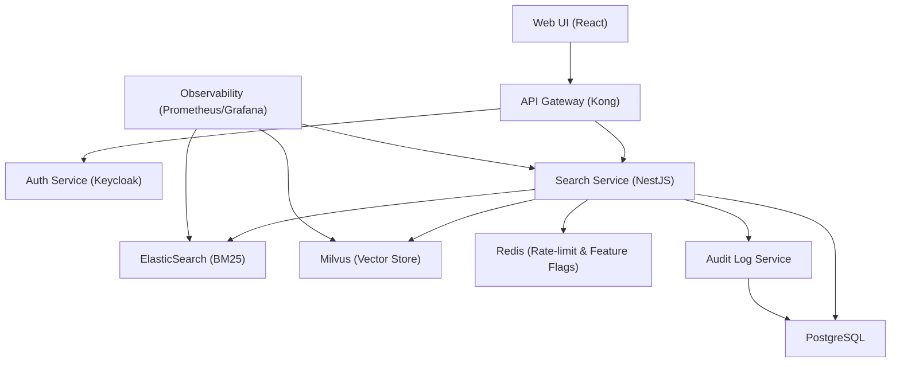

# Document Search
**Type:** feature | **Priority:** 3 | **Status:** todo

## Notes
# Document Search – Feature Specification (1.b.c)

## 1. Feature Overview
**Purpose** – Enable end‑users to retrieve relevant passages from previously uploaded documents using a hybrid BM25 + vector similarity search.  
**Scope** – Read‑only search across `document_chunks` (full‑text) and their embeddings (Milvus). No writes to the relational DB are performed.  
**Business Value** –  
* Reduces time for support agents to locate policy information.  
* Increases user satisfaction by surfacing precise answers from internal knowledge bases.  
* Provides audit‑ready logs for compliance (GDPR, SOC 2).  

---

## 2. User Stories  

| # | User Story | Acceptance Criteria |
|---|------------|----------------------|
| 1 | **As a tenant member**, I want to type a natural‑language query and see the top‑k most relevant document snippets, so that I can quickly find the information I need. | * Query parameter `query` is required and ≤ 512 chars.<br>* Optional `k` defaults to 5, max 20.<br>* Response returns an array of `SearchResult` objects ordered by descending `score`.<br>* Each result contains `documentId`, `chunkId`, `snippet` (highlighted), and `score` (0‑1). |
| 2 | **As a tenant admin**, I want every search request to be recorded in `audit_logs` with tenant, user, and query details, so that we can demonstrate compliance. | * After a successful response, an immutable row is inserted into `audit_logs` with `action = "search"` and a JSON payload `{ query, k, resultCount }`.<br>* The audit entry respects RLS (`tenant_id = current_setting('app.tenant_id')`). |
| 3 | **As a developer**, I want the search endpoint to respect the tenant’s feature flag `documentSearch`, so that we can roll the capability out gradually. | * If the flag is disabled for the tenant, the endpoint returns `403 FORBIDDEN` with error code `FEATURE_DISABLED`. |
| 4 | **As a security officer**, I want rate‑limiting per tenant to protect the search service from abuse, so that system stability is maintained. | * Redis token‑bucket limits to 20 requests / second per tenant.<br>* Exceeding returns `429 TOO_MANY_REQUESTS` with a `Retry-After` header. |
| 5 | **As a user with a slow network**, I want the service to return a partial result set if the vector store is temporarily unavailable, so that I still get useful BM25 matches. | * If Milvus query fails, the service falls back to ElasticSearch only and returns a warning flag `vectorFallback: true` in the response. |

---

## 3. Technical Specification  

### 3.1 Architecture  



*The Search Service* reads from ElasticSearch and Milvus, joins the results with `documents` (via `document_id`) to fetch metadata, and writes a single audit entry to `audit_logs`. No new tables are created.

### 3.2 API Endpoints  

| Method | Path | Auth | Query Parameters | Success Response | Errors |
|--------|------|------|------------------|------------------|--------|
| **GET** | `/api/v1/search` | JWT (role ≥ member) | `query` (string, required, max 512) <br> `k` (int, optional, default = 5, max = 20) | `200 OK` → `{ "results": [ SearchResult, … ], "vectorFallback": false }` | `400 INVALID_PAYLOAD` (missing/empty query, exceeds length) <br>`401 UNAUTHORIZED` <br>`403 FEATURE_DISABLED` <br>`429 TOO_MANY_REQUESTS` <br>`500 INTERNAL_ERROR` |

**Request Example**

```
GET /api/v1/search?query=refund%20policy&k=8
Authorization: Bearer <jwt>
```

**Response Schema (`SearchResult`)**

```json
{
  "title": "SearchResult",
  "type": "object",
  "required": ["documentId","chunkId","snippet","score"],
  "properties": {
    "documentId": { "type": "string", "format": "uuid" },
    "chunkId":    { "type": "string", "format": "uuid" },
    "snippet":    { "type": "string" },
    "score":      { "type": "number" }
  },
  "additionalProperties": false
}
```

**Full Response Example**

```json
{
  "results": [
    {
      "documentId": "c1a2b3d4-5678-90ab-cdef-1234567890ab",
      "chunkId":    "d4c3b2a1-8765-43fe-dcba-0987654321fe",
      "snippet":    "Our refund policy states that ...",
      "score":      0.92
    },
    {
      "documentId": "e5f6g7h8-1112-1314-1516-171819202122",
      "chunkId":    "h8g7f6e5-2121-2223-2425-262728293031",
      "snippet":    "Customers may request a refund within 30 days ...",
      "score":      0.87
    }
  ],
  "vectorFallback": false
}
```

### 3.3 Data Model  

| Table | Primary Key | Relevant Columns | Indexes Used by Search |
|-------|-------------|------------------|------------------------|
| `documents` | `id` UUID | `tenant_id`, `status`, `filename`, `s3_key` | `idx_documents_status` (filter `status='ready'`) |
| `document_chunks` | `id` UUID | `document_id`, `content`, `embedding_id`, `chunk_index` | `idx_chunks_doc` (join to `documents`) |
| `embeddings` | `id` UUID | `vector` (BYTEA) | `idx_embeddings_chunk` (lookup by `embedding_id`) |
| `audit_logs` | `id` UUID | `tenant_id`, `user_id`, `action`, `payload`, `created_at` | `idx_audit_tenant_time` (filter by tenant) |

*No new tables are added.* The search service performs:

1. **BM25** query on ElasticSearch index of `document_chunks.content`.  
2. **Vector** similarity query on Milvus using `embedding_id` → `embeddings.vector`.  
3. **Join** results with `documents` (via `document_id`) to ensure `status='ready'` and tenant isolation (RLS).  

All joins are performed in‑memory after retrieving IDs; no additional DB writes occur.

### 3.4 Business Logic  

1. **Feature‑Flag Check** – Retrieve `documentSearch` flag from Redis for the tenant. If disabled → `403`.  
2. **Rate‑Limit** – Token‑bucket per tenant (`20 req/s`). Exceeded → `429`.  
3. **Input Validation** –  
   * Trim whitespace, enforce max length 512.  
   * Reject queries containing disallowed characters (HTML/JS).  
4. **Search Pipeline**  
   * **Step A – BM25**: Call ElasticSearch `_search` with `query` and `size = k`. Retrieve `chunkId` + BM25 score.  
   * **Step B – Vector**: Resolve `embedding_id` for each `chunkId` (cached mapping). Query Milvus for top‑k vectors, get similarity scores.  
   * **Step C – Merge**: Compute combined score `combined = α·BM25 + (1‑α)·vector` (α = 0.6). Sort descending, keep top k.  
   * **Step D – Enrich**: For each selected `chunkId`, fetch `documentId` and `filename` (optional UI use) from PostgreSQL (single batched query). Build `snippet` by highlighting query terms (server‑side).  
5. **Fallback** – If Milvus query fails, skip vector step, set `vectorFallback: true`, return BM25‑only results.  
6. **Audit Logging** – Insert a row into `audit_logs` with `action = "search"` and payload `{ query, k, resultCount, vectorFallback }`. RLS guarantees tenant isolation.  

---

## 4. Security Considerations  

| Aspect | Controls |
|--------|----------|
| **Authentication** | JWT (RS256) validated at API gateway; token contains `tenantId` and `role`. |
| **Authorization** | RBAC: any role ≥ `member` may call the endpoint. Additional per‑tenant flag `documentSearch` must be enabled. |
| **Transport** | TLS 1.3 enforced on ingress and internal service mesh (mTLS). |
| **Input Validation** | Query length ≤ 512 chars; HTML/JS stripped; Unicode normalization. |
| **Data Protection** | No PII stored in `document_chunks.content`. All data at rest encrypted (PostgreSQL, ElasticSearch, Milvus, S3). |
| **Rate Limiting** | Redis token‑bucket per tenant (20 req/s). |
| **Audit Logging** | Immutable entry per search stored in `audit_logs`; RLS enforces tenant isolation. |
| **Compliance** | GDPR “right to be forgotten”: deleting a document removes its chunks, embeddings, and ElasticSearch entries, ensuring they never appear in future searches. |

---

## 5. Error Handling  

| HTTP | Error Code | Message | Client Guidance |
|------|------------|---------|-----------------|
| 400 | `INVALID_PAYLOAD` | Missing/empty `query` or exceeds 512 chars. | Trim query and retry. |
| 401 | `UNAUTHORIZED` | Missing or invalid JWT. | Re‑authenticate. |
| 403 | `FEATURE_DISABLED` | Tenant’s `documentSearch` flag is off. | Enable feature via admin panel. |
| 429 | `TOO_MANY_REQUESTS` | Rate limit exceeded. | Respect `Retry-After` header; exponential back‑off. |
| 500 | `INTERNAL_ERROR` | Unexpected failure (e.g., Milvus down). | Show generic error; retry after a short delay. |

**Retry Strategy**  
* Idempotent `GET /search` – client may automatically retry up to 3 times with exponential back‑off for 5xx errors.  
* Vector fallback is performed server‑side; client does not need to handle it.

---

## 6. Testing Plan  

| Test Type | Scope | Tools |
|-----------|-------|-------|
| **Unit** | Query validation, flag check, score merging algorithm. | Jest (TS) |
| **Integration** | End‑to‑end flow: API → ElasticSearch + Milvus → PostgreSQL → audit log. Uses Testcontainers for PostgreSQL, ElasticSearch, Milvus. | SuperTest, Testcontainers |
| **Contract** | Verify OpenAPI spec compliance; Avro schema for any events (none for search). | Pact |
| **E2E** | UI search box → API → UI rendering of results, fallback case. | Cypress |
| **Performance** | Load test 500 concurrent searches, measure latency < 300 ms. | k6 |
| **Security** | OWASP ZAP scan for injection, rate‑limit bypass. | OWASP ZAP |
| **Chaos** | Simulate Milvus outage, ensure fallback to BM25 and proper warning flag. | LitmusChaos |

Edge Cases: empty result set, extremely long documents, Unicode queries, tenant with no documents, disabled feature flag.

---

## 7. Dependencies  

| Dependency | Type | Reason |
|------------|------|--------|
| **ElasticSearch** | External service (managed) | BM25 full‑text index of `document_chunks.content`. |
| **Milvus** | External vector store | Stores embeddings for semantic similarity. |
| **PostgreSQL** | Core DB | Provides tenant‑scoped metadata (`documents`, `document_chunks`). |
| **Redis** | Cache / Rate‑limit store | Token‑bucket counters, feature‑flag values. |
| **Auth Service (Keycloak)** | Authentication provider | JWT issuance and validation. |
| **Audit Log Service** | Internal service | Writes to `audit_logs`. |
| **Feature‑Flag Service** | Internal/third‑party (LaunchDarkly or Unleash) | Controls per‑tenant rollout of `documentSearch`. |

All dependencies are already part of the platform; no new libraries or tables are introduced.

---

## 8. Migration & Deployment  

### Database  
  
*No schema changes* are required for Document Search. The feature relies on existing tables (`documents`, `document_chunks`, `embeddings`, `audit_logs`). Ensure migrations `006‑009` are present (they already are).  

### Feature Flag  
* Flag key: `documentSearch` (boolean).  
* Default: **false** for all existing tenants.  
* Enable via admin UI or API (`PATCH /api/v1/tenants/{id}/flags`).  

### Deployment Steps  

1. **Build Docker image** for the Search Service (NestJS).  
2. **Helm upgrade** with new image tag; set `replicaCount` based on load.  
3. **ConfigMap** updates:  
   * `SEARCH_VECTOR_WEIGHT` (α) – default 0.6.  
   * `MAX_K` – default 20.  
4. **Canary rollout** – Deploy new version to 5 % of pods, route 5 % of traffic via Istio VirtualService.  
5. **Observability** – Add Prometheus metrics: `search_requests_total`, `search_latency_seconds`, `search_vector_fallback_total`.  
6. **Rollback** – If error rate > 2 % in canary, revert Helm release; feature flag remains unchanged.  

### Post‑Deployment Validation  

* Verify that `GET /api/v1/search` returns results for a known document.  
* Confirm audit rows appear in `audit_logs` with correct `tenant_id`.  
* Check rate‑limit counters in Redis and that `vectorFallback` flag appears when Milvus is deliberately stopped.  

---  

*Document Search is now fully specified and ready for implementation within the existing SaaS architecture.*
