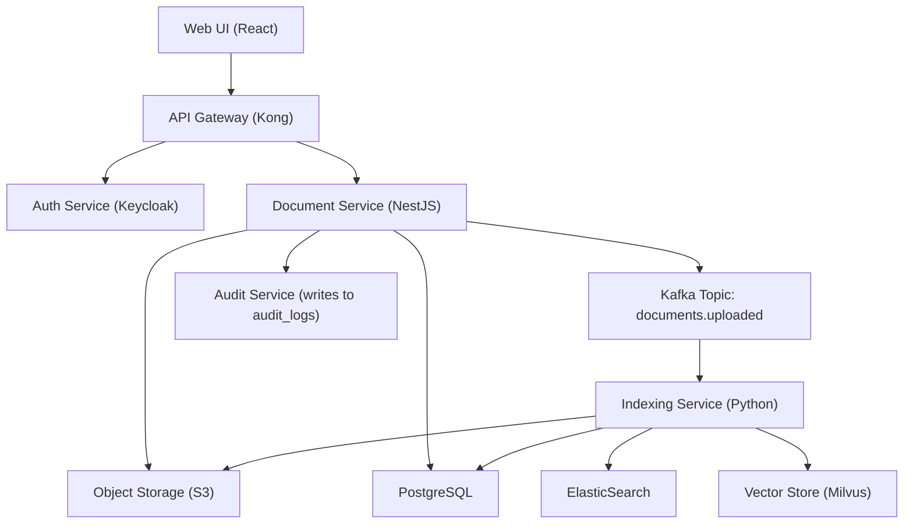

# Document Upload
**Type:** feature | **Priority:** 3 | **Status:** todo

## Notes
# 1. Feature Overview  

**Feature ID:** `1.b.a` – Document Upload  

**Purpose** – Allow users to upload files (PDF, DOCX, TXT) into the SaaS platform so that they can be processed, indexed, and later queried by the chatbot.  

**Scope** –  
* Accept multipart file uploads via the public REST API.  
* Store the raw file in the tenant‑scoped S3 bucket.  
* Create a `documents` row with status `processing`.  
* Emit a `DocumentUploaded` event for downstream indexing.  
* Record an immutable audit log entry.  

**Business Value** –  
* Enables knowledge‑base creation for each tenant.  
* Drives downstream revenue (premium plans unlock larger document limits).  
* Provides a measurable usage metric for billing and capacity planning.  

---

# 2. User Stories  

| # | User Story | Acceptance Criteria |
|---|------------|----------------------|
| 2.1 | **As a tenant member**, I want to upload a PDF file, so that it becomes part of my knowledge base. | • API returns `202 Accepted` with a `documentId`.<br>• File is persisted in S3 under `tenant/{tenantId}/{documentId}/{originalFilename}`.<br>• A `documents` row is created with `status = processing`.<br>• An audit log entry with `action="document_upload"` is written. |
| 2.2 | **As a tenant member**, I want the system to reject unsupported file types, so that only allowed formats are stored. | • MIME type whitelist enforced (PDF, DOCX, TXT).<br>• Response `415 UNSUPPORTED_MEDIA_TYPE` with error code `UNSUPPORTED_MEDIA_TYPE`. |
| 2.3 | **As a tenant member**, I want to see the upload progress and be notified when the document is ready, so that I can start using it. | • After upload, the client polls `GET /api/v1/documents/{id}`.<br>• Status transitions from `processing` → `ready` (or `failed`). |
| 2.4 | **As a tenant admin**, I want to prevent duplicate uploads of the same file, so that storage is not wasted. | • If a SHA‑256 checksum is supplied and a matching `documents` row exists for the same tenant, the API returns `200 OK` with the existing `documentId` and status. |
| 2.5 | **As a tenant member**, I want uploads to be rate‑limited, so that the service remains stable for all users. | • Redis token‑bucket limits to 10 uploads per minute per tenant.<br>• Exceeding returns `429 TOO_MANY_REQUESTS` with `Retry-After`. |

---

# 3. Technical Specification  

## 3.1 Architecture  

**How the feature plugs into the system**  

* The **API Gateway** routes `POST /api/v1/documents` to the **Document Service**.  
* The Document Service validates the request, streams the file to **S3**, writes a row to **PostgreSQL (`documents`)**, and publishes a **Kafka** `DocumentUploaded` event.  
* The **Indexing Service** consumes the event, extracts text, creates `document_chunks`, generates embeddings (Milvus), and updates ElasticSearch.  
* The **Audit Service** writes an immutable entry to `audit_logs`.  



*All nodes that contain spaces or special characters are quoted as required by Mermaid.*

## 3.2 API Endpoints  

| Method | Path | Auth | Request | Success Response | Errors |
|--------|------|------|---------|------------------|--------|
| **POST** | `/api/v1/documents` | JWT (role ≥ member) | `multipart/form-data` – field `file` (binary). Optional JSON field `metadata` (e.g., `{ "checksum": "sha256:…" }`). | `202 Accepted` → `UploadResponse` (`documentId`, `status`). | `400 INVALID_PAYLOAD`, `401 UNAUTHORIZED`, `413 PAYLOAD_TOO_LARGE`, `415 UNSUPPORTED_MEDIA_TYPE`, `429 TOO_MANY_REQUESTS`, `409 DUPLICATE_DOCUMENT` |
| **GET** | `/api/v1/documents` | JWT | Query: `?page=`, `?size=`, `?status=` (optional) | `200 OK` → `{ "items": [ { "id":"uuid","filename":"string","status":"ready","size":int,"createdAt":"timestamp" } ], "total":int }` | `401 UNAUTHORIZED`, `403 FORBIDDEN` |
| **GET** | `/api/v1/documents/{id}` | JWT | – | `200 OK` → `{ "id":"uuid","filename":"string","status":"ready","size":int,"createdAt":"timestamp","s3Url":"string" }` | `401 UNAUTHORIZED`, `403 FORBIDDEN`, `404 NOT_FOUND` |
| **DELETE** | `/api/v1/documents/{id}` | JWT (role ≥ owner) | – | `204 No Content` | `401 UNAUTHORIZED`, `403 FORBIDDEN`, `404 NOT_FOUND` |

### JSON Schemas  

**UploadResponse**

```json
{
  "title": "UploadResponse",
  "type": "object",
  "required": ["documentId", "status"],
  "properties": {
    "documentId": { "type": "string", "format": "uuid" },
    "status": { "type": "string", "enum": ["processing","ready","failed"] }
  },
  "additionalProperties": false
}
```

**DocumentListItem**

```json
{
  "type": "object",
  "required": ["id","filename","status","size","createdAt"],
  "properties": {
    "id": { "type": "string", "format": "uuid" },
    "filename": { "type": "string" },
    "status": { "type": "string", "enum": ["processing","ready","failed","deleted"] },
    "size": { "type": "integer" },
    "createdAt": { "type": "string", "format": "date-time" }
  }
}
```

## 3.3 Data Model  

| Table | Primary Key | Columns (type) | Indexes | Notes |
|-------|-------------|----------------|---------|-------|
| `documents` | `id` UUID | `tenant_id` UUID, `owner_id` UUID, `filename` VARCHAR, `s3_key` VARCHAR, `status` ENUM(`processing`,`ready`,`failed`,`deleted`), `size` BIGINT, `created_at` TIMESTAMP | `idx_documents_tenant` (tenant_id), `idx_documents_status` (status) | RLS enforces `tenant_id = current_setting('app.tenant_id')`. |
| `document_chunks` | `id` UUID | `document_id` UUID, `content` TEXT, `embedding_id` UUID, `chunk_index` INT | `idx_chunks_doc` (document_id) | `ON DELETE CASCADE` from `documents`. |
| `embeddings` | `id` UUID | `vector` BYTEA | `idx_embeddings_chunk` (embedding_id) | Row holds reference to Milvus vector. |
| `audit_logs` | `id` UUID | `tenant_id` UUID, `user_id` UUID, `action` VARCHAR, `payload` JSONB, `created_at` TIMESTAMP | `idx_audit_tenant_time` (tenant_id, created_at) | Immutable append‑only log. |

**Relationships**  

* `documents.owner_id → users.id` (FK).  
* `document_chunks.document_id → documents.id` (FK).  
* `document_chunks.embedding_id → embeddings.id` (FK).  

No new tables are introduced; the feature re‑uses the existing schema.

## 3.4 Business Logic  

1. **Authentication & RBAC** – API gateway validates JWT, extracts `tenant_id` and `role`. Only `member` or higher may call `POST /documents`.  
2. **Request Validation**  
   * MIME type must be one of `application/pdf`, `application/vnd.openxmlformats-officedocument.wordprocessingml.document`, `text/plain`.  
   * File size ≤ `MAX_UPLOAD_SIZE` (default 50 MiB).  
   * Optional `metadata.checksum` (SHA‑256) is parsed.  
3. **Duplicate Detection** (if checksum provided)  
   * Query `documents` where `tenant_id = current tenant` **and** `s3_key` derived from checksum exists.  
   * If found, return `200 OK` with existing `documentId` and current `status`.  
4. **ID Generation** – Generate `documentId = UUIDv4()`.  
5. **S3 Upload** – Stream the file to `tenant/{tenant_id}/{documentId}/{originalFilename}` with server‑side encryption (AES‑256).  
6. **Persist Document Record** – Insert into `documents` with:  
   * `tenant_id` = JWT claim.  
   * `owner_id` = JWT `sub`.  
   * `filename` = original filename.  
   * `s3_key` = generated S3 key.  
   * `status` = `processing`.  
   * `size` = file size.  
   * `created_at` = `now()`.  
7. **Audit Log** – Write an entry to `audit_logs` with `action="document_upload"` and payload `{ "documentId": ..., "filename": ..., "size": ..., "s3Key": ... }`.  
8. **Event Emission** – Publish a `DocumentUploaded` Avro event to Kafka topic `documents.uploaded` containing `{documentId, tenantId, s3Key, mimeType, checksum}`.  
9. **Response** – Return `202 Accepted` with `UploadResponse`.  

*All steps are performed within a single DB transaction where possible (insert + audit log) to guarantee atomicity. The S3 upload is performed **before** the DB insert to avoid orphan rows on failure; if the DB insert fails, the S3 object is deleted as part of a compensating transaction.*

---

# 4. Security Considerations  

| Aspect | Controls |
|--------|----------|
| **Authentication** | JWT (RS256) validated at API gateway; token includes `tenantId` and `role`. |
| **Authorization** | RBAC: `member` can upload; `owner`/`admin` can delete. Enforced in service layer and reinforced by PostgreSQL RLS (`010-rls-documents.sql`). |
| **Transport Security** | TLS 1.3 on all ingress and internal mesh (mTLS). |
| **Input Validation** | - MIME whitelist (PDF, DOCX, TXT).<br>- File size limit 50 MiB.<br>- SHA‑256 checksum verification if supplied.<br>- Multipart boundaries validated against OpenAPI schema. |
| **Data Protection** | - S3 bucket default encryption (AES‑256).<br>- No PII stored in `documents` (only filename & key).<br>- Embeddings stored in Milvus with at‑rest encryption (KMS). |
| **Rate Limiting** | Redis token‑bucket per tenant: 10 uploads / minute. Exceeding returns `429` with `Retry-After`. |
| **Audit Logging** | Every successful upload writes an immutable entry to `audit_logs`. Failures also logged with `action="document_upload_failed"`. |
| **Compliance** | GDPR “right to be forgotten” – `DELETE /documents/{id}` permanently removes S3 object, DB rows, and embeddings. |
| **Secrets Management** | All credentials (S3, Kafka, DB) stored in HashiCorp Vault and injected as Kubernetes secrets. |

---

# 5. Error Handling  

| HTTP | JSON Error Code | Message | Client Guidance |
|------|----------------|---------|-----------------|
| 400 | `INVALID_PAYLOAD` | Missing file or malformed multipart request. | Ensure `file` field is present and correctly encoded. |
| 401 | `UNAUTHORIZED` | Missing or invalid JWT. | Re‑authenticate. |
| 403 | `FORBIDDEN` | RBAC violation or tenant mismatch. | Show access‑denied UI. |
| 404 | `NOT_FOUND` | Document not found (GET/DELETE). | Verify the document ID. |
| 409 | `DUPLICATE_DOCUMENT` | Same checksum already uploaded. | Use the returned `documentId`. |
| 413 | `PAYLOAD_TOO_LARGE` | File exceeds 50 MiB limit. | Compress or split the file. |
| 415 | `UNSUPPORTED_MEDIA_TYPE` | File type not allowed. | Upload PDF, DOCX, or TXT only. |
| 429 | `TOO_MANY_REQUESTS` | Rate limit exceeded. | Exponential back‑off; respect `Retry-After`. |
| 500 | `INTERNAL_ERROR` | Unexpected server error. | Show generic error; retry after a short delay. |

**Retry Strategy**  

* **Idempotent** endpoints (`GET /documents`, `GET /documents/{id}`) may be automatically retried up to 3 times with exponential back‑off.  
* **Non‑idempotent** (`POST /documents`) must not be auto‑retried; UI prompts the user to retry manually after fixing the cause.

---

# 6. Testing Plan  

| Test Type | Scope | Tools |
|-----------|-------|-------|
| **Unit** | Validation logic, checksum handling, S3 key generation. | Jest (TS) |
| **Integration** | End‑to‑end upload flow: API → S3 → PostgreSQL → Kafka → Audit. | Testcontainers (PostgreSQL, Kafka, MinIO) + SuperTest |
| **Contract** | Ensure Document Service complies with OpenAPI spec and Avro `DocumentUploaded` schema. | Pact, Avro schema validator |
| **E2E** | UI file upload component, progress handling, duplicate detection. | Cypress |
| **Performance** | Upload throughput under load (10 k concurrent uploads). | k6 |
| **Security** | OWASP ZAP scan for file‑type bypass, large‑payload attacks. | OWASP ZAP |
| **Chaos** | Simulate S3 latency spikes and Kafka broker failures. | LitmusChaos |

**Edge Cases**  

* Empty file (size = 0) → `400 INVALID_PAYLOAD`.  
* Missing `filename` header → `400 INVALID_PAYLOAD`.  
* Checksum mismatch (client‑provided vs. server‑computed) → `400 INVALID_PAYLOAD`.  
* Upload of a file that exceeds the tenant’s quota → `403 FORBIDDEN` with custom error code `QUOTA_EXCEEDED`.  

---

# 7. Dependencies  

| Dependency | Description |
|------------|-------------|
| **Auth Service** (Keycloak) | Provides JWTs and tenant/role claims. |
| **S3 / MinIO** | Object storage for raw documents. |
| **PostgreSQL** | Stores `documents` and `audit_logs`. |
| **Kafka** | Event bus for `DocumentUploaded`. |
| **Indexing Service** | Consumes the upload event to create chunks & embeddings. |
| **Audit Service** | Writes immutable entries to `audit_logs`. |
| **Feature‑Flag Service** | Controls rollout of the upload UI (e.g., per‑plan enablement). |
| **Rate‑Limiter (Redis)** | Enforces per‑tenant upload limits. |

All dependencies are already part of the platform; no new external services are introduced.

---

# 8. Migration & Deployment  

## 8.1 Database Migrations  

No new tables or columns are required for this feature. Ensure the following migrations are present (already applied in production):  

| Version | Script | Description |
|---------|--------|-------------|
| `006-add-documents-table.sql` | Creates `documents`. |
| `007-add-document-chunks.sql` | Creates `document_chunks`. |
| `009-index-documents-status.sql` | Index on `documents(status)`. |
| `010-rls-documents.sql` | RLS policy for tenant isolation. |

If a future change adds a `checksum` column, follow the zero‑downtime pattern: add column with default `NULL`, back‑fill via background job, then switch code to use it.

## 8.2 Feature Flags  

* Flag key: `document_upload_enabled` (boolean).  
* Default: `true` for all tenants.  
* Can be toggled per‑tenant via `system_settings.feature_flags`.  

The Document Service checks the flag at request start; if disabled, returns `403 FORBIDDEN` with error code `FEATURE_DISABLED`.

## 8.3 Deployment Steps  

1. **Build Docker image** for Document Service (includes updated validation logic).  
2. **Helm upgrade** with new image tag; enable rolling update (`maxSurge: 25%`, `maxUnavailable: 0`).  
3. **Run DB migration** (no‑op for this feature).  
4. **Smoke test** – POST a small PDF via the staging environment; verify S3 object, DB row, audit log, and Kafka event.  
5. **Canary rollout** – Enable the flag for 5 % of tenants; monitor error rate and queue depth.  
6. **Full rollout** – Flip flag for all tenants.  

## 8.4 Rollback Plan  

* **Image rollback** – Re‑deploy previous Docker tag via Helm.  
* **Feature flag** – Set `document_upload_enabled = false` for all tenants; the endpoint will return `403`.  
* **Compensating cleanup** – If a rollback occurs after some uploads succeeded, a background job scans for `documents` with `status = processing` older than 5 minutes and marks them `failed`, then deletes the associated S3 objects.  

---  

*End of Document*
