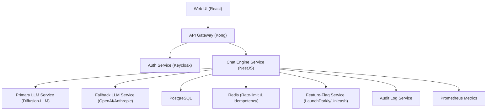

# Fallback to LLM
**Type:** feature | **Priority:** 3 | **Status:** todo

## Notes
# Feature Specification – Fallback to LLM (Notation **1.c.b**)

---

## 1. Feature Overview
| Item | Description |
|------|-------------|
| **Feature** | **Fallback to LLM** – automatically invoke a secondary LLM when the primary model is unavailable or its confidence score falls below a tenant‑specific threshold. |
| **Purpose** | Guarantee a response for every user message, even during primary‑model degradation, while recording the fallback event for analytics and cost tracking. |
| **Scope** | * API layer – `POST /api/v1/chat/{conversationId}/message` (idempotent). <br>* Chat Engine Service – decision logic, LLM orchestration, persistence of `fallback_used`. <br>* Persistence – `messages.fallback_used` flag and `messages.idempotency_key`. <br>* Telemetry – metrics, audit logs, and feature‑flag control. |
| **Business Value** | • Improves SLA compliance (≤ 2 s 95th‑percentile). <br>• Reduces user‑visible errors when the primary model degrades. <br>• Provides a data point (`fallback_used`) for cost‑allocation and product analytics. |

---

## 2. User Stories

| # | User Story | Acceptance Criteria |
|---|------------|----------------------|
| **2.1** | **As a** end‑user, **I want** my chat request to be answered even if the primary LLM is down, **so that** I never see a “service unavailable” error. | 1. When the primary LLM returns an error or a confidence < `fallback.confidenceThreshold`, the system returns a valid assistant message. <br>2. The response payload contains `fallbackUsed: true`. <br>3. The `messages.fallback_used` column is set to `TRUE`. |
| **2.2** | **As a** tenant admin, **I want** to enable/disable fallback per tenant, **so that** I can control cost and model usage. | 1. The flag `system_settings.feature_flags.fallback.enabled` can be toggled via the Admin UI. <br>2. When disabled, the system returns a `502 LLM_PRIMARY_UNAVAILABLE` error instead of falling back. |
| **2.3** | **As a** developer, **I want** my POST request to be idempotent, **so that** retries do not create duplicate messages. | 1. Supplying an `Idempotency-Key` header stores the key in `messages.idempotency_key`. <br>2. A second request with the same key returns the original message (same `id`, `created_at`, `fallback_used`). |
| **2.4** | **As a** product analyst, **I want** to see how often fallback is used per tenant, **so that** I can evaluate model reliability and cost. | 1. A daily aggregate `fallback_messages` counter is emitted to Prometheus. <br>2. Each fallback event is written to the immutable `audit_logs` table with `action = "chat_fallback"`. |
| **2.5** | **As a** security auditor, **I want** fallback decisions to be logged with tenant context, **so that** I can verify compliance with data‑handling policies. | 1. Audit log entry includes `tenant_id`, `conversation_id`, `message_id`, `fallback_used`, and timestamp. |

---

## 3. Technical Specification

### 3.1 Architecture
The fallback feature lives inside the **Chat Engine Service** and interacts with the **Primary LLM**, **Fallback LLM**, **PostgreSQL**, **Redis**, and **Feature‑Flag Service**.



*The `Chat Engine Service` decides whether to call `PrimaryLLM` or `FallbackLLM` based on the feature flag and confidence score.*

### 3.2 API Endpoints

| Method | Path | Idempotency | Request Headers | Request Body | Success Response | Error Responses |
|--------|------|-------------|----------------|--------------|------------------|-----------------|
| **POST** | `/api/v1/chat/{conversationId}/message` | Header `Idempotency-Key` (optional) | `Authorization: Bearer <jwt>`<br>`Idempotency-Key: <string>` (optional) | `UserMessageRequest` (see schema) | `AssistantMessageResponse` (see schema) – always `200 OK` (fallback is transparent) | 400 INVALID_PAYLOAD, 401 UNAUTHORIZED, 403 FORBIDDEN, 404 CONVERSATION_NOT_FOUND, 429 TOO_MANY_REQUESTS, 502 LLM_PRIMARY_UNAVAILABLE (fallback applied internally, still 200), 503 SERVICE_UNAVAILABLE, 500 INTERNAL_ERROR |

#### Request Schema – `UserMessageRequest`
```json
{
  "content": "string (max 2000 chars)",
  "metadata": { "type": "object", "additionalProperties": true }   // optional, passed to LLM
}
```

#### Success Response – `AssistantMessageResponse`
```json
{
  "messageId": "uuid",
  "role": "assistant",
  "content": "string",
  "citations": [
    { "documentId": "uuid", "chunkId": "uuid", "snippet": "string" }
  ],
  "fallbackUsed": true|false,
  "createdAt": "ISO8601 timestamp"
}
```

### 3.3 Data Model
Only existing tables are used; new columns are already present.

| Table | Columns (relevant) | Types | Indexes | Notes |
|-------|--------------------|-------|---------|-------|
| `messages` | `id` (PK) | UUID | PK | Primary key |
| | `conversation_id` (FK) | UUID | Index `idx_messages_conversation` | |
| | `role` | ENUM(`user`,`assistant`) | – | |
| | `content` | TEXT | – | |
| | `created_at` | TIMESTAMP | Index `idx_messages_created` | |
| | `citations` | JSONB (nullable) | GIN index `idx_messages_citations` | Stores `{documentId,chunkId,snippet}` |
| | `fallback_used` | BOOLEAN NOT NULL DEFAULT FALSE | – | **New** – indicates fallback LLM usage |
| | `idempotency_key` | VARCHAR(255) (nullable) | Unique index `idx_messages_idempotency` (tenant_id, idempotency_key) WHERE idempotency_key IS NOT NULL | **New** – for idempotent POST |
| `system_settings` | `tenant_id` (PK) | UUID | PK | |
| | `feature_flags` | JSON | – | Holds `fallback.enabled` and `fallback.confidenceThreshold` |

All tables already enforce tenant isolation via `tenant_id` and RLS policies.

### 3.4 Business Logic

#### 3.4.1 Decision Flow (State Machine)

```
START → Validate Request → Check Feature Flag
   ├─ Flag disabled → Return 502 LLM_PRIMARY_UNAVAILABLE
   └─ Flag enabled → Call Primary LLM
          ├─ Success & confidence ≥ threshold → Store message (fallback_used = FALSE) → RETURN
          └─ Failure OR confidence < threshold → Call Fallback LLM
                 ├─ Success → Store message (fallback_used = TRUE) → RETURN
                 └─ Failure → Return 502 LLM_BOTH_UNAVAILABLE
```

#### 3.4.2 Algorithm Steps (pseudo‑code)

```ts
async function handleUserMessage(req) {
  const tenantId = req.auth.tenantId;
  const conversationId = req.params.conversationId;
  const idempotencyKey = req.headers['Idempotency-Key'] ?? null;

  // 1️⃣ Idempotency lookup
  if (idempotencyKey) {
    const existing = await db.messages.findOne({
      tenant_id: tenantId,
      idempotency_key: idempotencyKey
    });
    if (existing) return mapToResponse(existing);
  }

  // 2️⃣ Load tenant feature flags
  const flags = await db.systemSettings.getFeatureFlags(tenantId);
  if (!flags.fallback?.enabled) throw new ServiceUnavailable('LLM_PRIMARY_UNAVAILABLE');

  // 3️⃣ Call primary LLM
  const primaryResult = await primaryLLM.generate(req.body.content);
  const confidence = primaryResult.confidence ?? 1.0; // default 1 if not provided

  // 4️⃣ Determine need for fallback
  const needFallback = primaryResult.error ||
                       confidence < (flags.fallback?.confidenceThreshold ?? 0.7);

  let finalResult, fallbackUsed = false;

  if (!needFallback) {
    finalResult = primaryResult;
  } else {
    // 5️⃣ Call fallback LLM
    const fallbackResult = await fallbackLLM.generate(req.body.content);
    if (fallbackResult.error) {
      throw new ServiceUnavailable('LLM_BOTH_UNAVAILABLE');
    }
    finalResult = fallbackResult;
    fallbackUsed = true;
  }

  // 6️⃣ Persist message
  const message = await db.messages.create({
    id: uuid(),
    conversation_id: conversationId,
    role: 'assistant',
    content: finalResult.content,
    citations: finalResult.citations ?? [],
    fallback_used: fallbackUsed,
    idempotency_key: idempotencyKey,
    tenant_id: tenantId,
    created_at: now()
  });

  // 7️⃣ Emit events & metrics
  await eventBus.publish('ChatMessageCreated', { message });
  metrics.increment('chat_fallback_total', { tenant: tenantId, used: fallbackUsed });
  await auditLog.record('chat_fallback', {
    tenant_id: tenantId,
    conversation_id: conversationId,
    message_id: message.id,
    fallback_used: fallbackUsed
  });

  return mapToResponse(message);
}
```

#### 3.4.3 Idempotency Handling
* The `Idempotency-Key` header is hashed (SHA‑256) before storage to avoid long strings.
* Unique index `idx_messages_idempotency` guarantees a single row per `(tenant_id, idempotency_key)`.
* If the key is missing, the request is treated as non‑idempotent.

#### 3.4.4 Telemetry
* **Prometheus Counter** `chat_fallback_total{tenant_id, used}`.
* **Audit Log** entry with `action = "chat_fallback"` and payload containing `fallback_used`.
* **Latency Metrics** – separate histograms for primary vs. fallback latency.

---

## 4. Security Considerations

| Aspect | Controls |
|--------|----------|
| **Authentication** | JWT (RS256) validated at API gateway; token includes `tenantId` and `role`. |
| **Authorization** | RBAC – only users with role `member` or higher may POST messages. Enforced in service layer and reinforced by PostgreSQL RLS on `tenant_id`. |
| **Rate Limiting** | Redis token‑bucket per tenant: 20 req/min for `/chat/*`. Exceeding returns `429 TOO_MANY_REQUESTS` with `Retry-After`. |
| **Input Validation** | JSON‑Schema validation; `content` max 2000 characters; reject control characters; trim whitespace. |
| **Idempotency** | `Idempotency-Key` stored hashed; unique index prevents replay. |
| **Data Protection** | `citations` JSONB contains no PII. All data at rest encrypted (PostgreSQL TDE, Redis TLS). TLS 1.3 everywhere (Ingress, internal mTLS). |
| **Audit Logging** | Every chat request, fallback decision, and response writes an immutable entry to `audit_logs`. |
| **Feature‑Flag Security** | Flags stored in `system_settings.feature_flags`; only `admin` role can modify via Admin UI. |
| **Compliance** | GDPR – `DELETE /api/v1/conversations/{id}` removes related rows, including `fallback_used`. |

---

## 5. Error Handling

| HTTP Status | JSON Error Code | Message | Internal Action |
|-------------|-----------------|---------|-----------------|
| 400 | `INVALID_PAYLOAD` | Request body fails schema validation. | Log, audit. |
| 401 | `UNAUTHORIZED` | Missing or invalid JWT. | Prompt re‑login. |
| 403 | `FORBIDDEN` | RBAC violation or `fallback.enabled = false`. | Return access‑denied. |
| 404 | `CONVERSATION_NOT_FOUND` | `conversationId` does not exist for this tenant. | Return friendly not‑found. |
| 429 | `TOO_MANY_REQUESTS` | Rate limit exceeded. | Increment `rate_limit_exceeded` metric. |
| 502 | `LLM_PRIMARY_UNAVAILABLE` | Primary LLM failed; fallback applied internally. | Record `fallback_used = true`. |
| 502 | `LLM_BOTH_UNAVAILABLE` | Both primary and fallback failed. | Increment `llm_failure` metric, alert. |
| 503 | `SERVICE_UNAVAILABLE` | Downstream service (search, embeddings) unavailable. | Return `Retry-After`. |
| 500 | `INTERNAL_ERROR` | Unexpected server error. | Capture stack trace, send to Sentry. |

**Retry Strategy**
* **GET** endpoints – safe to retry up to 3 times with exponential back‑off.  
* **POST** `/chat/{conversationId}/message` – client must **not** auto‑retry; UI shows “Try again”. Idempotency key prevents duplicate creation if the user manually retries.  

When fallback is triggered, the response still returns `200 OK` with `fallbackUsed = true`; the client is unaware of the internal switch.

---

## 6. Testing Plan

| Test Type | Scope | Tools |
|-----------|-------|-------|
| **Unit** | `decideFallback` logic, confidence threshold handling, idempotency hash, flag lookup. | Jest (TS) |
| **Integration** | End‑to‑end POST flow with mock Primary/LLM services, verify DB row (`fallback_used`) and audit log entry. | Testcontainers (PostgreSQL, Redis), SuperTest |
| **Contract** | OpenAPI compliance for `/chat/{conversationId}/message`. | Pact |
| **E2E** | UI chat window sends a message, receives assistant reply, `fallbackUsed` flag toggles correctly when primary is mocked to fail. | Cypress |
| **Performance** | Latency under 500 ms for primary path; fallback latency < 1 s; 95th‑percentile SLA. | k6 |
| **Security** | JWT validation, RLS enforcement, idempotency replay protection, rate‑limit bypass attempts. | OWASP ZAP, custom scripts |
| **Chaos** | Simulate primary LLM timeout → verify fallback path, audit log, and metric increments. | LitmusChaos (K8s) |

**Edge Cases**
* No `Idempotency-Key` header → request is processed normally.  
* `fallback.confidenceThreshold` missing → default to `0.7`.  
* Primary LLM returns confidence exactly equal to threshold → **no** fallback.  
* Primary LLM returns malformed JSON → treated as error → fallback.  

All tests run in CI; feature‑flag matrix tests verify both enabled and disabled states.

---

## 7. Dependencies

| Dependency | Type | Reason |
|------------|------|--------|
| **Primary LLM Service** (Diffusion‑LLM) | Internal microservice | Fast, parallel token generation. |
| **Fallback LLM Service** (OpenAI/Anthropic) | External SaaS | Reliable backup when primary is down or low confidence. |
| **Chat Engine Service** | Internal (NestJS) | Orchestrates LLM calls, persistence, metrics. |
| **PostgreSQL** | Database | Stores `messages` with `fallback_used`. |
| **Redis** | Cache | Rate‑limit counters, idempotency key lookup. |
| **Kafka** | Event bus | Emits `ChatMessageCreated` and `ChatFallback` events. |
| **Feature‑Flag Service** (LaunchDarkly / Unleash) | External or self‑hosted | Controls per‑tenant fallback enablement and thresholds. |
| **Audit Log Service** | Internal | Immutable logging of fallback events. |
| **Metrics Service** (Prometheus) | Internal | Collects `fallback_messages` counter. |

---

## 8. Migration & Deployment

### 8.1 Database Migration
* The required columns (`fallback_used`, `idempotency_key`) already exist with defaults and indexes. No schema change is needed for this feature.  
* If a future change adds a new column, follow the zero‑downtime pattern: add with default, back‑fill via background job, then switch code.

### 8.2 Feature Flag Rollout
1. Add `fallback.enabled` (boolean) and `fallback.confidenceThreshold` (float) to `system_settings.feature_flags` JSON for each tenant.  
2. Default values: `enabled = false`, `confidenceThreshold = 0.7`.  
3. Admin UI toggles the flag; changes are persisted in `system_settings`.  

### 8.3 Deployment Steps
| Step | Action |
|------|--------|
| **1** | Build new Docker image for **Chat Engine Service** with fallback logic. |
| **2** | Deploy via Helm chart (increment `image.tag`). |
| **3** | Verify that the new pods have the environment variable `FEATURE_FALLBACK_ENABLED=true` (optional) and that the feature flag is enabled for a test tenant. |
| **4** | Run smoke tests against `/chat/{conversationId}/message` with a mocked primary LLM failure. |
| **5** | Promote flag to production tenants gradually (percentage rollout). |
| **6** | Monitor `chat_fallback_total` metric and error rates. |

### 8.4 Rollback Plan
* **Database** – No schema change; columns are additive and default‑compatible.  
* **Feature Flag** – Immediate disable of fallback via Admin UI (no code change).  
* **Code** – Deploy previous container version (without fallback logic) via Helm rollback.  

---  

*End of Feature Specification.*
