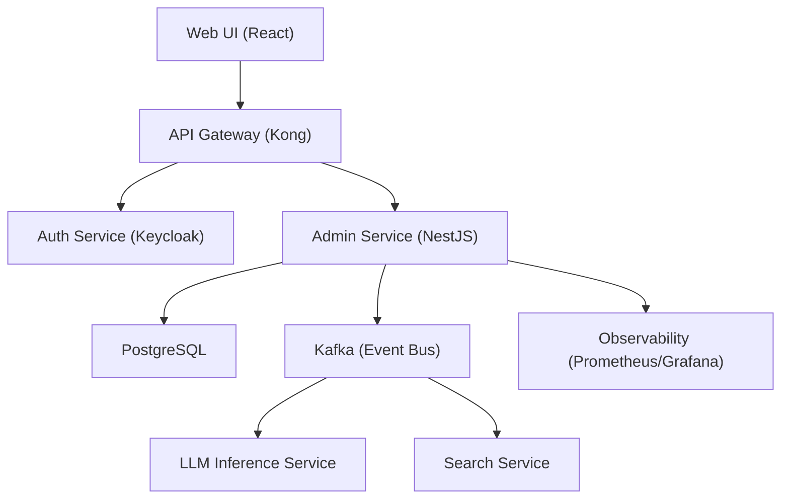

# System Settings
**Type:** feature | **Priority:** 3 | **Status:** todo

## Notes
# System Settings – Feature Specification (1.d.c)

## 1. Feature Overview
**Purpose** – Enable tenant‑level administrators (owners and admins) to view and modify the SaaS plan and feature‑flag configuration for their tenant.  
**Scope** – CRUD‑style operations limited to **GET** (read) and **PATCH** (partial update) of the `system_settings` row. No new tables are introduced; the feature works on the existing `system_settings` table.  
**Business Value** –  
* Allows the product team to roll out new capabilities per‑tenant via feature flags without redeploying code.  
* Supports plan upgrades/downgrades that drive revenue.  
* Centralises tenant configuration, simplifying downstream services (billing, indexing, chat) that consume `system_settings` via the `SystemSettingsChanged` Kafka event.

---

## 2. User Stories  

| # | User Story | Acceptance Criteria |
|---|------------|---------------------|
| 1 | **As an Owner**, I want to view the current plan and feature flags for my tenant, so that I can verify what capabilities are enabled. | • `GET /api/v1/admin/settings` returns `200 OK` with a JSON payload containing `plan` (string) and `feature_flags` (object). <br>• Response is scoped to the tenant derived from the JWT. |
| 2 | **As an Admin**, I want to change the tenant’s plan, so that we can upgrade to a higher tier. | • `PATCH /api/v1/admin/settings` with body `{ "plan": "enterprise" }` returns `200 OK` and the updated object. <br>• Only values `free`, `pro`, `enterprise` are accepted. <br>• Event `SystemSettingsChanged` is emitted on Kafka. |
| 3 | **As an Admin**, I want to toggle feature flags, so that we can enable beta functionality for my team. | • `PATCH /api/v1/admin/settings` with body `{ "feature_flags": { "chat_history": true, "document_summarization": false } }` returns `200 OK`. <br>• Flags are stored as JSON in `system_settings.feature_flags`. |
| 4 | **As a Viewer**, I must not be able to modify settings, so that security is enforced. | • `PATCH` request from a user with role `viewer` returns `403 FORBIDDEN`. |
| 5 | **As any tenant user**, I want the system to reject malformed payloads, so that data integrity is preserved. | • Missing required fields or invalid enum values cause `400 INVALID_PAYLOAD`. <br>• Error response includes a machine‑readable error code and human‑readable message. |

---

## 3. Technical Specification  

### 3.1 Architecture  



*The **Admin Service** implements the System Settings endpoints. It reads/writes the `system_settings` table (tenant‑scoped) and publishes a `SystemSettingsChanged` event for downstream services (billing, indexing, chat). All traffic passes through the API Gateway, which enforces JWT validation and rate‑limiting.*

### 3.2 API Endpoints  

| Method | Path | Auth | Request Body | Success Response | Errors |
|--------|------|------|--------------|------------------|--------|
| **GET** | `/api/v1/admin/settings` | JWT (`role` ∈ {owner,admin}) | – | `200 OK` <br>`{ "plan": "pro", "feature_flags": { "chat_history": true, "document_summarization": false } }` | `401 UNAUTHORIZED`, `403 FORBIDDEN`, `404 NOT_FOUND` (if row missing) |
| **PATCH** | `/api/v1/admin/settings` | JWT (`role` ∈ {owner,admin}) | `SystemSettingsUpdateRequest` (see JSON schema) | `200 OK` <br>Updated object (same shape as GET) | `400 INVALID_PAYLOAD`, `401 UNAUTHORIZED`, `403 FORBIDDEN`, `404 NOT_FOUND`, `429 TOO_MANY_REQUESTS`, `500 INTERNAL_ERROR` |

**JSON Schemas**

```json
{
  "title": "SystemSettingsUpdateRequest",
  "type": "object",
  "properties": {
    "plan": { "type": "string", "enum": ["free","pro","enterprise"] },
    "feature_flags": {
      "type": "object",
      "additionalProperties": { "type": "boolean" }
    }
  },
  "additionalProperties": false,
  "minProperties": 1
}
```

*The PATCH endpoint follows JSON‑Merge‑Patch semantics – only supplied fields are updated.*

### 3.3 Data Model  

| Table | Primary Key | Columns | Types | Indexes |
|-------|-------------|---------|-------|---------|
| `system_settings` | `tenant_id` (PK) | `plan` (VARCHAR), `feature_flags` (JSONB) | `tenant_id` UUID, `plan` VARCHAR(20), `feature_flags` JSONB | `idx_system_settings_tenant_id` (PK) |

*All queries are scoped by the `tenant_id` claim in the JWT. Row‑level security (RLS) policies ensure a tenant can only read/write its own row.*

### 3.4 Business Logic  

1. **Authentication & Authorization**  
   * JWT is validated; `tenant_id` and `role` claims extracted.  
   * Only `owner` or `admin` roles are permitted to call the PATCH endpoint.  

2. **GET Flow**  
   1. `SELECT plan, feature_flags FROM system_settings WHERE tenant_id = $tenant_id;`  
   2. If no row exists, return `404 NOT_FOUND`. (A row is created at tenant onboarding.)  

3. **PATCH Flow**  
   1. Validate request body against `SystemSettingsUpdateRequest`.  
   2. Begin transaction.  
   3. `SELECT plan, feature_flags FROM system_settings WHERE tenant_id = $tenant_id FOR UPDATE;`  
   4. Apply updates:  
      * If `plan` present, verify it is one of the allowed enums.  
      * If `feature_flags` present, merge with existing JSON (deep merge, overriding supplied keys).  
   5. `UPDATE system_settings SET plan = $plan, feature_flags = $flags WHERE tenant_id = $tenant_id;`  
   6. Commit transaction.  
   7. Emit Kafka event `SystemSettingsChanged` with payload `{ tenant_id, plan, feature_flags, updated_at }`.  
   8. Return the new state.  

4. **Event Consumption**  
   * Billing service consumes `SystemSettingsChanged` to adjust invoicing.  
   * Chat and Search services read the latest flags from the cache (Redis) refreshed by the event.  

5. **Audit Logging**  
   * Insert a row into `audit_logs` with `action = "system_settings_update"` and a JSONB payload containing `before` and `after` snapshots.  

---

## 4. Security Considerations  

| Aspect | Controls |
|--------|----------|
| **Authentication** | JWT signed with RSA‑256 (private key stored in Vault). Access token TTL 15 min; refresh token TTL 7 days. |
| **Authorization** | RBAC enforced at API gateway and service layer. Only `owner`/`admin` can access admin endpoints. Tenant isolation via `tenant_id` claim and PostgreSQL RLS. |
| **Input Validation** | JSON‑Schema validation for PATCH body; server‑side sanitization of string values (trim, escape). |
| **Rate Limiting** | Redis token‑bucket per tenant: max 20 admin requests per minute. Exceeding returns `429 TOO_MANY_REQUESTS` with `Retry-After`. |
| **Data Protection** | `system_settings` rows are encrypted at rest via KMS‑managed PostgreSQL encryption. `feature_flags` JSONB is stored as plaintext within the encrypted column. |
| **Audit Trail** | Immutable entry in `audit_logs` for every successful or failed update, containing before/after snapshots. |
| **Transport** | TLS 1.3 enforced by API gateway; HSTS header set. |
| **Compliance** | GDPR “right to be forgotten” – plan downgrade does not delete data; only plan/flags are altered. All personal data remains in `users`/`profiles`. |

---

## 5. Error Handling  

| HTTP Status | Error Code | Message | Fallback / Retry |
|-------------|------------|---------|------------------|
| 400 | `INVALID_PAYLOAD` | Request body fails schema validation (e.g., unknown flag, invalid plan). | Client must correct payload. |
| 401 | `UNAUTHORIZED` | Missing or invalid JWT. | Prompt re‑login. |
| 403 | `FORBIDDEN` | User role not permitted or tenant mismatch. | Show access‑denied UI. |
| 404 | `NOT_FOUND` | No `system_settings` row for tenant (should not happen). | Return generic error; investigate. |
| 429 | `TOO_MANY_REQUESTS` | Rate limit exceeded. | Exponential back‑off; respect `Retry-After`. |
| 500 | `INTERNAL_ERROR` | Unexpected server error. | Log, return generic message, trigger alert. |

**Retry Strategy**  
* `GET` is idempotent – client may retry automatically with exponential back‑off (max 3 attempts).  
* `PATCH` is not automatically retried; client must handle `429` or `500` and optionally re‑submit after user confirmation.

---

## 6. Testing Plan  

| Test Type | Scope | Tools |
|-----------|-------|-------|
| **Unit** | Validation of JSON schema, merging of feature flags, permission checks. | Jest (TS) |
| **Integration** | End‑to‑end flow: JWT → API → PostgreSQL → Kafka → audit log. | Testcontainers (PostgreSQL, Kafka), SuperTest |
| **Contract** | Verify that the API conforms to OpenAPI spec and that the Kafka event matches Avro schema. | Pact, Avro‑tools |
| **E2E** | UI admin panel: view settings, toggle flags, change plan, error handling. | Cypress |
| **Performance** | Load test PATCH with 100 concurrent admin users; ensure < 200 ms response. | k6 |
| **Security** | OWASP ZAP scan for injection, CSRF, XSS on admin endpoints. | OWASP ZAP |
| **Chaos** | Simulate PostgreSQL latency and Kafka broker failure; verify graceful degradation. | LitmusChaos |

Edge Cases to cover:  
* Missing `system_settings` row (should return 404).  
* Invalid enum value for `plan`.  
* Empty `feature_flags` object (should be accepted).  
* Concurrent PATCH requests – verify last‑write wins and audit log captures both attempts.  

---

## 7. Dependencies  

| Dependency | Reason |
|------------|--------|
| **Auth Service (Keycloak)** | Provides JWTs with `tenant_id` and `role`. |
| **PostgreSQL** | Stores `system_settings` and `audit_logs`. |
| **Kafka** | Publishes `SystemSettingsChanged` events for downstream services. |
| **Feature‑Flag Service** | Optional – flags can be overridden per‑tenant via LaunchDarkly/Unleash; the JSON column is the source of truth. |
| **Frontend Admin UI** | Consumes the GET/PATCH endpoints; built with the shared UI design system (see global UI spec). |
| **Observability Stack** | Metrics and tracing for the admin service (Prometheus, OpenTelemetry). |

---

## 8. Migration & Deployment  

### 8.1 Database Migration  
*No schema change is required* – the `system_settings` table already exists with the required columns and primary key (`tenant_id`). Ensure the index `idx_system_settings_tenant_id` is present (it is the PK).  

If a future column is added (e.g., `billing_cycle`), follow the zero‑downtime pattern:  

1. `ALTER TABLE system_settings ADD COLUMN billing_cycle VARCHAR(20) DEFAULT 'monthly';`  
2. Background job back‑fills existing rows if needed.  
3. Update code to use the new column.  

### 8.2 Feature Flags  
* The endpoint is guarded by the `admin_settings` flag (default `true`).  
* New flags can be added to the `feature_flags` JSON column without code changes; they become visible to downstream services after the Kafka event.  

### 8.3 Deployment Steps  

1. **Build** Docker image for the Admin Service (includes the new controller).  
2. **Helm Upgrade** with version bump; set `replicaCount` to at least 2 for HA.  
3. **Run Migration** – a no‑op, but execute a health‑check that `system_settings` row exists for each tenant (create default row if missing).  
4. **Canary Release** – enable the new endpoint for 5 % of tenants via the feature‑flag service.  
5. **Monitor** – watch error rate (`5xx`) and Kafka lag; roll back if thresholds exceeded.  

### 8.4 Rollback Plan  

* **Code** – revert Helm release to previous chart version; the old container does not expose the new endpoints, so traffic automatically falls back.  
* **Data** – no data migration was performed; rolling back does not affect existing rows.  
* **Feature Flags** – disable the `admin_settings` flag for all tenants if any unexpected behavior is observed.  

---  

*End of System Settings feature specification.*
