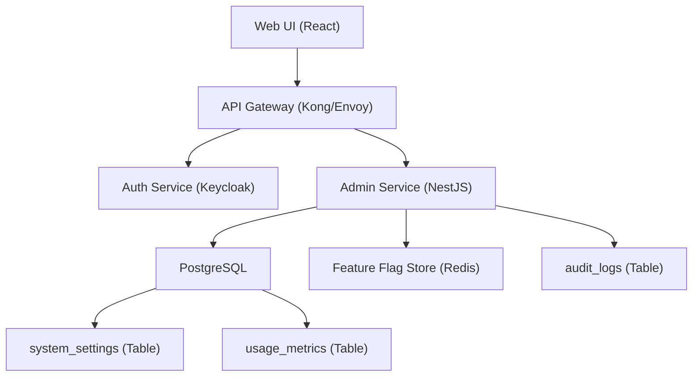

# Usage Analytics
**Type:** feature | **Priority:** 3 | **Status:** todo

## Notes
# 1. Feature Overview  

**Feature:** Usage Analytics (notation 1.d.b)  

**Purpose** – Provide tenant‑level visibility into how many messages have been sent and how many LLM tokens have been consumed over a selectable date range.  

**Scope** –  
* Read‑only admin UI for owners and admins.  
* Backend REST endpoint that returns daily aggregates from the existing `usage_metrics` table.  
* Optional CSV export endpoint.  

**Business Value** –  
* Enables customers to monitor consumption against their subscription plan and avoid unexpected overage charges.  
* Gives the SaaS operator data to drive upsell opportunities and capacity planning.  
* Supports compliance reporting (e.g., audit of AI usage).  

---

## 2. User Stories  

| # | User Story | Acceptance Criteria |
|---|------------|---------------------|
| 2.1 | **As an `owner` or `admin`, I want to view daily message‑ and token‑counts for a custom date range, so that I can see how my team is using the chatbot.** | • The UI shows a table with one row per day (`date`, `messages_sent`, `tokens_used`). <br>• Data is scoped to the current tenant (`tenant_id`). <br>• The table respects the `start` and `end` query parameters (inclusive). |
| 2.2 | **As an `owner` or `admin`, I want to see a summary (total messages, total tokens, average per day) for the selected range, so that I can quickly assess overall usage.** | • The response includes a `summary` object with `total_messages`, `total_tokens`, `average_messages_per_day`, `average_tokens_per_day`. |
| 2.3 | **As an `owner` or `admin`, I want to export the usage data as CSV, so that I can share it with finance or compliance teams.** | • `GET /api/v1/admin/usage/export?start=…&end=…` returns `text/csv` with a header row `date,messages_sent,tokens_used`. |
| 2.4 | **As an `owner` or `admin`, I want the usage view to be disabled for tenants on the free plan, so that we respect plan limits.** | • When `system_settings.plan = "free"` and the feature flag `usageAnalytics.enabled` is false, the endpoint returns `403 FEATURE_DISABLED`. |
| 2.5 | **As an `owner` or `admin`, I want the request to be rate‑limited to 20 calls per minute, so that the service stays performant.** | • Exceeding the limit returns `429 TOO_MANY_REQUESTS` with a `Retry-After` header. |

---

## 3. Technical Specification  

### 3.1 Architecture  



*The **Admin Service** implements the usage‑analytics endpoints. It reads `usage_metrics` (scoped by `tenant_id`) and, when needed, consults `system_settings` and the feature‑flag store to enforce plan‑based enablement.*  

### 3.2 API Endpoints  

| Method | Path | Auth | Query Params | Request Body | Success Response | Error Responses |
|--------|------|------|--------------|--------------|------------------|-----------------|
| `GET` | `/api/v1/admin/usage` | JWT (role = owner|admin) | `start=YYYY-MM-DD` (required) <br> `end=YYYY-MM-DD` (required) <br> `page` (optional, default 1) <br> `pageSize` (optional, default 30) | – | `200 OK` <br>```json<br>{<br>  "tenantId": "uuid",<br>  "range": {"start":"2024-01-01","end":"2024-01-31"},<br>  "summary": {"totalMessages":1234,"totalTokens":56789,"avgMessagesPerDay":40,"avgTokensPerDay":1835},<br>  "data": [<br>    {"date":"2024-01-01","messagesSent":45,"tokensUsed":2100},<br>    {"date":"2024-01-02","messagesSent":38,"tokensUsed":1900}<br>    // …<br>  ]<br>}``` | `400 INVALID_QUERY` – malformed dates or `start > end`.<br>`401 UNAUTHORIZED` – missing/invalid JWT.<br>`403 FORBIDDEN` – role not permitted.<br>`403 FEATURE_DISABLED` – plan does not include analytics.<br>`429 TOO_MANY_REQUESTS` – rate limit exceeded.<br>`500 INTERNAL_ERROR` – unexpected failure. |
| `GET` | `/api/v1/admin/usage/export` | JWT (role = owner|admin) | Same as above | – | `200 OK` with `Content-Type: text/csv` <br>Header row: `date,messages_sent,tokens_used` | Same error codes as above. |
| `GET` | `/api/v1/admin/usage/plan-limit` | JWT (role = owner|admin) | – | – | `200 OK` <br>```json<br>{ "plan":"pro","messagesQuota":100000,"tokensQuota":500000 }``` | `401`, `403`, `500`. |

**Headers** – All responses include `X-Request-ID` (traceability) and `Cache-Control: no‑store` (data is always fresh).  

### 3.3 Data Model  

| Table | Columns (relevant) | Types | Indexes | Notes |
|-------|--------------------|-------|---------|-------|
| `usage_metrics` | `id` (PK), `tenant_id`, `date`, `messages_sent`, `tokens_used` | UUID, UUID, DATE, INTEGER, BIGINT | Composite index `idx_usage_tenant_date` on `(tenant_id, date)` | One row per tenant per day. Updated by Chat Engine after each assistant reply. |
| `system_settings` | `tenant_id` (PK), `plan`, `feature_flags` (JSON) | UUID, TEXT, JSON | PK on `tenant_id` | `feature_flags` holds `"usageAnalytics.enabled": true/false`. |
| `audit_logs` | `id` (PK), `tenant_id`, `user_id`, `action`, `payload` (JSONB), `created_at` | UUID, UUID, UUID, VARCHAR, JSONB, TIMESTAMP | `idx_audit_tenant_time` (tenant_id, created_at) | Every request to `/admin/usage*` writes an entry with `action="usage_view"` or `"usage_export"`.

 |

*No new tables are introduced; the feature only reads existing tables and writes audit entries.*  

### 3.4 Business Logic  

1. **Authorization** – Verify JWT, extract `tenant_id` and `role`. Reject if role not in `{owner,admin}`.  
2. **Feature‑Flag Check** –  
   * Load `system_settings` for the tenant.  
   * Parse `feature_flags`. If `usageAnalytics.enabled` is `false` **and** the tenant’s `plan` is `"free"` → return `403 FEATURE_DISABLED`.  
3. **Parameter Validation** –  
   * `start` and `end` must be ISO‑8601 dates (`YYYY‑MM‑DD`).  
   * `start` ≤ `end`.  
   * `page` ≥ 1, `pageSize` between 1‑100.  
4. **Data Retrieval** –  
   * Query `usage_metrics` with `WHERE tenant_id = $tenantId AND date BETWEEN $start AND $end`.  
   * Apply pagination (`OFFSET`, `LIMIT`).  
   * Compute aggregates on the fly: `SUM(messages_sent)`, `SUM(tokens_used)`, `COUNT(*)` for averages.  
5. **Response Construction** –  
   * Build `summary` object.  
   * Map each row to `{date, messagesSent, tokensUsed}`.  
6. **CSV Export** –  
   * Re‑run the same query without pagination.  
   * Stream rows as CSV lines to avoid loading the whole set into memory.  
7. **Audit Logging** –  
   * Insert a row into `audit_logs` with `action="usage_view"` or `"usage_export"` and payload containing the query parameters.  

**State Machine (simplified)**  

```
START --> AUTH_CHECK --> FEATURE_FLAG --> VALIDATE_PARAMS --> FETCH_DATA --> BUILD_RESPONSE --> END
```

If any step fails, transition to `ERROR` with appropriate HTTP status.

---

## 4. Security Considerations  

| Aspect | Controls |
|--------|----------|
| **Authentication** | JWT signed with RSA‑256 (private key in Vault). Token must contain `tenant_id` claim. |
| **Authorization** | RBAC: only `owner` or `admin` roles may access the endpoints. Enforced in API gateway and service layer. |
| **Tenant Isolation** | All queries filter by `tenant_id`. PostgreSQL Row‑Level Security (RLS) policies prevent cross‑tenant reads. |
| **Input Validation** | Query parameters validated against JSON‑Schema (`start`, `end` as `string` with `format: date`). Reject malformed dates with `400`. |
| **Rate Limiting** | Redis token‑bucket per tenant: 20 requests/minute for `/admin/usage*`. Exceeding returns `429` with `Retry-After`. |
| **Data Protection** | `usage_metrics` stores only numeric aggregates; no PII. All DB columns encrypted at rest via KMS. |
| **Audit Trail** | Every successful or failed request writes an immutable entry to `audit_logs`. |
| **Transport Security** | TLS 1.3 enforced by API gateway; internal service‑to‑service calls use mTLS. |
| **Feature‑Flag Security** | Flags stored in `system_settings.feature_flags`; only `owner`/`admin` can modify via Admin UI. |

---

## 5. Error Handling  

| Situation | HTTP Status | Error Code | JSON Body Example | Internal Action |
|-----------|-------------|------------|-------------------|-----------------|
| Missing or malformed `start`/`end` | 400 | `INVALID_QUERY` | `{ "error":"Invalid date format. Expected YYYY-MM-DD." }` | Log request ID, increment `usage_invalid_query` metric. |
| `start` > `end` | 400 | `INVALID_RANGE` | `{ "error":"` date must be before or equal to end date." }` | Same as above. |
| No JWT or expired token | 401 | `UNAUTHORIZED` | `{ "error":"Authentication required." }` | Increment auth‑failure metric. |
| Role not owner/admin | 403 | `FORBIDDEN` | `{ "error":"Insufficient permissions." }` | Increment auth‑failure metric. |
| Feature disabled for tenant | 403 | `FEATURE_DISABLED` | `{ "error":"Usage analytics not enabled for this plan." }` | Increment feature‑disabled counter. |
| Rate limit exceeded | 429 | `TOO_MANY_REQUESTS` | `{ "error":"Rate limit exceeded. Retry after 30 seconds." }` | Increment rate‑limit metric. |
| Unexpected DB error | 500 | `INTERNAL_ERROR` | `{ "error":"Unexpected server error. Please try again later." }` | Capture stack trace, alert on `usage_internal_error`. |
| CSV streaming failure | 500 | `STREAM_ERROR` | `{ "error":"Failed to generate CSV export." }` | Abort stream, log error, alert. |

**Retry Strategy** –  
* **GET** endpoints are safe to retry client‑side (up to 3 attempts with exponential back‑off).  
* **POST** (none for this feature) would require idempotency keys; not applicable.  

---

## 6. Testing Plan  

| Test Type | Scope | Example Cases |
|-----------|-------|----------------|
| **Unit** | Service layer functions (`validateParams`, `buildSummary`, `streamCsv`). | Valid date range, start > end, empty result set. |
| **Integration** | End‑to‑end request through API gateway to Admin Service with a real PostgreSQL test DB. | - Successful request returns correct aggregates.<br>- Feature flag disabled returns 403.<br>- Tenant isolation: tenant A cannot see tenant B data.<br>- Pagination boundaries (first/last page). |
| **Contract** | Verify OpenAPI spec matches implementation (Pact). | Request/response schema compliance. |
| **Performance** | Load test 10 k rows for a 90‑day range, ensure response < 500 ms. | Simulate 50 concurrent admin users. |
| **Security** | OWASP ZAP scan on the admin endpoints. | Ensure no XSS, CSRF (CSRF token not needed for GET). |
| **Chaos** | Kill PostgreSQL pod during a request to verify graceful 500 handling. | Verify error code and audit log entry. |
| **Edge Cases** | - Future dates (should return empty data).<br>- Leap‑year date range.<br>- Very large range (e.g., 2 years) – verify pagination works. |

All tests run in CI on every PR; nightly pipeline runs a full performance suite on a staging cluster.

---

## 7. Dependencies  

| Dependency | Reason |
|------------|--------|
| **system_settings** (table) | Provides plan information and feature‑flag JSON. |
| **feature flag store** (Redis) | Controls per‑tenant enablement of usage analytics. |
| **Auth Service** (Keycloak) | Issues JWTs used for authentication and tenant identification. |
| **audit_logs** (table) | Required for compliance‑grade audit of admin accesses. |
| **Prometheus** | Metrics for request latency, error rates, and rate‑limit counters. |
| **OpenTelemetry** | Tracing of the request flow for observability. |
| **Node.js / NestJS** (backend) | Existing admin service framework; no new language introduced. |
| **PostgreSQL** | Source of truth for `usage_metrics`. |
| **Redis** | Rate‑limit counters and feature‑flag cache. |

No external SaaS services are required beyond the existing cloud‑native stack.

---

## 8. Migration & Deployment  

### 8.1 Database Migration  

*No schema changes are needed.* The feature only reads from existing tables and writes to `audit_logs`. Ensure the composite index `idx_usage_tenant_date` exists (already defined).  

### 8.2 Feature‑Flag Rollout  

1. **Default** – In `system_settings.feature_flags` set `"usageAnalytics.enabled": false` for all existing tenants.  
2. **Enable for a tenant** – Admin UI toggles the flag; the service reads the JSON on each request (cached for 30 s).  
3. **Beta rollout** – Enable for 5 % of `pro` tenants via a background job that updates the JSON column.  

### 8.3 Deployment Steps  

| Step | Action |
|------|--------|
| 1 | Add the new endpoint handlers to the Admin Service repository (branch `feature/usage-analytics`). |
| 2 | Write unit & integration tests; ensure they pass in CI. |
| 3 | Create a Helm values entry `admin.service.enableUsageAnalytics=true` (feature‑flag default). |
| 4 | Deploy to **dev** namespace; run smoke tests against a seeded tenant. |
| 5 | Promote to **staging**; enable the flag for a pilot tenant and verify UI/CSV export. |
| 6 | Roll out to **prod** with a canary release (5 % of tenants). Monitor `usage_endpoint_error` and `usage_endpoint_latency` metrics. |
| 7 | Full rollout – set `usageAnalytics.enabled` to `true` for all `pro` and `enterprise` tenants via a migration script that updates `system_settings`. |
| 8 | Rollback plan – if a critical bug appears, disable the flag in `system_settings` (no code change needed) and redeploy the previous container image. |

**Rollback** – Because the feature is read‑only and guarded by a flag, disabling the flag instantly stops all usage‑analytics traffic without database changes.  

---  

*End of Specification*
