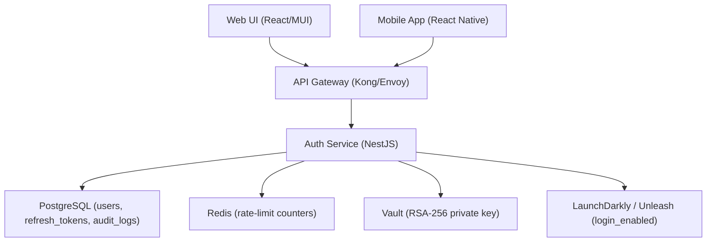

# User Login
**Type:** feature | **Priority:** 3 | **Status:** todo

## Notes
# 1. Feature Overview **Feature:** User Login (notation 1.a.b)  

**Purpose** – Authenticate a tenant‑scoped user with email + password, issue a short‑lived JWT access token and a long‑lived refresh token, and create an immutable audit record.  

**Scope**  

- Validate credentials against the existing `users` table.  
- Enforce tenant isolation (`tenant_id`) and status check (`active`).  
- Generate a signed JWT (RSA‑256) containing `sub`, `tenantId`, `role`, and `exp`.  
- Create a cryptographically random refresh token, hash it with bcrypt, and store the hash in `refresh_tokens`.  
- Emit a `login_success` or `login_failure` entry in `audit_logs`.  
- Return the plain refresh token (not hashed) to the client.  

**Business Value** – Provides the entry point for all SaaS functionality, enables RBAC and tenant isolation, supports revocable sessions for compliance, and lays the foundation for SSO fallback via Keycloak.

---

# 2. User Stories  

| # | User Story | Acceptance Criteria |
|---|------------|----------------------|
| 2.1 | **As a registered user, I want to log in with my email and password so that I can access my workspace.** | - `POST /api/v1/auth/login` returns `200 OK` with `accessToken`, `refreshToken`, `expiresIn`. <br>- Password is verified with Argon2id. <br>- User `status` must be `active`. <br>- JWT contains `sub`, `tenantId`, `role`, `exp`. |
| 2.2 | **As a logged‑in user, I want my access token to expire after a short period so that a compromised token has limited impact.** | - JWT `exp` is 15 minutes from issuance. <br>- Refresh token can be used to obtain a new access token. |
| 2.3 | **As a user, I want to be able to refresh my session without re‑entering credentials so that I stay logged in across page reloads.** | - `POST /api/v1/auth/refresh` with a valid refresh token returns a new access token (15 min). <br>- Refresh token is stored hashed (bcrypt) in `refresh_tokens`. |
| 2.4 | **As a user, I want to log out and invalidate my refresh token so that no one can reuse it.** | - `POST /api/v1/auth/logout` deletes the hashed refresh‑token row. <br>- Returns `204 No Content`. |
| 2.5 | **As a security‑conscious tenant admin, I want all login attempts to be rate‑limited per tenant so that brute‑force attacks are mitigated.** | - Redis token‑bucket: max 10 login attempts per minute per `tenant_id`/`email`. <br>- Exceeding limit returns `429 TOO_MANY_REQUESTS`. |

---

# 3. Technical Specification  

## 3.1 Architecture  



*The Login feature lives entirely inside the **Auth Service**. All other services remain unchanged.*

## 3.2 API Endpoints  

| Method | Path | Auth | Request Body | Success Response | Errors |
|--------|------|------|--------------|------------------|--------|
| **POST** | `/api/v1/auth/login` | – | `LoginRequest` (see schema) | `200 OK` → `{ "accessToken": "string", "refreshToken": "string", "expiresIn": 900 }` | `400 INVALID_PAYLOAD`, `401 UNAUTHORIZED`, `403 FORBIDDEN`, `429 TOO_MANY_REQUESTS` |
| **POST** | `/api/v1/auth/refresh` | – | `RefreshRequest` (see schema) | `200 OK` → `{ "accessToken": "string", "expiresIn": 900 }` | `401 UNAUTHORIZED`, `410 TOKEN_EXPIRED` |
| **POST** | `/api/v1/auth/logout` | JWT (access token) | `LogoutRequest` (see schema) | `204 No Content` | `401 UNAUTHORIZED` |

### JSON‑Schema Snippets  

```json
{
  "title": "LoginRequest",
  "type": "object",
  "required": ["email", "password"],
  "properties": {
    "email": { "type": "string", "format": "email" },
    "password": { "type": "string", "minLength": 8 }
  },
  "additionalProperties": false
}
```

```json
{
  "title": "RefreshRequest",
  "type": "object",
  "required": ["refreshToken"],
  "properties": {
    "refreshToken": { "type": "string", "minLength": 32 }
  },
  "additionalProperties": false
}
```

```json
{
  "title": "LogoutRequest",
  "type": "object",
  "required": ["refreshToken"],
  "properties": {
    "refreshToken": { "type": "string", "minLength": 32 }
  },
  "additionalProperties": false
}
```

## 3.3 Data Model  

| Table | Primary Key | Relevant Columns | Relationships | Indexes |
|-------|-------------|------------------|---------------|---------|
| `users` | `id` UUID | `email` VARCHAR(255) **unique**, `password_hash` VARCHAR(255), `tenant_id` UUID, `status` ENUM(`pending_verification`,`active`,`suspended`), `role` ENUM(`owner`,`admin`,`member`,`viewer`), `created_at` TIMESTAMP, `updated_at` TIMESTAMP | 1‑M → `refresh_tokens`, 1‑M → `audit_logs` | `idx_users_tenant_id`, `idx_users_email` |
| `refresh_tokens` | `id` UUID | `user_id` UUID, `token_hash` VARCHAR(255) (bcrypt), `expires_at` TIMESTAMP, `created_at` TIMESTAMP | FK → `users.id` | `idx_refresh_user` (user_id) |
| `audit_logs` | `id` UUID | `tenant_id` UUID, `user_id` UUID, `action` VARCHAR, `payload` JSONB, `created_at` TIMESTAMP | – | `idx_audit_tenant_time` (tenant_id, created_at) |

*No new tables are introduced; the login feature only reads/writes to the tables above.*

## 3.4 Business Logic  

### 3.4.1 Login Workflow  

1. **Feature‑flag check** – Abort with `403` if `login_enabled` is `false`.  
2. **Rate‑limit** – Increment Redis counter `login:{tenant_id}:{email}` (token‑bucket, max 10 / minute). Return `429` if exceeded.  
3. **Payload validation** – JSON‑Schema validation (see `LoginRequest`).  
4. **User lookup** – `SELECT * FROM users WHERE LOWER(email) = LOWER($email) AND tenant_id = $tenant_id`.  
5. **Status check** – Must be `active`; otherwise `403 FORBIDDEN`.  
6. **Password verification** – Compare supplied password with `password_hash` using Argon2id.  
7. **JWT creation** – Sign with RSA‑256 private key from Vault. Claims: `sub = user.id`, `tenantId = user.tenant_id`, `role = user.role`, `exp = now + 15 min`.  
8. **Refresh token generation** – Generate 32‑byte cryptographically random string, base64url‑encode.  
9. **Hash refresh token** – bcrypt (cost = 12) → store `token_hash` in `refresh_tokens` with `expires_at = now + 7 days`.  
10. **Audit log** – Insert into `audit_logs` (`action = "login_success"` or `"login_failure"` with payload containing `email`, `tenantId`, `reason` if failure).  
11. **Response** – Return JWT, plain refresh token, and `expiresIn = 900` seconds.

### 3.4.2 Refresh Workflow  

1. **Rate‑limit** – Separate Redis counter `refresh:{tenant_id}` (max 20 / minute).  
2. **Validate request** – `RefreshRequest` schema.  
3. **Lookup token** – `SELECT * FROM refresh_tokens WHERE token_hash = bcrypt_hash($refreshToken) AND expires_at > now()`.  
4. **User & tenant verification** – Join to `users` to ensure `status = active` and tenant matches.  
5. **JWT issuance** – Same as login step 7.  
6. **Audit log** – `action = "token_refresh"` with `userId`.  
7. **Response** – New JWT and `expiresIn`.

### 3.4.3 Logout Workflow  

1. **Validate request** – `LogoutRequest` schema.  
2. **Delete token** – `DELETE FROM refresh_tokens WHERE token_hash = bcrypt_hash($refreshToken)`.  
3. **Audit log** – `action = "logout"` with `userId`.  
4. **Response** – `204 No Content`.

### 3.4.4 State Machine (User Status)  

```
pending_verification --> active   (email verified)
pending_verification --> suspended (admin action)
active                --> suspended (admin action)
suspended             --> active    (admin re‑activate)
```

Only users in `active` state can obtain JWTs; all other states result in `403 FORBIDDEN`.

---

# 4. Security Considerations  

| Aspect | Controls |
|--------|----------|
| **Authentication** | Passwords stored as Argon2id hashes. JWT signed with RSA‑256 private key retrieved from Vault. |
| **Authorization** | RBAC via JWT `role`. Tenant isolation enforced by `tenant_id` claim and PostgreSQL Row‑Level Security (RLS) policies. |
| **Transport** | TLS 1.3 enforced by API Gateway; HSTS header on all responses. |
| **Token Security** | Refresh tokens stored hashed (bcrypt) in `refresh_tokens`. Plain token only ever sent to the client over TLS. |
| **Input Validation** | JSON‑Schema validation for all request bodies; email normalized to lower‑case before DB lookup. |
| **Rate Limiting** | Redis token‑bucket per tenant/email (login) and per tenant (refresh). |
| **Audit Logging** | Immutable entry in `audit_logs` for every login, refresh, and logout event. |
| **Data Protection** | PostgreSQL encrypted at rest via KMS; Vault manages RSA keys; no PII logged. |
| **Compliance** | GDPR “right to be forgotten” – soft‑delete via `users.status = suspended`; audit logs retained 2 years. |
| **Feature Flag** | `login_enabled` (default `true`) controlled via LaunchDarkly/Unleash for gradual rollout. |

---

# 5. Error Handling  

| HTTP Status | Error Code | Message | Fallback / Retry |
|-------------|------------|---------|------------------|
| 400 | `INVALID_PAYLOAD` | Request body fails schema validation. | Client must correct payload. |
| 401 | `UNAUTHORIZED` | Missing, malformed, or expired JWT / refresh token. | Prompt re‑login. |
| 403 | `FORBIDDEN` | User not `active` or tenant mismatch. | Show access‑denied UI. |
| 404 | `NOT_FOUND` | Refresh token not found. | Prompt re‑login. |
| 410 | `TOKEN_EXPIRED` | Refresh token or email verification token expired. | Offer to request a new token. |
| 429 | `TOO_MANY_REQUESTS` | Rate limit exceeded. | Exponential back‑off on client side. |
| 500 | `INTERNAL_ERROR` | Unexpected server error. | Log, return generic message, trigger alert. |

**Retry Strategy**  

- **Idempotent** endpoints (`POST /auth/refresh`, `POST /auth/logout`) may be automatically retried with exponential back‑off (max 3 attempts).  
- **Non‑idempotent** endpoint (`POST /auth/login`) must not be auto‑retried; UI should present a “Try again” button after fixing the cause.

---

# 6. Testing Plan  

| Test Level | Scope | Tools | Example Cases |
|------------|-------|-------|---------------|
| **Unit** | Password hashing, JWT creation, token hashing, rate‑limit helper functions. | Jest (TS) / Go test | `hashPassword()` returns Argon2id hash; `verifyRefreshToken()` matches bcrypt hash. |
| **Integration** | End‑to‑end login/refresh/logout flow through API Gateway, DB, Redis, Vault. | Testcontainers (PostgreSQL, Redis), SuperTest | Successful login → DB contains refresh token hash; audit log entry created. |
| **Contract** | OpenAPI compliance for `/auth/*` endpoints. | OpenAPI validator, Pact | Provider returns fields exactly as defined; consumer receives expected error codes. |
| **E2E** | Full UI journey (login page, token storage, logout). | Cypress | User enters credentials → redirected to dashboard; token stored in HttpOnly cookie. |
| **Performance** | Load test login and refresh under concurrent users. | k6 | 500 concurrent login attempts, 95 % < 200 ms response. |
| **Security** | Vulnerability scanning, auth‑bypass attempts. | OWASP ZAP, Snyk | Ensure no SQL injection possible; verify rate‑limit works. |
| **Chaos** | Simulate Redis outage, DB latency spikes. | LitmusChaos | Service returns `503` with proper fallback message. |

All tests run in CI on every PR; nightly pipeline runs full integration + performance suites on a staging cluster.

---

# 7. Dependencies  

| Dependency | Reason |
|------------|--------|
| **Auth Service** (NestJS) | Hosts the login, refresh, and logout handlers. |
| **PostgreSQL** | Stores `users`, `refresh_tokens`, `audit_logs`. |
| **Redis** | Rate‑limit counters and feature‑flag cache. |
| **Vault** (or cloud KMS) | Holds RSA‑256 private key for JWT signing. |
| **LaunchDarkly / Unleash** | Feature flag `login_enabled`. |
| **Argon2id library** | Secure password hashing. |
| **bcrypt library** | Hashing refresh tokens. |
| **JWT library** (node‑jsonwebtokens) | Token creation and verification. |
| **MUI + Lucide React** | UI components and icons for the login page (global UI spec). |
| **Kubernetes + Helm** | Deployment of Auth Service with zero‑downtime rollouts. |

All dependencies are already part of the platform; no new external services are introduced.

---

# 8. Migration & Deployment  

| Step | Action | Tool |
|------|--------|------|
| **1** | Verify existing tables (`users`, `refresh_tokens`, `audit_logs`) are present (migration versions 001‑005). | Prisma Migrate / Flyway |
| **2** | Ensure index `idx_refresh_user` exists on `refresh_tokens(user_id)`. | Migration script (no new table) |
| **3** | Deploy Auth Service with new login, refresh, logout handlers. | Helm chart version bump |
| **4** | Enable feature flag `login_enabled` (default `true`) for gradual rollout. | LaunchDarkly / Unleash |
| **5** | Rolling update via Kubernetes Deployment (zero‑downtime). | `kubectl rollout restart` |
| **6** | Rollback plan – revert Deployment to previous image; delete any newly created refresh‑token rows if needed (soft‑delete via `status`). | Helm rollback, DB transaction logs |

*No schema changes are required; the feature only reads/writes to existing tables.*  

---  

*End of Feature Specification*
