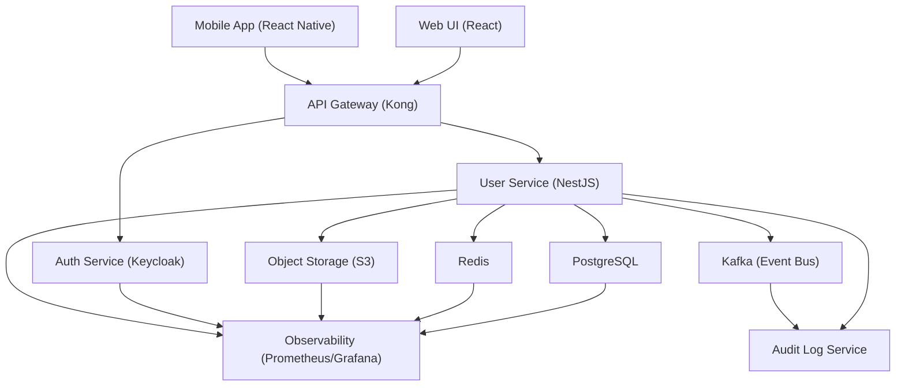

# User Management
**Type:** feature | **Priority:** 3 | **Status:** todo

## Notes
# Feature Specification – User Management (1.d.a)

## 1. Feature Overview
**Purpose** – Enable multi‑tenant user lifecycle management (sign‑up, email verification, login, token refresh, logout, profile view & edit, avatar upload) for the Chatbot SaaS platform.  

**Scope** – All user‑facing authentication flows and self‑service profile operations. Admin‑level user CRUD is handled by the separate *Admin Panel* module (1.d).  

**Business Value** –  
- Provides secure onboarding for new tenants and their members.  
- Guarantees tenant isolation via `tenant_id`.  
- Supplies audit trails for compliance (GDPR, SOC 2).  
- Enables fine‑grained RBAC (`owner`, `admin`, `member`, `viewer`).  

---

## 2. User Stories  

| # | User Story | Acceptance Criteria |
|---|------------|----------------------|
| 2.1 | **As a prospective user, I want to sign up with my email and password so that I can create a new account in my tenant.** | - `POST /api/v1/auth/signup` returns `201` with `userId` and a verification token. <br>- Email is stored unique (`users.email`). <br>- A `profiles` row is automatically created (trigger or transaction). <br>- An entry is written to `audit_logs` (`action = "signup"`). |
| 2.2 | **As a new user, I want to verify my email address so that my account becomes active.** | - `GET /api/v1/auth/verify?token=…` validates a hashed token in `email_verifications`. <br>- On success, `users.status` changes from `pending_verification` → `active`. <br>- `audit_logs` records `action = "email_verified"`. |
| 2.3 | **As an active user, I want to log in with my email and password so that I receive an access token and a refresh token.** | - `POST /api/v1/auth/login` returns `200` with JWT (15 min) and refresh token (7 days). <br>- Only users with `status = active` are allowed; others receive `403`. <br>- Successful and failed attempts are logged (`audit_logs`). |
| 2.4 | **As a logged‑in user, I want to refresh my session without re‑entering credentials so that I stay logged in.** | - `POST /api/v1/auth/refresh` with a valid refresh token returns a new JWT. <br>- Refresh token is stored hashed (bcrypt) in `refresh_tokens`. <br>- Expired or revoked tokens return `410`. |
| 2.5 | **As a logged‑in user, I want to log out and invalidate my refresh token so that no one can reuse it.** | - `POST /api/v1/auth/logout` deletes the matching `refresh_tokens` row. <br>- Returns `204`. |
| 2.6 | **As a logged‑in user, I want to view my profile (name, avatar, locale) so that I can confirm my personal data.** | - `GET /api/v1/users/me` returns a `UserProfile` JSON (see schema). <br>- Requires a valid JWT; tenant mismatch results in `403`. |
| 2.7 | **As a logged‑in user, I want to update my first name, last name, or locale so that my profile stays current.** | - `PATCH /api/v1/users/me` accepts partial `UserProfileUpdate`. <br>- Returns the updated `UserProfile`. <br>- `audit_logs` records `action = "profile_update"`. |
| 2.8 | **As a logged‑in user, I want to upload a new avatar image (max 5 MB, PNG/JPEG) so that my profile shows a personal picture.** | - `POST /api/v1/users/me/avatar` accepts multipart/form‑data. <br>- Validates size & MIME type; stores the file in private S3 bucket. <br>- Returns a signed, time‑limited URL (`avatarUrl`). <br>- `profiles.avatar_url` is updated. |

---

## 3. Technical Specification  

### 3.1 Architecture  



*The **User Service** implements all endpoints listed in §3.2. It reads/writes only the tables defined in the data model (users, profiles, email_verifications, refresh_tokens, audit_logs). All writes are performed inside a single transaction to guarantee the existence of a `profiles` row (trigger or service‑level logic).*

### 3.2 API Endpoints  

| Method | Path | Auth | Request Body | Success Response | Errors |
|--------|------|------|--------------|------------------|--------|
| **POST** | `/api/v1/auth/signup` | – | `SignUpRequest` (see schema) | **201 Created** → `{ "userId": UUID, "verificationToken": string }` | `400 INVALID_PAYLOAD`, `409 DUPLICATE_EMAIL` |
| **GET** | `/api/v1/auth/verify` | – | Query `token` (string) | **200 OK** → `{ "message": "Verified" }` | `400 INVALID_TOKEN`, `410 TOKEN_EXPIRED` |
| **POST** | `/api/v1/auth/login` | – | `LoginRequest` | **200 OK** → `{ "accessToken": string, "refreshToken": string, "expiresIn": 900 }` | `400 INVALID_PAYLOAD`, `401 UNAUTHORIZED`, `403 FORBIDDEN` |
| **POST** | `/api/v1/auth/refresh` | – | `RefreshRequest` | **200 OK** → `{ "accessToken": string, "expiresIn": 900 }` | `401 UNAUTHORIZED`, `410 TOKEN_EXPIRED` |
| **POST** | `/api/v1/auth/logout` | JWT | `LogoutRequest` (optional `refreshToken`) | **204 No Content** | `401 UNAUTHORIZED` |
| **GET** | `/api/v1/users/me` | JWT | – | **200 OK** → `UserProfile` | `401 UNAUTHORIZED` |
| **PATCH** | `/api/v1/users/me` | JWT | `UserProfileUpdate` (partial) | **200 OK** → updated `UserProfile` | `400 INVALID_PAYLOAD`, `401 UNAUTHORIZED`, `409 CONFLICT` |
| **POST** | `/api/v1/users/me/avatar` | JWT | `multipart/form-data` (`avatar` file) | **200 OK** → `{ "avatarUrl": string }` | `400 INVALID_PAYLOAD`, `401 UNAUTHORIZED`, `413 PAYLOAD_TOO_LARGE`, `415 UNSUPPORTED_MEDIA_TYPE` |

#### JSON Schemas  

```json
{
  "title": "SignUpRequest",
  "type": "object",
  "properties": {
    "email":    { "type": "string", "format": "email" },
    "password": { "type": "string", "minLength": 8 },
    "firstName":{ "type": "string", "maxLength": 100 },
    "lastName": { "type": "string", "maxLength": 100 },
    "locale":   { "type": "string", "pattern": "^[a-z]{2}-[A-Z]{2}$" },
    "tenantId": { "type": "string", "format": "uuid" }
  },
  "required": ["email","password","tenantId"],
  "additionalProperties": false
}
```

```json
{
  "title": "LoginRequest",
  "type": "object",
  "properties": {
    "email":    { "type": "string", "format": "email" },
    "password": { "type": "string" },
    "tenantId": { "type": "string", "format": "uuid" }
  },
  "required": ["email","password","tenantId"],
  "additionalProperties": false
}
```

```json
{
  "title": "RefreshRequest",
  "type": "object",
  "properties": {
    "refreshToken": { "type": "string" }
  },
  "required": ["refreshToken"],
  "additionalProperties": false
}
```

```json
{
  "title": "UserProfile",
  "type": "object",
  "properties": {
    "userId":    { "type": "string", "format": "uuid" },
    "email":     { "type": "string", "format": "email" },
    "firstName": { "type": "string", "maxLength": 100 },
    "lastName":  { "type": "string", "maxLength": 100 },
    "avatarUrl": { "type": "string", "format": "uri" },
    "locale":    { "type": "string", "pattern": "^[a-z]{2}-[A-Z]{2}$" },
    "createdAt": { "type": "string", "format": "date-time" },
    "updatedAt": { "type": "string", "format": "date-time" }
  },
  "required": ["userId","email","createdAt","updatedAt"],
  "additionalProperties": false
}
```

```json
{
  "title": "UserProfileUpdate",
  "type": "object",
  "properties": {
    "firstName": { "type": "string", "maxLength": 100 },
    "lastName":  { "type": "string", "maxLength": 100 },
    "locale":    { "type": "string", "pattern": "^[a-z]{2}-[A-Z]{2}$" }
  },
  "additionalProperties": false
}
```

### 3.3 Data Model  

| Table | Primary Key | Relevant Columns | Relationships | Indexes |
|-------|-------------|------------------|---------------|---------|
| `users` | `id` UUID | `email` VARCHAR(255) **unique**, `password_hash` VARCHAR(255), `tenant_id` UUID, `status` ENUM(`pending_verification`,`active`,`suspended`), `role` ENUM(`owner`,`admin`,`member`,`viewer`), `created_at` TIMESTAMP, `updated_at` TIMESTAMP | 1‑M → `profiles`, 1‑M → `refresh_tokens`, 1‑M → `audit_logs` | `idx_users_tenant_id`, `idx_users_email` |
| `profiles` | `user_id` UUID (FK → users.id) | `first_name` VARCHAR, `last_name` VARCHAR, `avatar_url` VARCHAR, `locale` VARCHAR(5) | PK on `user_id` (1‑1) | – |
| `email_verifications` | `id` UUID | `user_id` UUID, `token_hash` VARCHAR(255), `expires_at` TIMESTAMP, `created_at` TIMESTAMP | FK → `users.id` | `idx_email_token` (token_hash) |
| `refresh_tokens` | `id` UUID | `user_id` UUID, `token_hash` VARCHAR(255), `expires_at` TIMESTAMP, `created_at` TIMESTAMP | FK → `users.id` | `idx_refresh_user` (user_id) |
| `audit_logs` | `id` UUID | `tenant_id` UUID, `user_id` UUID, `action` VARCHAR, `payload` JSONB, `created_at` TIMESTAMP | – | `idx_audit_tenant_time` (tenant_id, created_at) |

*All writes to `users` and `profiles` occur inside a single transaction (or rely on the `trg_user_insert` trigger) to guarantee a profile row exists.*

### 3.4 Business Logic  

#### 3.4.1 Sign‑Up Workflow  

1. **Feature‑flag check** – `user_management_enabled` must be `true`.  
2. **Rate‑limit** – Redis token bucket `signup:{tenantId}:{email}` (max 5 / hour).  
3. **Validate** request against `SignUpRequest` schema.  
4. **Begin DB transaction**:  
   - Insert into `users` (`status = pending_verification`).  
   - Insert into `profiles` (only `user_id` required; other columns may be null).  
5. **Create email verification token**:  
   - Generate 32‑byte random string, base64url‑encode.  
   - Store SHA‑256 hash in `email_verifications.token_hash` with `expires_at = now + 24 h`.  
6. **Send verification email** (async worker).  
7. **Audit** – Insert into `audit_logs` (`action = "signup"`).  
8. **Commit** transaction; return `userId` and the plain verification token.  

#### 3.4.2 Email Verification  

1. Hash the supplied token (SHA‑256) and look up `email_verifications`.  
2. If not found → `400 INVALID_TOKEN`.  
3. If `expires_at` passed → `410 TOKEN_EXPIRED`.  
4. Update `users.status = active`.  
5. Delete the verification row (or mark as used).  
6. Audit `action = "email_verified"`.

#### 3.4.3 Login Workflow  

1. **Rate‑limit** – Redis `login:{tenantId}:{email}` (max 10 / minute).  
2. Validate `LoginRequest`.  
3. Query `users` by lower‑cased email and `tenant_id`.  
4. If no row or `status != active` → `403 FORBIDDEN`.  
5. Verify password with Argon2id against `password_hash`.  
6. On success:  
   - Issue JWT (RS256) with claims `sub`, `tenantId`, `role`, `exp = now + 15 min`.  
   - Generate refresh token (32 bytes random, base64url).  
   - Hash refresh token with bcrypt (cost = 12) → store in `refresh_tokens` with `expires_at = now + 7 days`.  
   - Audit `action = "login_success"`.  
7. On failure: audit `action = "login_failure"` and return `401 UNAUTHORIZED`.  

#### 3.4.4 Refresh Token  

1. Look up `refresh_tokens` by `user_id` (derived from JWT or supplied token).  
2. Compare bcrypt hash; if mismatch → `401 UNAUTHORIZED`.  
3. If `expires_at` passed → `410 TOKEN_EXPIRED`.  
4. Issue new JWT (same claims, new `exp`).  
5. Audit `action = "token_refresh"`.

#### 3.4.5 Logout  

1. Delete the matching `refresh_tokens` row (by hashed token).  
2. Audit `action = "logout"`.

#### 3.4.6 Profile View / Update  

* **View** – `SELECT` from `users` + `profiles` using `tenant_id` from JWT.  
* **Update** – Validate `UserProfileUpdate`; `UPDATE` `profiles` fields inside a transaction; update `users.updated_at`.  
* **Audit** – `action = "profile_update"` with JSON payload of changed fields.

#### 3.4.7 Avatar Upload  

1. Validate MIME type (`image/png`, `image/jpeg`) and size ≤ 5 MB.  
2. Store file in private S3 bucket under `avatars/{userId}/{uuid}.ext`.  
3. Generate a signed URL (valid 15 min) and store it in `profiles.avatar_url`.  
4. Audit `action = "avatar_update"`.

#### 3.4.8 State Machine – User Status  

```
pending_verification --> active   (email verified)
pending_verification --> suspended (admin action)
active                --> suspended (admin action)
suspended             --> active    (admin re‑activate)
```

Only `active` users can obtain JWTs; others receive `403 FORBIDDEN`.

---

## 4. Security Considerations  

| Aspect | Controls |
|--------|----------|
| **Authentication** | JWT signed with RSA‑256 (private key in Vault). Access token TTL 15 min; refresh token TTL 7 days. |
| **Authorization** | RBAC via JWT `role`. Endpoints enforce `tenant_id` claim; RLS policies in PostgreSQL ensure tenant isolation. |
| **Password Storage** | Argon2id (memory ≥ 64 MiB, parallelism = 2). |
| **Refresh Token Storage** | Hashed with bcrypt; never stored in plaintext. |
| **Email Verification Token** | Stored as SHA‑256 hash; plain token only sent via email. |
| **Input Validation** | JSON‑Schema validation for all request bodies; multipart avatar validation (type, size). |
| **Rate Limiting** | Redis token‑bucket per tenant/email for sign‑up (5 / h) and login (10 / min). |
| **Transport** | TLS 1.3 enforced by API gateway; HSTS header set. |
| **Audit Logging** | Immutable rows in `audit_logs` for every authentication‑related event. |
| **Data Protection** | `avatar_url` is a signed, time‑limited S3 URL; raw file stored in private bucket. All DB columns at rest encrypted via KMS. |
| **Compliance** | GDPR “right to be forgotten” – `users.status = suspended` and personal fields cleared on admin request. |

---

## 5. Error Handling  

| HTTP Status | Error Code | Message | Fallback / Retry |
|-------------|------------|---------|------------------|
| 400 | `INVALID_PAYLOAD` | Request body fails schema validation. | Client must correct payload. |
| 401 | `UNAUTHORIZED` | Missing or invalid JWT / refresh token. | Prompt re‑login. |
| 403 | `FORBIDDEN` | User not `active` or tenant mismatch. | Show access‑denied UI. |
| 404 | `NOT_FOUND` | Resource (user, token) not found. | Show friendly not‑found page. |
| 409 | `DUPLICATE_EMAIL` | Email already registered. | Suggest login or password reset. |
| 410 | `TOKEN_EXPIRED` | Email verification or refresh token expired. | Offer to resend token. |
| 429 | `TOO_MANY_REQUESTS` | Rate limit exceeded. | Exponential back‑off on client side. |
| 413 | `PAYLOAD_TOO_LARGE` | Avatar file exceeds 5 MB. | Prompt user to use smaller image. |
| 415 | `UNSUPPORTED_MEDIA_TYPE` | Avatar file not PNG/JPEG. | Prompt correct format. |
| 500 | `INTERNAL_ERROR` | Unexpected server error. | Log, return generic message, trigger alert. |

**Retry Strategy** – Idempotent `GET` endpoints (`/me`, `/auth/verify`) may be automatically retried with exponential back‑off. Mutating endpoints (`POST /signup`, `PATCH /me`) are **not** auto‑retried; client must handle `429` or `500` explicitly.

---

## 6. Testing Plan  

| Test Level | Scope | Tools |
|------------|-------|-------|
| **Unit** | Service functions: token generation, password hashing, JWT creation, avatar URL signing. | Jest (TS) / Go test |
| **Integration** | End‑to‑end flow through API gateway, DB, Redis, S3 (using Testcontainers). | SuperTest, Docker‑Compose |
| **Contract** | Verify OpenAPI compliance; ensure request/response shapes match schemas. | Pact, Swagger‑validator |
| **E2E** | Full user journey: sign‑up → email verification → login → profile edit → avatar upload → logout. | Cypress (web) |
| **Performance** | Load test login and refresh endpoints (10 k RPS). | k6 |
| **Security** | OWASP ZAP scan, token‑tampering tests, RLS bypass attempts. | ZAP, custom scripts |
| **Chaos** | Simulate Redis outage, DB latency spikes. | LitmusChaos |

**Edge Cases** to cover:  
- Duplicate email (case‑insensitive).  
- Expired verification token.  
- Refresh token reuse after logout.  
- Avatar upload with malicious MIME type.  
- Tenant‑cross‑access attempts (should be blocked by RLS).  

---

## 7. Dependencies  

| Dependency | Reason |
|------------|--------|
| **Auth Service (Keycloak)** | Provides OAuth2 / OIDC token issuance for SSO (optional). |
| **PostgreSQL** | Primary data store for users, profiles, tokens, audit logs. |
| **Redis** | Rate‑limit counters, short‑lived session data. |
| **S3 (or MinIO)** | Avatar storage (private bucket). |
| **Kafka** | Event bus for audit‑log publishing (optional). |
| **LaunchDarkly / Unleash** | Feature‑flag `user_management_enabled`. |
| **Email Service (SendGrid / SES)** | Sends verification emails. |
| **Vault / Secrets Manager** | Stores JWT private key, DB credentials. |
| **Observability Stack** | Prometheus, Grafana, Loki for metrics & logs. |

---

## 8. Migration & Deployment  

### 8.1 Database Migrations  

*No new tables are added.* Ensure the following indexes exist (already present in baseline migrations):  

- `idx_users_email` (unique)  
- `idx_users_tenant_id`  
- `idx_email_token` (on `email_verifications.token_hash`)  
- `idx_refresh_user` (on `refresh_tokens.user_id`)  
- `idx_audit_tenant_time` (on `audit_logs.tenant_id, created_at`)  

If a `trg_user_insert` trigger is missing, add it to guarantee profile creation:

```sql
CREATE OR REPLACE FUNCTION create_profile_if_missing()
RETURNS trigger AS $$
BEGIN
  IF NOT EXISTS (SELECT 1 FROM profiles WHERE user_id = NEW.id) THEN
    INSERT INTO profiles (user_id) VALUES (NEW.id);
  END IF;
  RETURN NEW;
END;
$$ LANGUAGE plpgsql;

CREATE TRIGGER trg_user_insert
AFTER INSERT ON users
FOR EACH ROW EXECUTE FUNCTION create_profile_if_missing();
```

### 8.2 Feature Flags  

- `user_management_enabled` – default `true`.  
- Controlled per‑environment via Helm values (`featureFlags.userManagement`).  

All endpoints are wrapped by middleware that checks the flag; if disabled, they return `403 FORBIDDEN`.

### 8.3 Deployment  

| Component | Container Image | Helm Chart | HPA Settings |
|-----------|----------------|------------|--------------|
| User Service | `registry.company.com/user-service:${VERSION}` | `user-service` | CPU > 70 % → scale up to 5 replicas |
| API Gateway | `kong:3.x` | `gateway` | N/A |
| Redis | `redis:7-alpine` | `redis` | N/A |
| S3 Proxy (if self‑hosted) | `minio/minio` | `minio` | N/A |

*Deployments use rolling updates; readiness probes ensure no traffic is sent to a pod before the DB connection and health check pass.*

### 8.4 Rollback Plan  

| Failure Point | Rollback Action |
|---------------|-----------------|
| **Sign‑up transaction** | DB transaction aborts automatically – no partial rows. |
| **Email service outage** | Feature flag `email_enabled` can be toggled off; users can request a resend later. |
| **Login service crash** | HPA will spin up new pods; fallback to a “service unavailable” page (HTTP 503). |
| **Avatar upload failure** | Return `500` and do not update `profiles.avatar_url`. |
| **Schema change** | Since no schema change, only index rebuilds may be needed; can be rolled back by restoring previous DB snapshot. |

---  

*End of Document*
