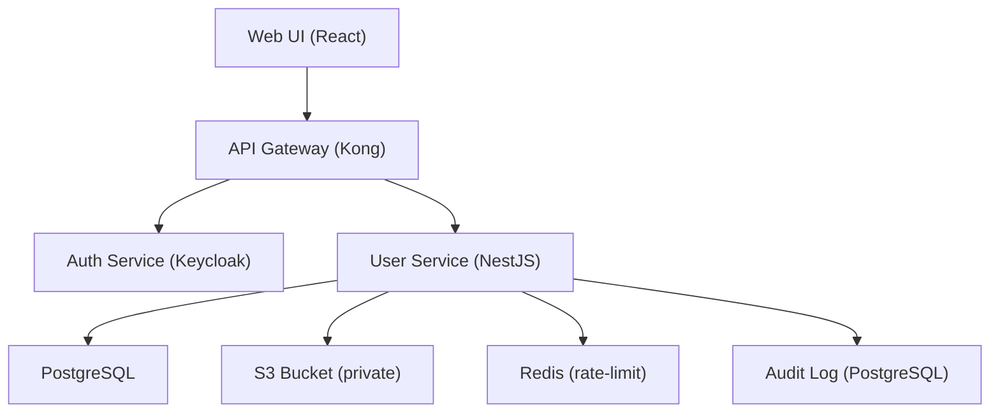

# User Profile Management
**Type:** feature | **Priority:** 3 | **Status:** todo

## Notes
# 1. Feature Overview
**Feature:** User Profile Management (notation 1.a.c)  

**Purpose** – Allow authenticated users to view and edit their personal profile (name, locale, avatar) from within the Chatbot SaaS application.  

**Scope** –  
* Retrieval of the current user’s profile (`GET /me`).  
* Partial update of profile fields (`PATCH /me`).  
* Avatar upload with validation and storage of a signed S3 URL (`POST /me/avatar`).  

**Business Value** –  
* Improves user experience by personalising the UI (name, avatar, locale).  
* Enables tenant‑level branding (locale‑specific UI).  
* Provides a foundation for future features such as per‑user preferences, audit trails, and GDPR “right to be forgotten”.  

---

# 2. User Stories  

| # | User Story | Acceptance Criteria |
|---|------------|----------------------|
| 2.1 | **As a logged‑in user, I want to view my profile so that I can see my current name, avatar and locale.** | • `GET /api/v1/users/me` returns HTTP 200 with a `UserProfile` payload.<br>• The response contains `userId`, `email`, `firstName`, `lastName`, `avatarUrl`, `locale`, `createdAt`, `updatedAt`.<br>• Request is rejected with 401 if JWT is missing/invalid. |
| 2.2 | **As a logged‑in user, I want to update my first name, last name or locale so that my profile reflects my current information.** | • `PATCH /api/v1/users/me` accepts a JSON body with any subset of `firstName`, `lastName`, `locale`.<br>• Validation: strings ≤ 100 chars, `locale` must be a 5‑character ISO language‑region code (e.g., `en‑US`).<br>• On success returns HTTP 200 with the updated `UserProfile`.<br>• Optimistic concurrency: if `If‑Modified‑Since` header does not match current `updatedAt`, return 409. |
| 2.3 | **As a logged‑in user, I want to upload a new avatar image so that my profile shows my picture.** | • `POST /api/v1/users/me/avatar` accepts `multipart/form-data` with a single `avatar` file.<br>• Accepted MIME types: `image/png`, `image/jpeg`.<br>• Max size: 5 MB.<br>• Service stores the raw file in a private S3 bucket, generates a signed URL (valid 15 min) and writes it to `profiles.avatar_url`.<br>• Returns HTTP 200 with `{ "avatarUrl": "<signed‑url>" }`. |
| 2.4 | **As a user whose account is suspended, I must not be able to access profile endpoints.** | • Any request to the three endpoints returns 403 FORBIDDEN when `users.status != active`. |
| 2.5 | **As a tenant admin, I need audit entries for every profile view, update, or avatar change.** | • Each successful or failed operation creates an immutable row in `audit_logs` with `action` = `profile_view`, `profile_update`, or `avatar_upload`. |

---

# 3. Technical Specification  

## 3.1 Architecture  



*The User Service plugs into the existing micro‑service landscape. All profile data lives in the `profiles` table (1‑1 with `users`). The DB trigger guarantees a profile row exists for every new user.*  

---

## 3.2 API Endpoints  

| Method | Path | Auth | Request | Success Response | Errors |
|--------|------|------|---------|------------------|--------|
| **GET** | `/api/v1/users/me` | JWT (any role) | – | `200 OK` → `UserProfile` (see schema) | `401 UNAUTHORIZED`, `403 FORBIDDEN`, `404 NOT_FOUND` |
| **PATCH** | `/api/v1/users/me` | JWT (any role) | `UserProfileUpdate` (JSON, partial) | `200 OK` → updated `UserProfile` | `400 INVALID_PAYLOAD`, `401 UNAUTHORIZED`, `403 FORBIDDEN`, `409 CONFLICT`, `404 NOT_FOUND` |
| **POST** | `/api/v1/users/me/avatar` | JWT (any role) | `multipart/form-data` (`avatar` file) | `200 OK` → `{ "avatarUrl": "<signed‑url>" }` | `400 INVALID_PAYLOAD`, `401 UNAUTHORIZED`, `403 FORBIDDEN`, `413 PAYLOAD_TOO_LARGE`, `415 UNSUPPORTED_MEDIA_TYPE`, `404 NOT_FOUND` |

### JSON Schemas  

**UserProfile**  

```json
{
  "type": "object",
  "properties": {
    "userId":   { "type": "string", "format": "uuid" },
    "email":    { "type": "string", "format": "email" },
    "firstName":{ "type": "string", "maxLength": 100 },
    "lastName": { "type": "string", "maxLength": 100 },
    "avatarUrl":{ "type": "string", "format": "uri" },
    "locale":   { "type": "string", "pattern": "^[a-z]{2}-[A-Z]{2}$" },
    "createdAt":{ "type": "string", "format": "date-time" },
    "updatedAt":{ "type": "string", "format": "date-time" }
  },
  "required": ["userId","email","createdAt","updatedAt"],
  "additionalProperties": false
}
```

**UserProfileUpdate** (partial)  

```json
{
  "type": "object",
  "properties": {
    "firstName":{ "type": "string", "maxLength": 100 },
    "lastName": { "type": "string", "maxLength": 100 },
    "locale":   { "type": "string", "pattern": "^[a-z]{2}-[A-Z]{2}$" }
  },
  "additionalProperties": false
}
```

*The avatar upload endpoint returns a JSON object `{ "avatarUrl": "<signed‑s3‑url>" }`.*

---

## 3.3 Data Model  

| Table | Primary Key | Columns (relevant) | Relationships | Indexes |
|-------|-------------|--------------------|---------------|---------|
| `users` | `id` UUID | `email` VARCHAR(255) **unique**, `password_hash` VARCHAR(255), `tenant_id` UUID, `status` ENUM(`pending_verification`,`active`,`suspended`), `role` ENUM(`owner`,`admin`,`member`,`viewer`), `created_at` TIMESTAMP, `updated_at` TIMESTAMP | 1‑M → `profiles`, 1‑M → `refresh_tokens`, 1‑M → `audit_logs` | `idx_users_tenant_id`, `idx_users_email` |
| `profiles` | `user_id` UUID (FK → users.id) | `first_name` VARCHAR, `last_name` VARCHAR, `avatar_url` VARCHAR, `locale` VARCHAR(5) | PK on `user_id` (1‑1) | – |
| `audit_logs` | `id` UUID | `tenant_id` UUID, `user_id` UUID, `action` VARCHAR, `payload` JSONB, `created_at` TIMESTAMP | – | `idx_audit_tenant_time` (tenant_id, created_at) |

*No new tables are introduced. The `profiles` row is guaranteed to exist by the `trg_user_insert` trigger (or service‑level transaction).*

### Trigger Migration (idempotent)  

File: `006-create-profile-trigger.sql`

```sql
CREATE OR REPLACE FUNCTION create_profile_if_missing()
RETURNS trigger AS $$
BEGIN
  IF NOT EXISTS (SELECT 1 FROM profiles WHERE user_id = NEW.id) THEN
    INSERT INTO profiles (user_id) VALUES (NEW.id);
  END IF;
  RETURN NEW;
END;
$$ LANGUAGE plpgsql;

DROP TRIGGER IF EXISTS trg_user_insert ON users;
CREATE TRIGGER trg_user_insert
AFTER INSERT ON users
FOR EACH ROW EXECUTE FUNCTION create_profile_if_missing();
```

---

## 3.4 Business Logic  

### 3.4.1 Profile Retrieval (`GET /me`)  
1. Extract `sub` (user_id) and `tenantId` from validated JWT.  
2. Query `profiles` joined with `users` where `users.id = :user_id` and `users.tenant_id = :tenant_id`.  
3. If `users.status != active` → return 403.  
4. Return assembled `UserProfile`.  
5. Insert audit log entry `action = "profile_view"` with minimal payload (`{ userId, tenantId }`).  

### 3.4.2 Profile Update (`PATCH /me`)  
1. Validate JWT → `user_id`, `tenant_id`.  
2. Parse JSON body; reject unknown fields (schema validation).  
3. Verify `users.status = active`.  
4. Begin DB transaction.  
5. `SELECT updated_at FROM profiles WHERE user_id = :user_id FOR UPDATE`.  
6. If `If‑Modified‑Since` header present and does not match `updated_at` → abort with 409.  
7. `UPDATE profiles SET first_name = COALESCE(:firstName, first_name), last_name = COALESCE(:lastName, last_name), locale = COALESCE(:locale, locale), updated_at = now() WHERE user_id = :user_id`.  
8. Commit transaction.  
9. Return refreshed `UserProfile`.  
10. Audit log `action = "profile_update"` with `payload` containing changed fields.  

### 3.4.3 Avatar Upload (`POST /me/avatar`)  
1. Validate JWT → `user_id`, `tenant_id`.  
2. Enforce rate limit: Redis token bucket `profile:avatar:{tenant_id}:{user_id}` (max 5 uploads per minute).  
3. Validate multipart file: MIME type, size ≤ 5 MB.  
4. Generate a UUID key: `avatars/{tenant_id}/{user_id}/{uuid}.png|or .jpg`.  
5. Upload raw file to private S3 bucket (server‑side encryption).  
6. Generate a signed URL (valid 15 min) using S3 SDK.  
7. Update `profiles.avatar_url` with the signed URL (or store the S3 key and generate signed URL on each GET).  
8. Return `{ "avatarUrl": "<signed‑url>" }`.  
9. Audit log `action = "avatar_upload"` with `payload` containing the S3 key (hashed) and result status.  

### 3.4.4 State Machine (User Status)  

```
pending_verification --> active   (email verified)
active                --> suspended (admin action)
suspended             --> active    (admin re‑activate)
```

Only `active` users may invoke any of the three profile endpoints.

---

# 4. Security Considerations  

| Aspect | Controls |
|--------|----------|
| **Authentication** | All endpoints require a valid JWT signed with RSA‑256 (Keycloak). Token must contain `sub`, `tenantId`, `role`, `exp`. |
| **Authorization** | RBAC not needed for self‑profile; however, tenant isolation is enforced via PostgreSQL Row‑Level Security (RLS) on `users` and `profiles`. |
| **Input Validation** | JSON‑Schema validation for `PATCH`; multipart validation for avatar (type, size). Server‑side trimming and escaping of string fields. |
| **Transport** | TLS 1.3 enforced at API gateway; HSTS header set. |
| **Data Protection** | `avatar_url` is a signed, time‑limited S3 URL; raw files stored in a private bucket with server‑side encryption (AES‑256). All DB columns at rest encrypted via KMS. |
| **Rate Limiting** | Redis token‑bucket: max **10** profile‑view or update attempts per minute per tenant/user; avatar upload limited to **5** per minute. |
| **Audit Logging** | Immutable entry in `audit_logs` for every successful/failed profile operation. |
| **Compliance** | GDPR “right to be forgotten”: admin can set `users.status = suspended` and clear `profiles.first_name`, `last_name`, `avatar_url`, `locale`. |

---

# 5. Error Handling  

| HTTP Status | Error Code | Message | Fallback / Retry |
|-------------|------------|---------|------------------|
| 400 | `INVALID_PAYLOAD` | Request body fails schema validation (e.g., locale format). | Client must correct payload. |
| 401 | `UNAUTHORIZED` | Missing or invalid JWT. | Prompt re‑login. |
| 403 | `FORBIDDEN` | User not `active` or tenant mismatch. | Show access‑denied UI. |
| 404 | `NOT_FOUND` | Profile row missing (should not happen for active users). | Return generic error; investigate. |
| 409 | `CONFLICT` | Optimistic concurrency failure (`If‑Modified‑Since` mismatch). | Client fetches latest profile and retries. |
| 413 | `PAYLOAD_TOO_LARGE` | Avatar file exceeds 5 MB. | Prompt user to use smaller image. |
| 415 | `UNSUPPORTED_MEDIA_TYPE` | Avatar file not PNG/JPEG. | Prompt correct format. |
| 429 | `TOO_MANY_REQUESTS` | Rate limit exceeded. | Exponential back‑off, display `Retry-After`. |
| 500 | `INTERNAL_ERROR` | Unexpected server error. | Log, return generic message, trigger alert. |

**Retry Strategy**  
* `GET /me` is idempotent – client may retry automatically with exponential back‑off (max 3 attempts).  
* `PATCH /me` and `POST /me/avatar` are non‑idempotent – client must present explicit “Try again” UI after fixing the cause; no automatic retry.  

---

# 6. Testing Plan  

| Test Type | Scope | Tools |
|-----------|-------|-------|
| **Unit** | Validation functions, avatar MIME/size checks, audit‑log helper. | Jest (TS) |
| **Integration** | End‑to‑end flow through User Service: JWT auth → DB transaction → trigger → profile row creation. | Testcontainers (PostgreSQL, Redis), SuperTest |
| **Contract** | Verify OpenAPI spec matches implementation. | Pact / Swagger‑assert |
| **E2E** | UI: login → view profile → edit fields → upload avatar → verify signed URL works. | Cypress |
| **Performance** | Load test avatar upload (concurrent 50 users) and profile update latency. | k6 |
| **Security** | OWASP ZAP scan for injection, CSRF, broken auth. | OWASP ZAP |
| **Edge Cases** | * Missing profile row (should be auto‑created). <br>* Stale `If‑Modified‑Since` header (409). <br>* Upload of unsupported MIME type (415). <br>* Rate‑limit breach (429). | Custom test scripts |

All CI pipelines run unit + contract tests on every PR; nightly pipeline runs integration + E2E on a staging cluster.

---

# 7. Dependencies  

| Dependency | Reason |
|------------|--------|
| **Auth Service (Keycloak)** | JWT issuance, token validation, tenant/role claims. |
| **PostgreSQL** | Stores `users`, `profiles`, `audit_logs`. |
| **Redis** | Rate‑limit counters and optional caching of signed avatar URLs. |
| **S3 (private bucket)** | Persistent storage of raw avatar files. |
| **AWS SDK / S3 client** | Upload, signed URL generation. |
| **Audit Logging Service** | Centralised immutable log table (`audit_logs`). |
| **Feature‑Flag SDK** (optional) | Ability to roll out profile UI gradually per tenant. |
| **OpenAPI Generator** | Keeps API contracts in sync with server code. |

---

# 8. Migration & Deployment  

### 8.1 Database Migration  

*File:* `006-create-profile-trigger.sql` (idempotent).  
*Execution:* Run via existing migration framework (Prisma Migrate / Flyway) during the next release cycle.  
*Verification:* After migration, insert a test user and confirm a corresponding `profiles` row exists automatically.  

### 8.2 Feature Flags  

*Flag name:* `profile_management_enabled` (default `true`).  
*Scope:* Global; can be overridden per tenant.  
*Implementation:* Checked in the API gateway before routing to the User Service.  

### 8.3 Deployment Steps  

1. **Build Docker image** for User Service with the new controller/handler code.  
2. **Apply DB migration** (idempotent script).  
3. **Rollout** via Helm chart with `image.tag = <git‑sha>`.  
4. **Canary** – Deploy to 5 % of pods with the flag enabled; monitor error rates.  
5. **Full rollout** – Increase traffic to 100 % after successful canary.  

### 8.4 Rollback Plan  

*If a critical bug is discovered:*  
1. Revert the Helm release to the previous image tag.  
2. No DB schema change is required (trigger already existed).  
3. Disable the feature flag (`profile_management_enabled = false`) to instantly block the endpoints while the bug is fixed.  

---  

*End of User Profile Management specification.*
