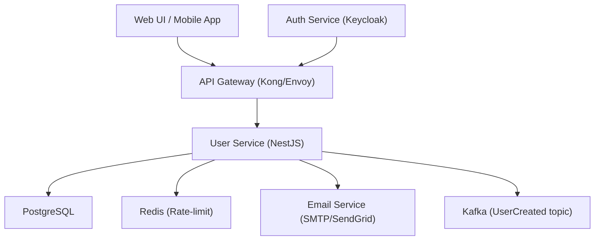

# User Sign‑up
**Type:** feature | **Priority:** 3 | **Status:** todo

## Notes
# 1. Feature Overview  

**Feature:** User Sign‑up (notation `1.a.a`)  

**Purpose** – Allow a new user (or a tenant‑admin) to create an account in the Chatbot SaaS platform. The sign‑up flow must:

* Capture the user’s email, password, and tenant identifier.  
* Store the password securely (Argon2id).  
* Create a corresponding `profiles` row automatically.  
* Issue a one‑time email‑verification token (hashed with SHA‑256).  
* Emit an immutable audit log entry.  

**Business Value** – Enables self‑service onboarding, reduces friction for new customers, and satisfies compliance (GDPR consent via email verification).  

---

## 2. User Stories  

| # | User Story | Acceptance Criteria |
|---|------------|----------------------|
| 2.1 | **As a prospective user**, I want to register with my email, password, and tenant ID so that I can start using the platform. | • `POST /api/v1/auth/signup` returns **201** with `userId` and a verification URL.<br>• Email is stored unique (case‑insensitive).<br>• Password hash is stored using Argon2id.<br>• A `profiles` row exists for the new user.<br>• An audit log entry `user_signup_initiated` is persisted. |
| 2.2 | **As a user**, I want to receive a verification email so that I can prove ownership of my address. | • Email contains a link to `GET /api/v1/auth/verify?token={plainToken}`.<br>• Token is stored hashed (SHA‑256) in `email_verifications` with a 24 h expiry.<br>• Email is sent via the configured Email Service (SMTP/SendGrid). |
| 2.3 | **As a user**, I want the system to reject duplicate email registrations so that I don’t create accidental duplicate accounts. | • If the email already exists (any status), the API returns **409 DUPLICATE_EMAIL**.<br>• No new rows are created. |
| 2.4 | **As a security system**, I want to limit sign‑up attempts per tenant to prevent abuse. | • Redis token‑bucket limits to **5 attempts per hour per tenant**.<br>• Exceeding the limit returns **429 TOO_MANY_REQUESTS**. |
| 2.5 | **As an admin**, I want the sign‑up process to be auditable so that I can trace who created which account. | • `audit_logs` entry with `action = "user_signup_initiated"` and payload `{ userId, tenantId, email }` is written atomically with the user row. |

---

## 3. Technical Specification  

### 3.1 Architecture  

The sign‑up feature is a **stateless** API endpoint that interacts with the **User Service**, **PostgreSQL**, **Redis**, **Email Service**, and **Kafka** (for the `UserCreated` event).  



*The `profiles` row is created automatically via a DB trigger (`trg_user_insert`) or within the same service transaction.*  

### 3.2 API Endpoints  

| Method | Path | Auth | Request Body | Success Response | Errors |
|--------|------|------|--------------|------------------|--------|
| **POST** | `/api/v1/auth/signup` | – | `SignUpRequest` (see schema) | **201 Created** → `SignUpResponse` (`userId`, `verificationUrl`) | `400 INVALID_PAYLOAD`, `409 DUPLICATE_EMAIL`, `429 TOO_MANY_REQUESTS`, `500 INTERNAL_ERROR` |
| **GET** | `/api/v1/auth/verify?token={token}` | – | – | **200 OK** → `{ message: "Email verified successfully" }` | `400 INVALID_TOKEN`, `410 TOKEN_EXPIRED`, `404 NOT_FOUND`, `500 INTERNAL_ERROR` |

#### 3.2.1 Request / Response Schemas  

**SignUpRequest**  

```json
{
  "title": "SignUpRequest",
  "type": "object",
  "required": ["email", "password", "tenantId"],
  "properties": {
    "email": { "type": "string", "format": "email" },
    "password": { "type": "string", "minLength": 8 },
    "tenantId": { "type": "string", "format": "uuid" },
    "locale": { "type": "string", "enum": ["en","es","fr","de"] }
  },
  "additionalProperties": false
}
```

**SignUpResponse**  

```json
{
  "title": "SignUpResponse",
  "type": "object",
  "properties": {
    "userId": { "type": "string", "format": "uuid" },
    "verificationUrl": { "type": "string", "format": "uri" }
  },
  "required": ["userId", "verificationUrl"]
}
```

### 3.3 Data Model  

| Table | Primary Key | Important Columns | Relationships | Indexes |
|-------|-------------|-------------------|---------------|---------|
| `users` | `id` UUID | `email` VARCHAR(255) **unique**, `password_hash` VARCHAR(255), `tenant_id` UUID, `status` ENUM(`pending_verification`,`active`,`suspended`), `role` ENUM(`owner`,`admin`,`member`,`viewer`), `created_at` TIMESTAMP, `updated_at` TIMESTAMP | 1‑M → `profiles`, 1‑M → `refresh_tokens`, 1‑M → `audit_logs` | `idx_users_tenant_id`, `idx_users_email` |
| `profiles` | `user_id` UUID (FK → users.id) | `first_name` VARCHAR, `last_name` VARCHAR, `avatar_url` VARCHAR, `locale` VARCHAR(5) | PK on `user_id` (1‑1) | – |
| `email_verifications` | `id` UUID | `user_id` UUID, `token_hash` VARCHAR(255), `expires_at` TIMESTAMP, `created_at` TIMESTAMP | FK → `users.id` | `idx_email_token` (token_hash) |
| `audit_logs` | `id` UUID | `tenant_id` UUID, `user_id` UUID, `action` VARCHAR, `payload` JSONB, `created_at` TIMESTAMP | – | `idx_audit_tenant_time` (tenant_id, created_at) |

*All writes to `users` and `profiles` happen inside a single transaction (or rely on the `trg_user_insert` trigger). No new tables are introduced.*  

#### Trigger (if missing)  

```sql
CREATE OR REPLACE FUNCTION create_profile_if_missing()
RETURNS trigger AS $$
BEGIN
  IF NOT EXISTS (SELECT 1 FROM profiles WHERE user_id = NEW.id) THEN
    INSERT INTO profiles (user_id) VALUES (NEW.id);
  END IF;
  RETURN NEW;
END;
$$ LANGUAGE plpgsql;

CREATE TRIGGER trg_user_insert
AFTER INSERT ON users
FOR EACH ROW EXECUTE FUNCTION create_profile_if_missing();
```

### 3.4 Business Logic  

#### 3.4.1 Sign‑up Workflow  

1. **Rate‑limit check** – Redis token‑bucket `signup:{tenantId}:{email}` (max 5 / hour). If exceeded → **429**.  
2. **Validate payload** against `SignUpRequest` JSON schema.  
3. **Normalize email** – lower‑case, trim whitespace.  
4. **Uniqueness check** – `SELECT 1 FROM users WHERE LOWER(email) = $email AND tenant_id = $tenantId`. If found → **409**.  
5. **Hash password** – Argon2id (memory ≥ 64 MiB, parallelism = 2).  
6. **Insert `users` row** (single transaction):  
   * `status = pending_verification`  
   * `role = member` (or `owner` if tenant is being created)  
   * `tenant_id` from request  
   * `created_at` / `updated_at` = now()  
7. **Trigger creates `profiles` row** (or service inserts it).  
8. **Generate verification token** – 32‑byte cryptographically random, base64url‑encoded.  
9. **Hash token** – SHA‑256, store in `email_verifications` with `expires_at = now() + 24 h`.  
10. **Send verification email** – link `https://app.example.com/verify?token={plainToken}` via Email Service.  
11. **Publish `UserCreated` event** to Kafka (`user.created` topic) with payload `{ tenantId, userId, email, createdAt }`.  
12. **Insert audit log** – `action = "user_signup_initiated"` with payload `{ userId, tenantId, email }`.  
13. **Return 201** with `userId` and `verificationUrl` (the URL sent in the email).  

#### 3.4.2 Email Verification Workflow  

1. **Lookup token** – `SELECT * FROM email_verifications WHERE token_hash = SHA256($token)`.  
2. **If not found** → **404**.  
3. **If `expires_at` < now()** → **410** (expired).  
4. **Update `users`**: set `status = active`, `updated_at = now()`.  
5. **Delete used token** (or mark as used).  
6. **Insert audit log** `action = "email_verified"` with payload `{ userId }`.  
7. **Return 200** with success message.  

#### 3.4.3 State Machine (User Status)  

```
pending_verification --> active   (email verified)
pending_verification --> suspended (admin action)
active                --> suspended (admin action)
suspended             --> active    (admin re‑activate)
```

Only users with `status = active` can obtain JWTs; others receive **403 FORBIDDEN** on protected endpoints.

---

## 4. Security Considerations  

| Aspect | Controls |
|--------|----------|
| **Authentication** | Sign‑up is unauthenticated; later endpoints require JWT signed with RSA‑256 (private key stored in Vault). |
| **Authorization** | No RBAC needed for sign‑up; tenant ID is validated against a whitelist (if self‑registration is disabled). |
| **Password Storage** | Argon2id hash (`password_hash`) stored in `users`. |
| **Verification Token** | Plain token only sent via email; stored hashed with SHA‑256 in `email_verifications`. |
| **Transport** | TLS 1.3 enforced by API gateway; HSTS header set. |
| **Input Validation** | JSON‑Schema validation for request bodies; server‑side sanitization for `locale`. |
| **Rate Limiting** | Redis token‑bucket per tenant/email (5 / hour). |
| **Audit Logging** | Immutable entry in `audit_logs` for each sign‑up initiation and verification. |
| **Data Protection** | PostgreSQL encrypted at rest (KMS); email token hash stored as SHA‑256 (no plaintext). |
| **Compliance** | Email verification satisfies GDPR “consent” requirement; audit log retained for 2 years. |

---

## 5. Error Handling  

| HTTP Status | Error Code | Message | Fallback / Retry |
|-------------|------------|---------|------------------|
| 400 | `INVALID_PAYLOAD` | Request body fails schema validation. | Client must correct payload. |
| 401 | `UNAUTHORIZED` | Not used for sign‑up (no auth). | – |
| 403 | `FORBIDDEN` | Tenant not allowed to self‑register (if disabled). | Show friendly message. |
| 404 | `TOKEN_NOT_FOUND` | Verification token not found. | Prompt to request new verification email. |
| 409 | `DUPLICATE_EMAIL` | Email already registered. | Suggest login or password reset. |
| 410 | `TOKEN_EXPIRED` | Verification token expired. | Offer to resend verification email. |
| 429 | `TOO_MANY_REQUESTS` | Rate limit exceeded. | Exponential back‑off on client side. |
| 500 | `INTERNAL_ERROR` | Unexpected server error. | Log, return generic message, trigger alert. |

**Retry Strategy**  

* `POST /api/v1/auth/signup` is **non‑idempotent** – client must not auto‑retry; UI should present a “Try again” button after fixing the cause.  
* `GET /api/v1/auth/verify` is **idempotent** – safe to retry with exponential back‑off (max 3 attempts).  

---

## 6. Testing Plan  

| Test Level | Scope | Tools | Example Cases |
|------------|-------|-------|---------------|
| **Unit** | Password hashing, token generation, email‑verification logic | Jest (TS) | `hashPassword()` returns Argon2id hash; `generateVerificationToken()` produces 32‑byte string; `hashToken()` matches SHA‑256. |
| **Integration** | End‑to‑end sign‑up flow (API → DB → Email Service → Kafka) | Testcontainers (PostgreSQL, Redis, Kafka), SuperTest | 1️⃣ Successful sign‑up → DB rows created, email sent, audit log entry.<br>2️⃣ Duplicate email → 409.<br>3️⃣ Rate‑limit exceeded → 429.<br>4️⃣ Token verification success/failure. |
| **Contract** | OpenAPI compliance, Kafka Avro schema | OpenAPI validator, Pact | Provider returns fields exactly as defined; consumer receives expected error codes. |
| **E2E** | Full UI journey (Cypress) | Cypress | User fills sign‑up form, receives email (mocked), clicks verification link, sees “verified” screen. |
| **Performance** | Load test sign‑up endpoint under concurrent requests | k6 | 200 concurrent sign‑up attempts, 95 % response < 300 ms, no DB deadlocks. |
| **Security** | OWASP ZAP scan, dependency check | OWASP ZAP, Snyk | No XSS, CSRF, or insecure headers; no vulnerable npm packages. |

All tests run in CI on every PR; nightly pipeline runs full integration + E2E against a staging cluster.

---

## 7. Dependencies  

| Dependency | Type | Reason |
|------------|------|--------|
| **User Service** | Internal service (NestJS) | Handles sign‑up logic, DB writes, audit logging. |
| **PostgreSQL** | Database | Stores `users`, `profiles`, `email_verifications`, `audit_logs`. |
| **Redis** | In‑memory store | Rate‑limit counters. |
| **Email Service** | External (SMTP / SendGrid) | Sends verification email. |
| **Kafka** | Message bus | Publishes `UserCreated` event for downstream consumers (e.g., analytics). |
| **Keycloak** | Identity provider | Provides JWT signing keys for later authentication (not used directly in sign‑up). |
| **Vault / Secrets Manager** | Secrets store | Holds Argon2id parameters, email service credentials. |
| **OpenAPI Generator** | Tooling | Generates client SDKs from the spec. |

---

## 8. Migration & Deployment  

### 8.1 Database Migration  

*No new tables are required.*  
If the `trg_user_insert` trigger does not exist, apply the **idempotent** migration `006-create-profile-trigger.sql` (see Architecture Context).  

```sql
-- 006-create-profile-trigger.sql
CREATE OR REPLACE FUNCTION create_profile_if_missing()
RETURNS trigger AS $$
BEGIN
  IF NOT EXISTS (SELECT 1 FROM profiles WHERE user_id = NEW.id) THEN
    INSERT INTO profiles (user_id) VALUES (NEW.id);
  END IF;
  RETURN NEW;
END;
$$ LANGUAGE plpgsql;

DROP TRIGGER IF EXISTS trg_user_insert ON users;
CREATE TRIGGER trg_user_insert
AFTER INSERT ON users
FOR EACH ROW EXECUTE FUNCTION create_profile_if_missing();
```

Run via Prisma Migrate or Flyway; the script is safe to re‑apply.

### 8.2 Feature Flag  

*Feature flag `signup_enabled`* (default **true**) – controlled per tenant via the Feature Flag service (LaunchDarkly / Unleash). The API checks the flag before processing the request; if disabled, returns **403 FORBIDDEN**.

### 8.3 Deployment Steps  

1. **Build Docker image** for User Service (includes the latest code).  
2. **Apply DB migration** (`006-create-profile-trigger.sql`) using the CI pipeline.  
3. **Deploy to Kubernetes** via Helm chart:  
   * `replicaCount` = 2 (can be scaled).  
   * `resources` set per load expectations.  
   * `livenessProbe` / `readinessProbe` on `/healthz`.  
4. **Configure Redis rate‑limit keys** (prefix `signup:`).  
5. **Update Kafka topic** `user.created` with proper retention (7 days).  
6. **Rollback plan** – If a deployment causes failures:  
   * Roll back Helm release to previous version.  
   * Re‑apply previous DB migration (no schema change, so rollback is a no‑op).  
   * Disable `signup_enabled` flag temporarily to stop new sign‑ups while investigating.  

---

*End of Feature Specification for **User Sign‑up (1.a.a)**.*
