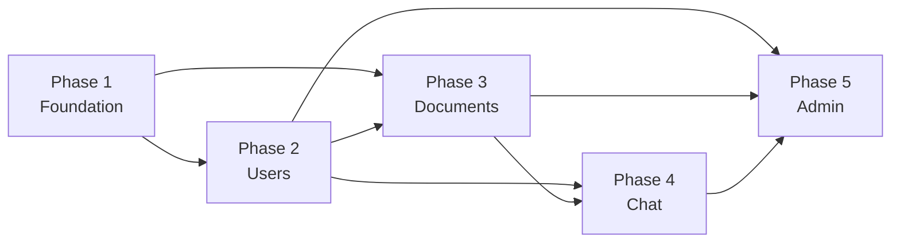

# Chatbot SaaS — Master Build Plan

> **16 feature specs in `docs-2/` → 5 phased build plans in `docs/`**

---

## Coherence Analysis

After reading all 16 specification documents, I verified the following coherence criteria:

### ✅ What Is Consistent

| Dimension | Finding |
|-----------|---------|
| **Tech Stack** | All 16 docs reference the same stack: React/Next.js + MUI frontend, NestJS backend, PostgreSQL, Redis, Kafka, ElasticSearch, Milvus, Keycloak (OAuth2/OIDC), Kubernetes, Terraform |
| **Database Schema** | All docs share the same entity model (`users`, `profiles`, `refresh_tokens`, `audit_logs`, `email_verifications`, `documents`, `document_chunks`, `embeddings`, `conversations`, `messages`, `usage_metrics`, `system_settings`). No conflicting column definitions. |
| **API Patterns** | Consistent REST API design: `/api/v1/` prefix, JWT authentication, RBAC enforcement, standardized error codes (400/401/403/404/409/413/415/429/500/502/503) |
| **Security Model** | Every doc specifies: JWT RS256 via Keycloak, Argon2id passwords, bcrypt refresh tokens, SHA-256 verification tokens, TLS 1.3, PostgreSQL RLS, Redis rate-limiting, immutable audit logs |
| **Error Handling** | Uniform error response structure with machine-readable codes and human-readable messages across all endpoints |
| **Rate Limiting** | Consistent Redis token-bucket approach per tenant across all modules |
| **Audit Logging** | Every mutating operation writes to the same `audit_logs` table with `tenant_id`, `user_id`, `action`, `payload` (JSONB), `created_at` |
| **Feature Flags** | All modules use `system_settings.feature_flags` (JSON column) for per-tenant rollout control |
| **Testing Strategy** | Every spec includes: Unit (Jest), Integration (Testcontainers), Contract (Pact), E2E (Cypress), Performance (k6), Security (OWASP ZAP), Chaos (LitmusChaos) |
| **Deployment** | All services deploy via Docker + Helm on Kubernetes with canary releases, HPA, and Helm rollback |

### ⚠️ Minor Observations (Not Blockers)

| Item | Notes |
|------|-------|
| **Module 1.d.a naming overlap** | `admin-panel.md` lists "User Management" as a sub-component but links to the same `user-management.md` that covers the user module (1.a). In context, the admin panel's "user management" is about *admin CRUD on users* (list, edit roles, suspend), not the sign-up/login flows. The docs handle this correctly in the body text. |
| **Feature Flag Invalidation** | Upgraded from basic TTL cache logic to immediate Redis Pub/Sub (Phase 1/5) to prevent eventual consistency race conditions in the UI. |
| **Indexing Worker Stability** | Added explicit Dead Letter Queue (DLQ) and streaming parser requirements in Phase 3 to prevent Out-Of-Memory poison pill loops on massive PDFs. |
| **Data Retention & Bloat** | Added native PostgreSQL table partitioning and cold-storage archival jobs in Phase 1 & 4 for `audit_logs` and `messages` tables to prevent database bloat. |

---

## Phase Summary

| Phase | Doc | Module | Features | Duration |
|-------|-----|--------|----------|----------|
| **1** | [phase-1-foundation.md](file:///c:/Users/makka/Music/chatbot-project/docs/phase-1-foundation.md) | Infrastructure | K8s, PostgreSQL, Redis, S3, Keycloak, API Gateway, CI/CD, Observability | 2–3 weeks |
| **2** | [phase-2-user-management.md](file:///c:/Users/makka/Music/chatbot-project/docs/phase-2-user-management.md) | User Management (1.a) | Sign-up, Login, Profile, Avatar | 2–3 weeks |
| **3** | [phase-3-document-handling.md](file:///c:/Users/makka/Music/chatbot-project/docs/phase-3-document-handling.md) | Document Handling (1.b) | Upload, Indexing, Hybrid Search | 3–4 weeks |
| **4** | [phase-4-chat-engine.md](file:///c:/Users/makka/Music/chatbot-project/docs/phase-4-chat-engine.md) | Chat Engine (1.c) | Context-Aware Reply, Fallback, History | 3–4 weeks |
| **5** | [phase-5-admin-panel.md](file:///c:/Users/makka/Music/chatbot-project/docs/phase-5-admin-panel.md) | Admin Panel (1.d) | User CRUD, Analytics, Settings | 2–3 weeks |

**Total estimated duration: 12–17 weeks**

---

## Feature-to-Phase Mapping

| # | Feature | Source Doc | Phase |
|---|---------|-----------|-------|
| 1.a.a | User Sign-up | `user-sign‑up.md` | 2 |
| 1.a.b | User Login | `user-login.md` | 2 |
| 1.a.c | User Profile | `user-profile-management.md` | 2 |
| 1.b.a | Document Upload | `document-upload.md` | 3 |
| 1.b.b | Document Indexing | `document-indexing.md` | 3 |
| 1.b.c | Document Search | `document-search.md` | 3 |
| 1.c.a | Context-Aware Reply | `context‑aware-reply.md` | 4 |
| 1.c.b | Fallback to LLM | `fallback-to-llm.md` | 4 |
| 1.c.c | Conversation History | `conversation-history.md` | 4 |
| 1.d.a | Admin User Mgmt | `user-management.md` (admin section) | 5 |
| 1.d.b | Usage Analytics | `usage-analytics.md` | 5 |
| 1.d.c | System Settings | `system-settings.md` | 5 |
| — | Architecture | `chatbot-saas-application.md` | 1 |
| — | Document Module | `document-handling.md` | 3 |
| — | Chat Module | `chat-engine.md` | 4 |
| — | Admin Module | `admin-panel.md` | 5 |

---

## Database Migration Sequence

| Migration | Phase | Table/Object |
|-----------|-------|-------------|
| 001 | 1 | `users` |
| 002 | 1 | `profiles` |
| 003 | 1 | `refresh_tokens` |
| 004 | 1 | `audit_logs` |
| 005 | 1 | `email_verifications` |
| 006 | 2 | `trg_user_insert` trigger |
| 007 | 1 | `system_settings` |
| 008 | 3 | `documents` |
| 009 | 3 | `document_chunks` |
| 010 | 3 | `embeddings` |
| 011 | 3 | Index on `documents(status)` |
| 012 | 3 | RLS on `documents` |
| 013 | 4 | `conversations` |
| 014 | 4 | `messages` |
| 015 | 4 | `usage_metrics` |
| 016 | 4 | Message indexes (GIN, idempotency) |

---

*This master plan was generated from the 16 specification files in `docs-2/`.*
